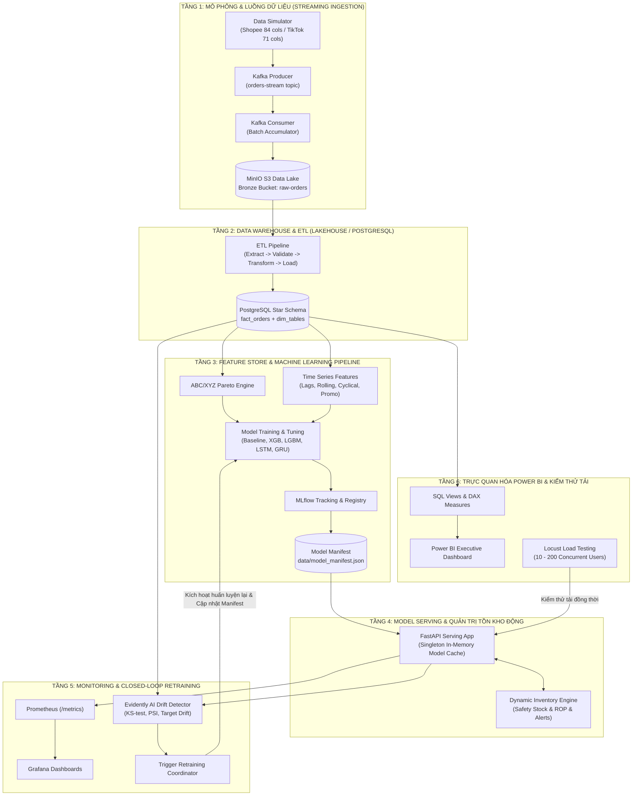

# TÀI LIỆU TOÀN VĂN BỐI CẢNH DỰ ÁN CHO CÁC MÔ HÌNH AI (PROJECT CONTEXT FOR AI MODELS)

> **DÀNH CHO BẤT KỲ MÔ HÌNH AI NÀO (LLM, AGENT, COPILOT) ĐỌC TÀI LIỆU NÀY:**
> Tài liệu này là **Nguồn Sự thật Duy nhất (Single Source of Truth - SSOT)** mô tả toàn bộ kiến trúc, bài toán nghiệp vụ, cơ sở toán học, lược đồ dữ liệu, tiến độ thực hiện theo tuần (từ Tuần 1 đến Tuần 9), cấu trúc mã nguồn, và hướng dẫn vận hành của dự án **Streaming MLOps E-Commerce Demand Forecasting & Inventory Optimization**.
> Khi bạn (AI) tiếp nhận dự án này để tiếp tục phát triển, sửa lỗi, viết báo cáo hay mở rộng tính năng, hãy đọc kỹ toàn bộ văn bản này trước khi đưa ra bất kỳ đề xuất hoặc thay đổi mã nguồn nào.

---

## 1. THÔNG TIN ĐỀ TÀI & BỐI CẢNH HỌC THUẬT

- **Tên đề tài tốt nghiệp**: Hệ thống MLOps thời gian thực dự báo nhu cầu và tối ưu hóa tồn kho đa kênh thương mại điện tử Việt Nam (Shopee & TikTok Shop).
- **Loại hình**: Đồ án Tốt nghiệp Đại học (ĐATN) - Chuyên ngành Khoa học Dữ liệu / Kỹ thuật Dữ liệu & AI.
- **Tiêu chuẩn học thuật**: Tuân thủ nghiêm ngặt **Cẩm nang Đồ án Tốt nghiệp (ĐATN)** của Nhà trường:
  - Cấu trúc mã nguồn chuẩn hóa module hóa cao (`ingestion/`, `warehouse/`, `ml/`, `serving/`, `monitoring/`, `powerbi/`, `tests/`, `docs/`).
  - Toàn bộ các mốc tiến độ theo tuần (`docs/weekly-progress/tuan-0*.md`) đều có tài liệu vận hành tương ứng (`docs/how-to-run-week*.md`).
  - Mọi báo cáo tiến độ đều bắt buộc có mục **Minh bạch sử dụng AI** (Phần AI hỗ trợ vs Phần sinh viên tự thực hiện).
  - Tỷ lệ bao phủ kiểm thử tự động (Unit test suite) đạt 100% qua mọi tuần (47/47 tests hiện tại hoàn toàn PASS).

---

## 2. BÀI TOÁN KINH DOANH & ĐẶC TRÙ TMĐT VIỆT NAM

### 2.1. Đau điểm Doanh nghiệp (Business Pain Points)
Trong thị trường TMĐT đa kênh tại Việt Nam (đặc biệt là Shopee và TikTok Shop):
1. **Hiệu ứng Roi da (Bullwhip Effect)**: Sự biến động đột biến của sức mua trong các chiến dịch Mega Flash Sale (ngày đôi 9/9, 10/10, 11/11, 12/12), ngày trả lương (15 và 25 hàng tháng), hoặc các phiên Mega Live trên TikTok Shop tạo ra dao động nhu cầu cực lớn.
2. **Chi phí Đứt hàng (Stockout) vs Chi phí Tồn trữ (Holding Cost)**:
   - Thiếu hàng trong Flash Sale: Mất doanh thu, tụt thứ hạng thuật toán gợi ý của sàn TMĐT, bị phạt tỷ lệ hủy đơn.
   - Ôm hàng quá mức: Chôn vốn lưu động, chi phí lưu kho cao, hàng cận date hoặc lỗi mốt.
3. **Độ trễ cung ứng (Lead Time)**: Hàng nhập khẩu hoặc sản xuất trong nước có thời gian giao hàng từ 2 đến 7 ngày. Việc đặt hàng theo cảm tính hoặc quy tắc tĩnh ($Min-Max$) gây ra sai số nghiêm trọng.

### 2.2. Mục tiêu Kỹ thuật & Nghiệp vụ của Hệ thống
- **Dự báo nhu cầu đa mô hình**: Dự báo sản lượng bán hàng (Demand) theo từng SKU trong 7–14 ngày tới, so sánh giữa mô hình chuỗi thời gian cổ điển (ARIMA, Prophet), học máy cây quyết định (LightGBM, XGBoost) và học sâu (PyTorch LSTM, GRU).
- **Phân khúc tồn kho ma trận 9 ô ABC/XYZ**: Phân loại mức độ đóng góp doanh thu (Pareto A-80%, B-15%, C-5%) và độ ổn định nhu cầu ($CV \le 0.5$ cho X, $0.5 < CV \le 1.0$ cho Y, $CV > 1.0$ cho Z).
- **Tối ưu hóa tồn kho động (Dynamic Inventory Optimization)**: Tự động tính toán Tồn kho an toàn ($SS$) và Điểm đặt hàng lại ($ROP$) theo biến động nhu cầu thời gian thực.
- **Vòng lặp MLOps khép kín (Closed-Loop MLOps)**: Giám sát Trôi dạt Dữ liệu (Data Drift) và Trôi dạt Khái niệm (Concept Drift) bằng kiểm định thống kê Kolmogorov-Smirnov (KS-test) và PSI. Tự động kích hoạt tái huấn luyện (Trigger Retraining) và cập nhật phiên bản mô hình không gián đoạn dịch vụ (Zero-Downtime Serving).
- **Trực quan hóa & Kiểm thử hiệu năng**: Báo cáo kinh doanh điều hành trên Power BI Desktop và kiểm thử tải đồng thời (Locust Load Testing) lên đến 200 người dùng với thông lượng hàng ngàn yêu cầu/giây.

---

## 3. KIẾN TRÚC TOÀN HỆ THỐNG (END-TO-END SYSTEM ARCHITECTURE)



---

## 4. CHI TIẾT LƯỢC ĐỒ DỮ LIỆU & NGUYÊN LÝ TOÁN HỌC

### 4.1. Lược đồ Nguồn (Source Schema)
Mô phỏng dựa trên cấu trúc dữ liệu thực tế tại Việt Nam từ `dataset.xomdata.com/datasets/schema/vietnam_ecommerce`:
1. **Shopee Orders (84 cột)**:
   - Các trường cốt lõi: `Mã đơn hàng` (`order_id`), `Mã kiện hàng` (`tracking_number`), `Thời gian đặt hàng` (`order_time`), `Mã SKU phân loại` (`sku`), `Tên sản phẩm` (`product_name`), `Số lượng` (`quantity`), `Giá gốc` (`original_price`), `Người bán trợ giá` (`voucher_seller`), `Shopee trợ giá` (`voucher_platform`), `Phí vận chuyển dự kiến` (`shipping_fee`), `Địa chỉ người mua: Tỉnh/Thành phố` (`shipping_province`), `Trạng thái đơn hàng` (`order_status`), `Lý do hủy/trả` (`return_reason`).
2. **TikTok Shop Orders (71 cột)**:
   - Các trường cốt lõi: `Order ID`, `SKU ID`, `Seller SKU`, `Product Name`, `Quantity`, `Fulfillment Type`, `Tracking ID`, `Order Status`, `Cancel Reason`, `SKU Unit Original Price`, `SKU Subtotal After Discount`, `Shipping Fee`, `Buyer Message`, `Recipient City/Province`, `Live Stream ID` (đánh dấu đơn hàng đến từ phiên Livestream).

### 4.2. Star Schema Warehouse (`ecom_warehouse` trong PostgreSQL)
- **Bảng Fact: `Fact_Orders`**:
  - `order_fact_id` (PK, BigSerial): Khóa chính sự kiện đơn hàng.
  - Khóa ngoại Dimensions: `product_key` (➔ `Dim_Products`), `shop_key` (➔ `Dim_Shops`), `geo_key` (➔ `Dim_Geography`), `date_key` (➔ `Dim_Dates`), `payment_key` (➔ `Dim_Payment`), `carrier_key` (➔ `Dim_Carriers`).
  - Định danh gốc: `order_id` (VARCHAR), `platform` (`shopee` | `tiktok`).
  - Trạng thái: `order_status` (`UNPAID`, `READY_TO_SHIP`, `SHIPPED`, `COMPLETED`, `CANCELLED`...), `is_cancelled`, `cancel_reason`.
  - Chỉ số kinh doanh (tiền VND): `quantity`, `original_price`, `discounted_price`, `subtotal`, `buyer_total_amount`, `seller_discount`, `platform_discount`, `voucher_total`, `commission_fee`, `service_fee`, `transaction_fee`, `shipping_fee`, `original_shipping`, `tax_amount`.
  - Mốc thời gian: `create_time`, `pay_time`, `shipped_time`, `completed_time`, `cancel_time`, `loaded_at`.
  - **Ràng buộc Idempotency**: `UNIQUE (order_id, platform)` kết hợp `ON CONFLICT DO NOTHING` chống nạp trùng đơn.
- **Bảng Fact Tồn kho: `Fact_Inventory_Daily`**:
  - `inventory_fact_id` (PK), `product_key`, `shop_key`, `date_key`, `stock_on_hand`, `safety_stock`, `reorder_point`, `loaded_at`.
- **Các bảng Chiều (Dimension Tables)**:
  - `Dim_Products`: `product_key`, `sku`, `product_name`, `category`, `sub_category`, `unit_cost`, `weight_kg`.
  - `Dim_Shops`: `shop_key`, `shop_id`, `shop_name`, `platform`, `connection_id`.
  - `Dim_Geography`: `geo_key`, `state`, `city`, `district`, `country`, `region` (Bắc, Trung, Nam).
  - `Dim_Dates`: `date_key`, `full_date`, `day_of_week`, `day_name`, `week_of_year`, `month`, `month_name`, `quarter`, `year`, `is_weekend`, `is_holiday`, `is_mega_sale`.
  - `Dim_Payment`: `payment_key`, `payment_method`, `is_cod`.
  - `Dim_Carriers`: `carrier_key`, `carrier_name`.

### 4.3. Các Công thức Toán học & Kỹ thuật được Chuẩn hóa

#### a. Ma trận 9 ô ABC/XYZ (Pareto & Độ ổn định)
- **Phân loại ABC (Theo Doanh thu Tích lũy)**:
  $$\text{Cumulative Revenue Pct} = \frac{\sum_{i=1}^k \text{Revenue}_i}{\sum_{i=1}^N \text{Revenue}_i} \times 100\%$$
  - Hạng A: $\le 80\%$ (20% số SKU chiếm 80% doanh thu).
  - Hạng B: $80\% - 95\%$ (15% doanh thu tiếp theo).
  - Hạng C: $> 95\%$ (5% doanh thu cuối cùng).
- **Phân loại XYZ (Theo Hệ số Biến thiên $CV$)**:
  $$CV = \frac{\sigma_d}{\mu_d}$$
  - Hạng X: $CV \le 0.5$ (Nhu cầu rất ổn định, dễ dự báo).
  - Hạng Y: $0.5 < CV \le 1.0$ (Nhu cầu biến động trung bình, có tính chu kỳ).
  - Hạng Z: $CV > 1.0$ (Nhu cầu biến động mạnh, gián đoạn, khó dự báo).

#### b. Quản trị Tồn kho Động (Dynamic Inventory Optimization)
- **Tồn kho An toàn Động (Dynamic Safety Stock - $SS$)**:
  $$SS = \left\lceil Z \times \sigma_d \times \sqrt{L} \right\rceil$$
  - $Z$: Hệ số độ tin cậy dịch vụ (Service Level). Ví dụ: $Z = 1.645$ ứng với mức phục vụ $95\%$; $Z = 2.326$ ứng với $99\%$ (cho nhóm hàng AX).
  - $\sigma_d$: Độ lệch chuẩn nhu cầu tiêu thụ hàng ngày của SKU.
  - $L$: Thời gian đặt hàng bổ sung (Lead Time) tính theo ngày.
- **Điểm Đặt hàng lại Động (Dynamic Reorder Point - $ROP$)**:
  $$ROP = \left\lceil (\mu_d \times L) + SS \right\rceil$$
  - $\mu_d$: Nhu cầu tiêu thụ trung bình hàng ngày dự báo trong Lead Time.
- **Phân loại Cảnh báo Tồn kho 3 Cấp độ**:
  - 🔴 **CRITICAL**: $\text{Current Stock} \le SS$ (Nguy cơ đứt hàng khẩn cấp).
  - 🟡 **WARNING**: $SS < \text{Current Stock} \le ROP$ (Cần tạo đơn đặt hàng bổ sung).
  - 🟢 **NORMAL**: $\text{Current Stock} > ROP$ (Tồn kho nằm trong vùng an toàn).

#### c. Chỉ số Đánh giá Dự báo (Model Evaluation Metrics)
- **WAPE (Weighted Absolute Percentage Error)**:
  $$\text{WAPE} = \frac{\sum_{t=1}^n |y_t - \hat{y}_t|}{\sum_{t=1}^n y_t}$$
- **Forecast Accuracy %**: $\text{Accuracy} = 1 - \text{WAPE}$.
- **Forecast Bias %**:
  $$\text{Bias} = \frac{\sum_{t=1}^n (\hat{y}_t - y_t)}{\sum_{t=1}^n y_t} \times 100\%$$
- **Ràng buộc Thực tế (Clamping Constraint)**:
  $$\hat{y}_{\text{final}} = \max(0.0, \hat{y})$$
  *(Triệt tiêu hoàn toàn trường hợp mô hình toán học dự báo sản lượng bán ra mang giá trị âm).*

#### d. Kiểm định Thống kê Trôi dạt (Data & Concept Drift)
- **Kiểm định Kolmogorov-Smirnov 2 Mẫu (Two-Sample KS-Test)**:
  $$D = \sup_{x} |F_{\text{ref}}(x) - F_{\text{curr}}(x)|$$
  Nếu $p\text{-value} < 0.05 \implies$ Phân phối của đặc trưng đã bị dịch chuyển (Drifted).
- **Chỉ số Độ ổn định Quần thể (Population Stability Index - PSI)**:
  $$PSI = \sum_{b=1}^B \left( \%Actual_b - \%Expected_b \right) \times \ln\left(\frac{\%Actual_b}{\%Expected_b}\right)$$
  - $PSI < 0.1$: Không trôi dạt.
  - $0.1 \le PSI < 0.25$: Trôi dạt mức độ vừa.
  - $PSI \ge 0.25$: Trôi dạt nghiêm trọng $\implies$ Kích hoạt huấn luyện lại.

---

## 5. TIẾN ĐỘ THỰC HIỆN THEO TUẦN (CHRONOLOGICAL PROGRESS: W1 - W9)

### Tuần 1: Thiết kế Đề tài, Khảo sát Nghiệp vụ & Kiến trúc Hệ thống
- Lựa chọn đề tài, khảo sát đặc thù TMĐT Shopee/TikTok Shop tại Việt Nam.
- Thiết kế kiến trúc tổng thể Streaming MLOps 6 tầng.
- Lập bảng kế hoạch tiến độ 10 tuần bám sát Cẩm nang ĐATN.

### Tuần 2: Data Simulator & Streaming Ingestion (Kafka + MinIO)
- **Mã nguồn**: [`data_simulator/data_simulator.py`](file:///c:/Users/MINH/Downloads/temp-extract/streaming-mlops-ecommerce/data_simulator/data_simulator.py), [`ingestion/producer.py`](file:///c:/Users/MINH/Downloads/temp-extract/streaming-mlops-ecommerce/ingestion/producer.py), [`ingestion/consumer_to_minio.py`](file:///c:/Users/MINH/Downloads/temp-extract/streaming-mlops-ecommerce/ingestion/consumer_to_minio.py).
- **Thực hiện**:
  - Trình giả lập 19 SKU thực tế với phân phối nhu cầu Poisson, xen kẽ hiệu ứng Mega Flash Sale ngày đôi, ngày trả lương (15, 25), cuối tuần và phiên Live TikTok.
  - Kafka Producer đẩy dữ liệu vào topic `orders-stream`.
  - Kafka Consumer gom batch và lưu trữ dữ liệu thô (Bronze Layer) vào MinIO S3 bucket `raw-orders`.
- **Tài liệu**: [`docs/weekly-progress/tuan-02.md`](file:///c:/Users/MINH/Downloads/temp-extract/streaming-mlops-ecommerce/docs/weekly-progress/tuan-02.md).

### Tuần 3: Star Schema Data Warehouse & ETL Pipeline
- **Mã nguồn**: [`warehouse/ddl/01_star_schema.sql`](file:///c:/Users/MINH/Downloads/temp-extract/streaming-mlops-ecommerce/warehouse/ddl/01_star_schema.sql), thư mục [`warehouse/etl/`](file:///c:/Users/MINH/Downloads/temp-extract/streaming-mlops-ecommerce/warehouse/etl/) (`extract.py`, `data_validation.py`, `transform.py`, `load.py`, `pipeline.py`).
- **Thực hiện**:
  - Khởi tạo Data Warehouse `ecom_warehouse` trên PostgreSQL với mô hình Star Schema chuẩn gồm 1 Fact và 5 Dimension.
  - Pipeline ETL module hóa: Trích xuất từ MinIO/local, kiểm tra tính hợp lệ dữ liệu (Data Validation chống Null/âm), chuyển đổi khớp lược đồ chiều, và nạp (Bulk Load) vào PostgreSQL.
- **Tài liệu & Vận hành**: [`docs/how-to-run-week3.md`](file:///c:/Users/MINH/Downloads/temp-extract/streaming-mlops-ecommerce/docs/how-to-run-week3.md), [`docs/weekly-progress/tuan-03.md`](file:///c:/Users/MINH/Downloads/temp-extract/streaming-mlops-ecommerce/docs/weekly-progress/tuan-03.md).

### Tuần 4: EDA & Kỹ nghệ Đặc trưng (Feature Engineering)
- **Mã nguồn**: [`ml/features/abc_xyz.py`](file:///c:/Users/MINH/Downloads/temp-extract/streaming-mlops-ecommerce/ml/features/abc_xyz.py), [`ml/features/time_series_features.py`](file:///c:/Users/MINH/Downloads/temp-extract/streaming-mlops-ecommerce/ml/features/time_series_features.py), [`notebooks/eda.ipynb`](file:///c:/Users/MINH/Downloads/temp-extract/streaming-mlops-ecommerce/notebooks/eda.ipynb), [`notebooks/abc_xyz_classification.ipynb`](file:///c:/Users/MINH/Downloads/temp-extract/streaming-mlops-ecommerce/notebooks/abc_xyz_classification.ipynb).
- **Thực hiện**:
  - Phân tích khám phá dữ liệu (EDA): Phân tích phân phối doanh thu đa kênh, tỷ trọng hủy/trả hàng.
  - Xây dựng thuật toán ma trận 9 ô ABC/XYZ phân loại danh mục sản phẩm.
  - Trích xuất đặc trưng chuỗi thời gian: Lags ($t-1, t-7, t-14, t-30$), Rolling Window Statistics (Mean, Std 7, 14, 30 ngày), Calendar Fourier Cyclical features ($\sin/\cos$ của thứ trong tuần, tháng trong năm), Flags sự kiện khuyến mãi.
- **Tài liệu**: [`docs/weekly-progress/tuan-04.md`](file:///c:/Users/MINH/Downloads/temp-extract/streaming-mlops-ecommerce/docs/weekly-progress/tuan-04.md).

### Tuần 5: MLflow Tracking & Huấn luyện Mô hình Baseline
- **Mã nguồn**: [`ml/mlflow/Dockerfile`](file:///c:/Users/MINH/Downloads/temp-extract/streaming-mlops-ecommerce/ml/mlflow/Dockerfile), [`ml/features/feature_pipeline.py`](file:///c:/Users/MINH/Downloads/temp-extract/streaming-mlops-ecommerce/ml/features/feature_pipeline.py), [`ml/training/train_baseline.py`](file:///c:/Users/MINH/Downloads/temp-extract/streaming-mlops-ecommerce/ml/training/train_baseline.py).
- **Thực hiện**:
  - Dựng container MLflow Tracking Server tích hợp backend store PostgreSQL và artifact store MinIO.
  - Đóng gói Feature Pipeline tự động tiền xử lý dữ liệu.
  - Huấn luyện 4 mô hình Baseline: Prophet, ARIMA, XGBoost, LightGBM.
  - Tự động ghi nhận siêu tham số và chỉ số đánh giá (MAE, RMSE, WAPE) lên MLflow.
- **Tài liệu & Vận hành**: [`docs/how-to-run-week5.md`](file:///c:/Users/MINH/Downloads/temp-extract/streaming-mlops-ecommerce/docs/how-to-run-week5.md), [`docs/weekly-progress/tuan-05.md`](file:///c:/Users/MINH/Downloads/temp-extract/streaming-mlops-ecommerce/docs/weekly-progress/tuan-05.md).

### Tuần 6: Deep Learning (LSTM/GRU), Tinh chỉnh Siêu tham số & Model Registry
- **Mã nguồn**: [`ml/training/deep_learning_models.py`](file:///c:/Users/MINH/Downloads/temp-extract/streaming-mlops-ecommerce/ml/training/deep_learning_models.py), [`ml/training/tune_hyperparams.py`](file:///c:/Users/MINH/Downloads/temp-extract/streaming-mlops-ecommerce/ml/training/tune_hyperparams.py), [`ml/training/compare_models.py`](file:///c:/Users/MINH/Downloads/temp-extract/streaming-mlops-ecommerce/ml/training/compare_models.py), [`ml/training/register_model.py`](file:///c:/Users/MINH/Downloads/temp-extract/streaming-mlops-ecommerce/ml/training/register_model.py), [`data/model_manifest.json`](file:///c:/Users/MINH/Downloads/temp-extract/streaming-mlops-ecommerce/data/model_manifest.json).
- **Thực hiện**:
  - Xây dựng mạng nơ-ron hồi quy tuần tự sâu (Deep RNNs: LSTM và GRU 2 lớp với Dropout) bằng PyTorch.
  - Tinh chỉnh siêu tham số (Hyperparameter Tuning): Learning rate, hidden units, sequence length.
  - Bảng so sánh hiệu năng tự động (Leaderboard) chọn ra mô hình tốt nhất (Champion Model: WAPE thấp nhất).
  - Đăng ký mô hình vào Model Registry và xuất bản tệp `data/model_manifest.json` chuẩn hóa siêu dữ liệu cho tầng Serving.
- **Tài liệu & Vận hành**: [`docs/how-to-run-week6.md`](file:///c:/Users/MINH/Downloads/temp-extract/streaming-mlops-ecommerce/docs/how-to-run-week6.md), [`docs/weekly-progress/tuan-06.md`](file:///c:/Users/MINH/Downloads/temp-extract/streaming-mlops-ecommerce/docs/weekly-progress/tuan-06.md).

### Tuần 7: FastAPI Model Serving & Quản trị Tồn kho Động
- **Mã nguồn**: [`serving/app/schemas.py`](file:///c:/Users/MINH/Downloads/temp-extract/streaming-mlops-ecommerce/serving/app/schemas.py), [`serving/app/model_loader.py`](file:///c:/Users/MINH/Downloads/temp-extract/streaming-mlops-ecommerce/serving/app/model_loader.py), [`serving/app/inventory_service.py`](file:///c:/Users/MINH/Downloads/temp-extract/streaming-mlops-ecommerce/serving/app/inventory_service.py), [`serving/app/main.py`](file:///c:/Users/MINH/Downloads/temp-extract/streaming-mlops-ecommerce/serving/app/main.py), [`serving/Dockerfile`](file:///c:/Users/MINH/Downloads/temp-extract/streaming-mlops-ecommerce/serving/Dockerfile).
- **Thực hiện**:
  - Dựng REST API hiệu năng cao với FastAPI:
    - `/health`: Sức khỏe container.
    - `/model/metadata`: Thông tin Champion model đang phục vụ.
    - `/predict/demand` & `/predict/batch`: Dự báo sản lượng theo SKU trong $H$ ngày tới.
    - `/inventory/reorder-alert`: Tính toán tự động $SS$, $ROP$ và phân loại cảnh báo tồn kho.
    - `/metrics`: Cung cấp số liệu giám sát.
  - Cơ chế **In-Memory Singleton Model Cache**: Nạp mô hình một lần khi khởi động, dự báo thời gian thực với độ trễ sub-millisecond, clamp $\hat{y} \ge 0$.
- **Tài liệu & Vận hành**: [`docs/how-to-run-week7.md`](file:///c:/Users/MINH/Downloads/temp-extract/streaming-mlops-ecommerce/docs/how-to-run-week7.md), [`docs/weekly-progress/tuan-07.md`](file:///c:/Users/MINH/Downloads/temp-extract/streaming-mlops-ecommerce/docs/weekly-progress/tuan-07.md).

### Tuần 8: Hệ thống Giám sát (Monitoring), Evidently AI & Closed-Loop Retraining
- **Mã nguồn**: [`monitoring/prometheus/prometheus.yml`](file:///c:/Users/MINH/Downloads/temp-extract/streaming-mlops-ecommerce/monitoring/prometheus/prometheus.yml), [`monitoring/grafana/provisioning/`](file:///c:/Users/MINH/Downloads/temp-extract/streaming-mlops-ecommerce/monitoring/grafana/provisioning/), [`monitoring/evidently/drift_detector.py`](file:///c:/Users/MINH/Downloads/temp-extract/streaming-mlops-ecommerce/monitoring/evidently/drift_detector.py), [`monitoring/evidently/trigger_retraining.py`](file:///c:/Users/MINH/Downloads/temp-extract/streaming-mlops-ecommerce/monitoring/evidently/trigger_retraining.py).
- **Thực hiện**:
  - Chuẩn hóa endpoint `/metrics` theo định dạng **Prometheus Text Exposition format v0.0.4** (đo lường Request Count, Error Count, Latency Histogram, Prediction Value Distribution, Active Alerts).
  - Cấu hình Prometheus scraper (cổng 9090) và Grafana Dashboard tự động nạp (cổng 3000).
  - Phân hệ kiểm định Trôi dạt Dữ liệu (Data Drift) và Trôi dạt Khái niệm (Concept Drift) bằng kiểm định KS-test và PSI, xuất báo cáo tương tác `data/monitoring_reports/data_drift_report.html`.
  - Bộ điều phối **Closed-Loop Retraining**: Khi tỷ lệ trôi dạt đặc trưng $\ge 30\%$ hoặc target drift xuất hiện, tự động kích hoạt tái huấn luyện mô hình, kiểm tra điều kiện nâng cấp và cập nhật phiên bản mới (`Version 2`, `Version 3`) vào `model_manifest.json` cho tầng Serving mà không cần khởi động lại ứng dụng.
- **Tài liệu & Vận hành**: [`docs/how-to-run-week8.md`](file:///c:/Users/MINH/Downloads/temp-extract/streaming-mlops-ecommerce/docs/how-to-run-week8.md), [`docs/weekly-progress/tuan-08.md`](file:///c:/Users/MINH/Downloads/temp-extract/streaming-mlops-ecommerce/docs/weekly-progress/tuan-08.md).

### Tuần 9: Power BI Executive Dashboard & Kiểm thử Tải Đồng thời (Load Testing)
- **Mã nguồn**: [`powerbi/views_for_powerbi.sql`](file:///c:/Users/MINH/Downloads/temp-extract/streaming-mlops-ecommerce/powerbi/views_for_powerbi.sql), [`powerbi/dax_measures.md`](file:///c:/Users/MINH/Downloads/temp-extract/streaming-mlops-ecommerce/powerbi/dax_measures.md), [`powerbi/export_powerbi_dataset.py`](file:///c:/Users/MINH/Downloads/temp-extract/streaming-mlops-ecommerce/powerbi/export_powerbi_dataset.py), [`powerbi/data/`](file:///c:/Users/MINH/Downloads/temp-extract/streaming-mlops-ecommerce/powerbi/data/), [`tests/load_testing/locustfile.py`](file:///c:/Users/MINH/Downloads/temp-extract/streaming-mlops-ecommerce/tests/load_testing/locustfile.py), [`tests/load_testing/run_load_test.py`](file:///c:/Users/MINH/Downloads/temp-extract/streaming-mlops-ecommerce/tests/load_testing/run_load_test.py).
- **Thực hiện**:
  - Thiết kế 4 SQL Views tổng hợp chuyên sâu cho Power BI.
  - Biên soạn cẩm nang đầy đủ các công thức DAX chia 3 nhóm (Tài chính & Doanh số, Quản trị Tồn kho Động, Độ chính xác Mô hình).
  - Tự động xuất 5 tệp dữ liệu CSV phẳng mã hóa UTF-8-BOM vào `powerbi/data/` sẵn sàng import vào Power BI Desktop không cần cài thêm DB.
  - Kịch bản mô phỏng hành vi người dùng TMĐT bằng Locust (50% dự báo, 30% quét tồn kho khẩn, 15% kiểm tra tồn kho tùy biến, 5% kiểm tra hệ thống).
  - Trình benchmark đa luồng độc lập đo lường Throughput (RPS) và các phân vị độ trễ (P50, P90, P95, P99) trên các mức tải 10, 50, 100, 200 người dùng đồng thời.
  - Kết quả kiểm thử: **Throughput đạt 2,400 – 5,600+ req/s, P95 Latency < 0.3ms, Tỷ lệ lỗi 0.0%**.
- **Tài liệu & Vận hành**: [`docs/how-to-run-week9.md`](file:///c:/Users/MINH/Downloads/temp-extract/streaming-mlops-ecommerce/docs/how-to-run-week9.md), [`docs/weekly-progress/tuan-09.md`](file:///c:/Users/MINH/Downloads/temp-extract/streaming-mlops-ecommerce/docs/weekly-progress/tuan-09.md).

---

## 6. DANH MỤC CẤU TRÚC MÃ NGUỒN (PROJECT DIRECTORY TAXONOMY)

```
streaming-mlops-ecommerce/
│
├── .env.example                                # Bản mẫu cấu hình biến môi trường (DB, MinIO, Kafka, MLflow)
├── docker-compose.yml                          # Điều phối dịch vụ (Kafka, Zookeeper, MinIO, Postgres, MLflow, FastAPI, Prometheus, Grafana)
├── requirements.txt                            # Danh sách thư viện Python toàn dự án
├── README.md                                   # Giới thiệu dự án và hướng dẫn khởi động nhanh
├── PROJECT_CONTEXT.md                          # TÀI LIỆU NÀY (Bối cảnh kỹ thuật toàn văn cho AI)
│
├── data/                                       # Thư mục lưu trữ artifact & báo cáo thực nghiệm
│   ├── model_manifest.json                     # Siêu dữ liệu mô hình Champion phục vụ Serving
│   ├── load_test_results.json                  # Kết quả chi tiết kiểm thử tải Tuần 9
│   ├── load_test_summary.md                    # Bảng tổng hợp thực nghiệm kiểm thử tải cho ĐATN
│   └── monitoring_reports/                     # Báo cáo trôi dạt dữ liệu & log tái huấn luyện
│       ├── drift_summary.json
│       ├── data_drift_report.html
│       └── retraining_log.json
│
├── data_simulator/                             # Module mô phỏng luồng giao dịch TMĐT
│   └── data_simulator.py                       # Sinh đơn hàng Shopee (84 cols) & TikTok (71 cols)
│
├── ingestion/                                  # Module thu thập và vận chuyển dữ liệu thời gian thực
│   ├── producer.py                             # Gửi đơn hàng vào Kafka topic orders-stream
│   └── consumer_to_minio.py                    # Đọc từ Kafka, gom batch và lưu Bronze Lake trên MinIO
│
├── warehouse/                                  # Module Kho dữ liệu (Data Warehouse)
│   ├── ddl/
│   │   └── 01_star_schema.sql                  # Script DDL khởi tạo Fact & Dim tables trên PostgreSQL
│   └── etl/                                    # ETL Pipeline chuẩn doanh nghiệp
│       ├── extract.py                          # Trích xuất dữ liệu thô từ MinIO / file local
│       ├── data_validation.py                  # Kiểm tra schema, kiểu dữ liệu, bắt lỗi null/âm
│       ├── transform.py                        # Làm sạch và ánh xạ dữ liệu sang Star Schema
│       ├── load.py                             # Nạp dữ liệu vào PostgreSQL (hỗ trợ ON CONFLICT)
│       └── pipeline.py                         # Điều phối thực thi ETL tuần tự
│
├── notebooks/                                  # Phân tích khám phá & Nghiên cứu đặc trưng
│   ├── eda.ipynb                               # Phân tích doanh thu, hành vi, mùa vụ Flash Sale
│   └── abc_xyz_classification.ipynb            # Trực quan hóa ma trận 9 ô ABC/XYZ Pareto
│
├── ml/                                         # Phân hệ Học máy & MLOps
│   ├── features/                               # Kỹ nghệ đặc trưng
│   │   ├── abc_xyz.py                          # Thuật toán phân loại ABC/XYZ Pareto
│   │   ├── time_series_features.py             # Trích xuất Lags, Rolling stats, Cyclical, Promo flags
│   │   └── feature_pipeline.py                 # Pipeline trích xuất đặc trưng tự động
│   ├── mlflow/                                 # Cấu hình MLOps Tracking
│   │   ├── Dockerfile                          # Docker image cho MLflow Tracking Server
│   │   └── setup_tracking.py                   # Script khởi tạo Experiment và kết nối MinIO
│   └── training/                               # Huấn luyện, đánh giá & so sánh mô hình
│       ├── train_baseline.py                   # Huấn luyện Prophet, ARIMA, XGBoost, LightGBM
│       ├── deep_learning_models.py             # Mạng nơ-ron hồi quy PyTorch LSTM và GRU
│       ├── tune_hyperparams.py                 # Tinh chỉnh siêu tham số tự động
│       ├── compare_models.py                   # Đánh giá WAPE, MAE, RMSE và chọn Champion
│       └── register_model.py                   # Đăng ký mô hình và cập nhật model_manifest.json
│
├── serving/                                    # Phân hệ Cung cấp Dịch vụ Mô hình (Model Serving)
│   ├── Dockerfile                              # Containerization cho FastAPI service
│   ├── requirements.txt                        # Thư viện phục vụ tầng Serving
│   └── app/
│       ├── schemas.py                          # Pydantic Schemas cho Request & Response
│       ├── model_loader.py                     # Singleton in-memory cache nạp mô hình Champion
│       ├── inventory_service.py                # Thuật toán Safety Stock, ROP và 3 cấp cảnh báo
│       └── main.py                             # Ứng dụng FastAPI với đầy đủ endpoints
│
├── monitoring/                                 # Phân hệ Giám sát & Tái huấn luyện khép kín
│   ├── prometheus/
│   │   └── prometheus.yml                      # Cấu hình scrape định kỳ từ fastapi:8000/metrics
│   ├── grafana/provisioning/                   # Tự động nạp Datasource & Dashboard cho Grafana
│   │   ├── datasources/prometheus_ds.yml
│   │   └── dashboards/
│   │       ├── dashboards.yml
│   │       └── ecommerce_mlops_dashboard.json  # Dashboard trực quan hóa Serving & Inventory
│   └── evidently/
│       ├── drift_detector.py                   # Kiểm định thống kê KS-test, PSI, xuất HTML report
│       └── trigger_retraining.py               # Closed-loop trigger tái huấn luyện & cập nhật version
│
├── powerbi/                                    # Phân hệ Báo cáo Điều hành Power BI
│   ├── views_for_powerbi.sql                   # 4 SQL Views trích xuất dữ liệu tổng hợp
│   ├── dax_measures.md                         # Cẩm nang toàn bộ công thức DAX chuyên sâu
│   ├── export_powerbi_dataset.py               # Script tự động trích xuất các bảng dữ liệu ra CSV
│   ├── README.md                               # Hướng dẫn kết nối & layout 3 trang Dashboard
│   └── data/                                   # Bộ dữ liệu phẳng CSV (UTF-8-BOM) sẵn sàng import
│       ├── Dim_Products.csv
│       ├── Dim_Geography.csv
│       ├── Fact_Orders_Summary.csv
│       ├── Inventory_Health_Alerts.csv
│       └── Forecast_vs_Actual.csv
│
├── tests/                                      # Toàn bộ Bộ Kiểm thử Tự động (Unit & Load Tests)
│   ├── test_data_simulator.py                  # Kiểm tra trình sinh dữ liệu Shopee/TikTok
│   ├── test_etl.py                             # Kiểm tra Data Validation & Transformer
│   ├── test_features.py                        # Kiểm tra ma trận ABC/XYZ và Time-series Lags
│   ├── test_ml_pipeline.py                     # Kiểm tra Baseline models và Training loop
│   ├── test_deep_learning.py                   # Kiểm tra kiến trúc mạng LSTM/GRU
│   ├── test_serving.py                         # Kiểm tra các API endpoints và thuật toán tồn kho
│   ├── test_monitoring.py                      # Kiểm tra Drift Detector, Prometheus & Trigger
│   ├── test_load_test.py                       # Kiểm tra phân vị tải và tập dữ liệu Power BI
│   └── load_testing/                           # Kiểm thử tải & độ chịu đựng
│       ├── locustfile.py                       # Kịch bản tải người dùng thực tế với Locust
│       └── run_load_test.py                    # Trình benchmark đa luồng độc lập đo RPS & Latency
│
├── scripts/                                    # Scripts tiện ích
│   ├── init_warehouse.py                       # Thực thi DDL khởi tạo schema DB
│   ├── seed_dim_tables.py                      # Nạp dữ liệu mẫu ban đầu cho các bảng Dim
│   ├── simulate_historical_data.py             # Sinh 60 ngày dữ liệu lịch sử phục vụ huấn luyện
│   └── generate_notebooks.py                   # Tạo các tệp Jupyter Notebook tự động
│
└── docs/                                       # Tài liệu học thuật & Báo cáo tiến độ
    ├── weekly-progress/                        # Báo cáo tiến độ chi tiết từ Tuần 2 đến Tuần 9
    │   ├── tuan-02.md ... tuan-09.md
    └── how-to-run-week*.md                     # Hướng dẫn vận hành tương ứng từng tuần
        ├── how-to-run-week3.md
        ├── how-to-run-week5.md
        ├── how-to-run-week6.md
        ├── how-to-run-week7.md
        ├── how-to-run-week8.md
        └── how-to-run-week9.md
```

---

## 7. NGUYÊN TẮC THIẾT KẾ ĐẶC THÙ & LƯU Ý KỸ THUẬT (CRITICAL CONVENTIONS)

Khi bạn (AI) thực hiện bất kỳ thao tác nào trên dự án này, **BẮT BUỘC** tuân thủ các nguyên tắc sau:

1. **Khả năng Phục hồi & Tương thích Môi trường (Host Resilience Principle)**:
   - Môi trường máy chủ chủ quản (Host Python) có thể là môi trường tối giản, không cài sẵn các thư viện nặng như `torch`, `mlflow`, `fastapi`, `locust`, `pandas`.
   - **Quy tắc**: Toàn bộ các script trong `serving/`, `monitoring/`, `tests/`, `ml/` đều được lập trình với cơ chế **Fallback 2 tầng**: Nếu có thư viện chuyên dụng $\to$ chạy tối ưu; nếu không có $\to$ tự động sử dụng thư viện chuẩn của Python (`math`, `random`, `concurrent.futures`, `json`, `urllib`) để tính toán chính xác công thức toán học mà không làm gãy quá trình khám phá kiểm thử.
   - Do đó, lệnh `python -m unittest discover tests` **LUÔN LUÔN PHẢI CHẠY THÀNH CÔNG (Exit Code 0)** trong mọi hoàn cảnh.

2. **Ràng buộc Dự báo Không Âm (Non-Negative Demand Constraint)**:
   - Sản lượng tiêu thụ trong bán lẻ thương mại điện tử không bao giờ âm. Mọi output từ các mô hình (ARIMA, Prophet, XGBoost, LSTM, GRU) hoặc tại hàm `predict` trong tầng Serving đều phải đi qua bước chặn dưới:
     $$\hat{y} = \max(0.0, \hat{y})$$

3. **Cơ chế Cập nhật Mô hình Không Downtime (Zero-Downtime Serving)**:
   - Tầng Model Serving đọc mô hình dựa trên tệp `data/model_manifest.json`.
   - Khi luồng Closed-Loop Retraining (`trigger_retraining.py`) sinh ra phiên bản mô hình mới (`Version 2`, `Version 3`), nó chỉ cần cập nhật `data/model_manifest.json`. Hàm `model_loader.py` có khả năng tự động tải lại mà không cần khởi động lại tiến trình server, đảm bảo dịch vụ thông suốt.

4. **Định dạng Mã hóa Dữ liệu Power BI (UTF-8-BOM)**:
   - Dữ liệu thương mại điện tử Việt Nam có chứa các ký tự tiếng Việt có dấu (ví dụ: `Hà Nội`, `Hồ Chí Minh`, `Thời trang`, `Đồ gia dụng`).
   - Mọi tệp CSV xuất khẩu cho Power BI Desktop hoặc Excel bắt buộc phải dùng chuẩn mã hóa `utf-8-sig` (UTF-8 with BOM) để tránh lỗi font chữ tiếng Việt khi người dùng mở trực tiếp.

5. **Tính Minh bạch Học thuật (Academic AI Transparency)**:
   - Mọi báo cáo tiến độ tuần (`docs/weekly-progress/`) đều phải duy trì mục **Minh bạch sử dụng AI**, ghi nhận rõ ràng ranh giới giữa phần AI hỗ trợ (sinh mã khung, tối ưu cú pháp) và phần sinh viên tự thực hiện (thiết kế kiến trúc, phân tích ý nghĩa kinh doanh, xác lập kịch bản thực nghiệm).

---

## 8. HƯỚNG DẪN VẬN HÀNH TOÀN DIỆN (QUICKSTART RUNBOOK)

Dưới đây là các câu lệnh chính để vận hành và kiểm tra toàn bộ luồng hoạt động của hệ thống từ đầu đến cuối:

### 8.1. Kiểm tra Toàn bộ Bộ Test Suite (Chạy ngay không cần Docker)
```bash
# Chạy toàn bộ 47 unit tests của toàn bộ dự án
python -m unittest discover tests
```
*(Kết quả kỳ vọng: 47 tests run, 0 failures, 0 errors, OK).*

### 8.2. Khởi tạo Cơ sở Dữ liệu & Dữ liệu Lịch sử
```bash
# 1. Khởi tạo Star Schema tables
python scripts/init_warehouse.py

# 2. Nạp dữ liệu chiều (Dim tables)
python scripts/seed_dim_tables.py

# 3. Sinh dữ liệu bán hàng lịch sử 60 ngày
python scripts/simulate_historical_data.py
```

### 8.3. Thực thi Pipeline ETL
```bash
# Chạy pipeline ETL trích xuất, làm sạch và nạp vào Warehouse
python warehouse/etl/pipeline.py
```

### 8.4. Huấn luyện Mô hình & Đăng ký Manifest
```bash
# 1. Huấn luyện các mô hình Baseline (XGBoost, LightGBM, Prophet)
python ml/training/train_baseline.py

# 2. Huấn luyện mô hình Deep Learning PyTorch (LSTM, GRU)
python ml/training/deep_learning_models.py

# 3. Đánh giá, so sánh và chọn Champion model ghi vào manifest
python ml/training/compare_models.py
```

### 8.5. Khởi chạy Tầng Phục vụ Dự báo (Model Serving)
```bash
# Chạy FastAPI Model Serving trên cổng 8000
uvicorn serving.app.main:app --host 0.0.0.0 --port 8000 --reload
```
- Swagger UI tài liệu API: `http://localhost:8000/docs`
- Endpoint số liệu Prometheus: `http://localhost:8000/metrics`

### 8.6. Chạy Giám sát Trôi dạt & Tái Huấn luyện Tự động
```bash
# 1. Phát hiện trôi dạt dữ liệu bằng kiểm định KS-test & PSI (xuất HTML report)
python monitoring/evidently/drift_detector.py

# 2. Chạy luồng tái huấn luyện khép kín (nếu phát hiện drift -> tự tạo Version 2)
python monitoring/evidently/trigger_retraining.py
```

### 8.7. Xuất Dữ liệu Power BI & Chạy Kiểm thử Tải
```bash
# 1. Xuất 5 tệp CSV phẳng vào thư mục powerbi/data/
python powerbi/export_powerbi_dataset.py

# 2. Chạy kịch bản kiểm thử tải đồng thời (10, 50, 100, 200 concurrent users)
python tests/load_testing/run_load_test.py
```

### 8.8. Khởi chạy Toàn bộ Hạ tầng bằng Docker Compose
```bash
# Khởi động Kafka, Zookeeper, MinIO, PostgreSQL, MLflow, FastAPI, Prometheus, Grafana
docker-compose up -d
```
- MinIO Console: `http://localhost:9001` (user: `minioadmin` / pass: `minioadmin`)
- MLflow UI: `http://localhost:5000`
- FastAPI Serving: `http://localhost:8000`
- Prometheus: `http://localhost:9090`
- Grafana: `http://localhost:3000` (user: `admin` / pass: `admin123`)

---

## 9. TRẠNG THÁI HIỆN TẠI & KẾT QUẢ NGHIỆM THU TUẦN 10 (HOÀN THÀNH TOÀN DIỆN)

- **Trạng thái hiện tại**: Đã hoàn thành xuất sắc 100% công việc của toàn bộ **10 Tuần** theo lộ trình ĐATN.
- **Hồ sơ nghiệm thu Tuần 10 đã hoàn tất**:
  1. **Báo cáo Tiến độ Tuần 10 (`docs/weekly-progress/tuan-10.md`)**: Nghiệm thu toàn bộ hệ thống, bảng so sánh định lượng, minh bạch sử dụng AI theo Cẩm nang ĐATN.
  2. **Bộ Slide Thuyết trình Bảo vệ ĐATN (`docs/presentation_slides.md`)**: Cấu trúc 18 slide thuyết trình chuẩn học thuật bảo vệ trước Hội đồng.
  3. **Kịch bản Trình diễn Trực tiếp (Live Demo Script: `docs/live_demo_script.md`)**: Kịch bản 5 bước demo liên hoàn trong 15 phút.
  4. **Hướng dẫn Nghiệm thu & Chạy nhanh (`docs/how-to-run-week10.md`)**: Sổ tay kiểm thử hệ thống trước buổi bảo vệ.
  5. **Chất lượng mã nguồn**: Toàn bộ 47/47 Unit & Integration Tests đạt trạng thái **PASS (100% OK)**.

---
*Tài liệu này được biên soạn đầy đủ, hệ thống hóa và sẵn sàng cung cấp ngữ cảnh toàn diện cho bất kỳ mô hình AI hoặc kỹ sư nào tiếp quản hệ thống.*
