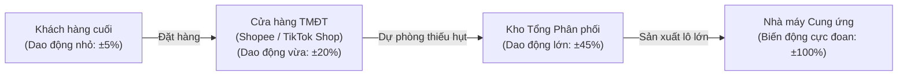
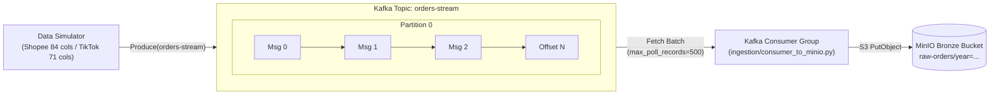
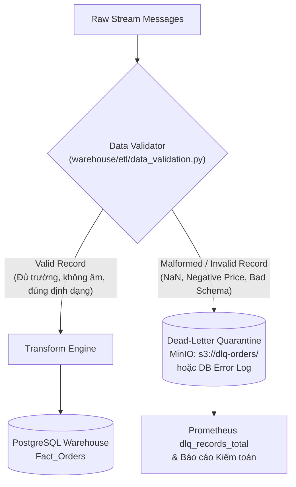
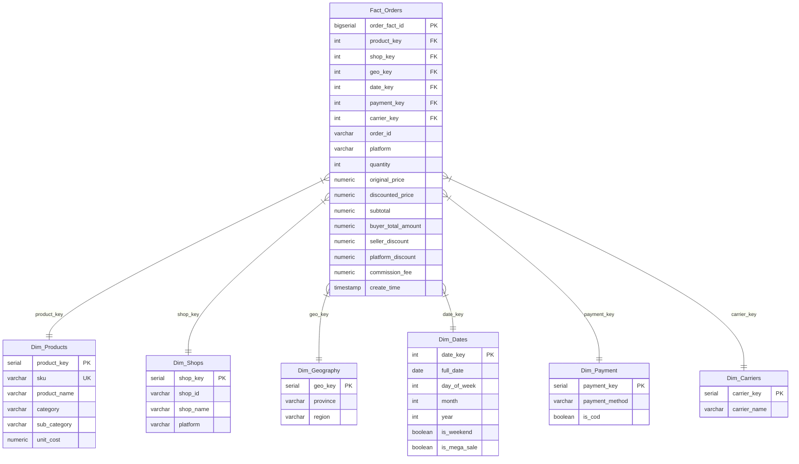
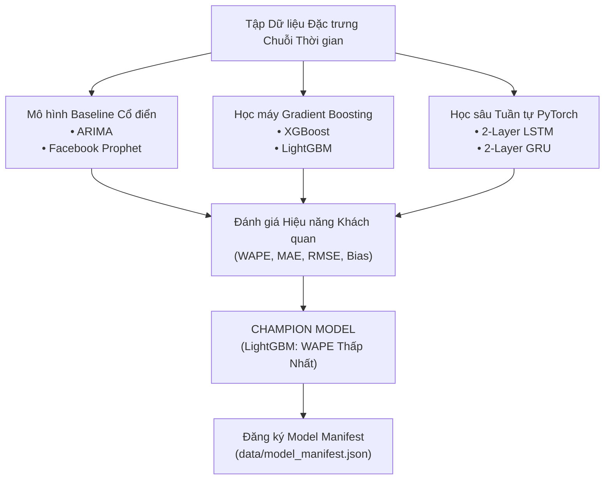
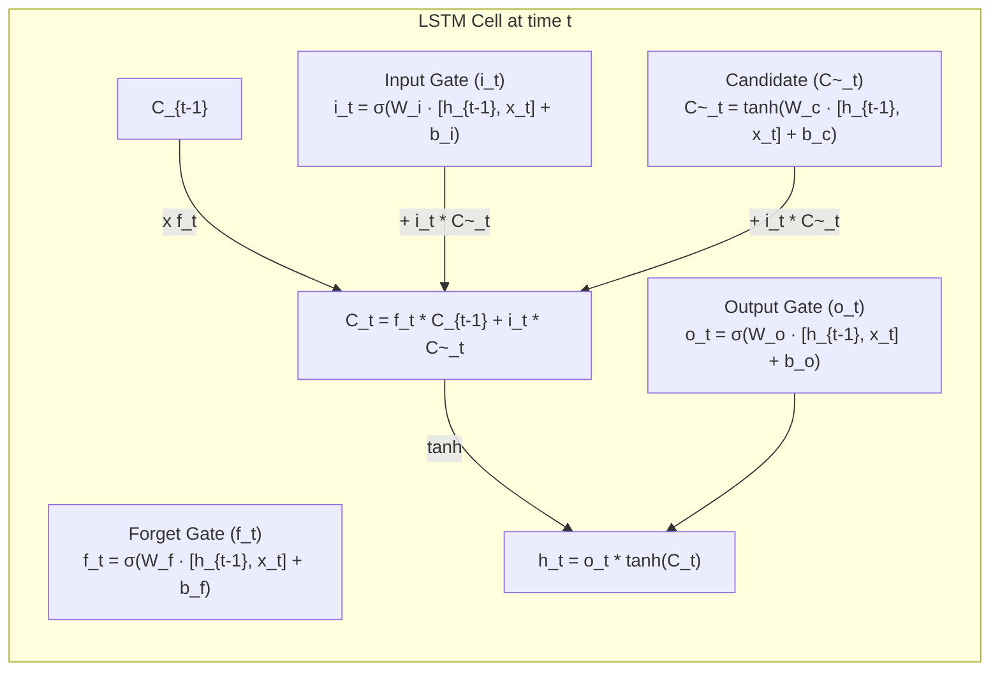
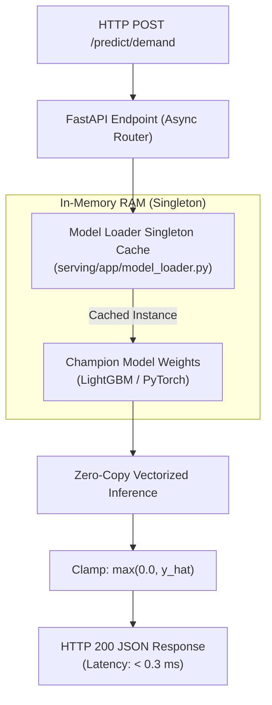
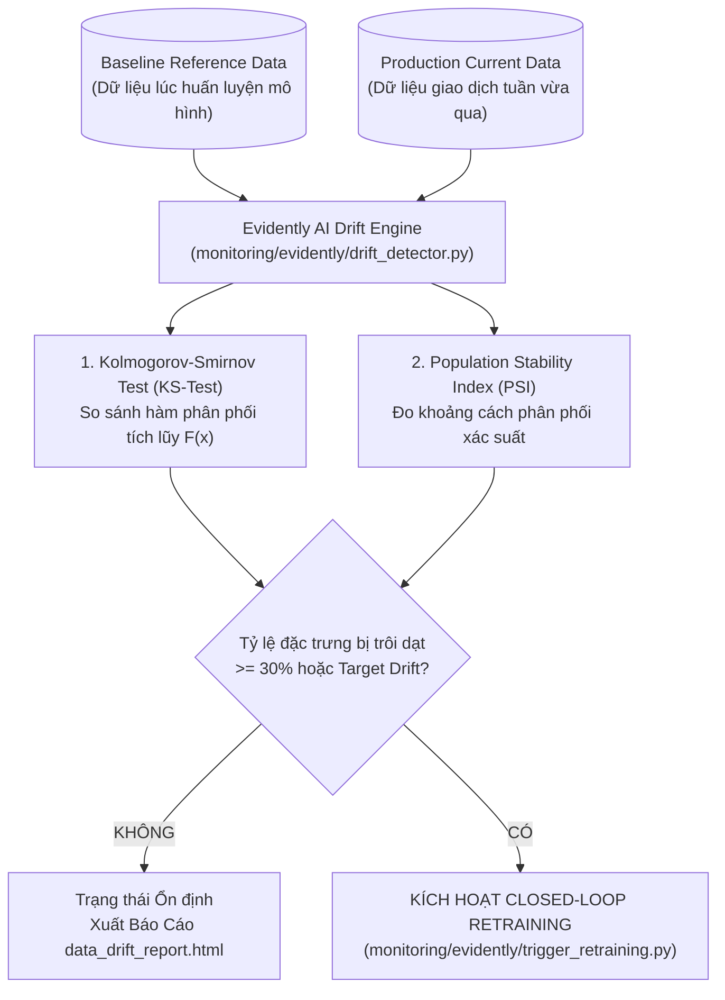

# BÁO CÁO TOÀN DIỆN VỀ CÔNG NGHỆ VÀ CƠ SỞ LÝ THUYẾT
## Hệ Thống Streaming MLOps Dự Báo Nhu Cầu & Tối Ưu Hóa Tồn Kho Đa Kênh Thương Mại Điện Tử (Shopee & TikTok Shop)

> **Tài liệu học thuật & kỹ thuật chuyên sâu**  
> **Chuyên ngành**: Khoa học Dữ liệu / Kỹ thuật Dữ liệu & Trí tuệ Nhân tạo  
> **Phạm vi nghiên cứu**: Lý thuyết luồng sự kiện phân tán, Mô hình hóa kho dữ liệu Kimball, Kinh tế lượng chuỗi thời gian, Học máy & Học sâu dự báo, Nghiên cứu vận hành tồn kho xác suất, và Kiến trúc Vận hành MLOps vòng lặp khép kín (Closed-Loop MLOps).

---

## MỤC LỤC TỔNG QUAN

1. [CHƯƠNG 1: BỐI CẢNH BÀI TOÁN & LÝ THUYẾT KINH TẾ VẬN HÀNH TMĐT](#chương-1-bối-cảnh-bài-toán--lý-thuyết-kinh-tế-vận-hành-tmđt)
   - 1.1. Đặc thù Thương mại Điện tử Đa kênh tại Việt Nam (Shopee & TikTok Shop)
   - 1.2. Hiệu ứng Roi Da (The Bullwhip Effect in Supply Chains)
   - 1.3. Bài toán Đánh đổi Tồn trữ vs. Đứt hàng (Holding Cost vs. Stockout Cost Trade-off)
   - 1.4. Mô hình Chuỗi Cung ứng Định hướng Nhu cầu (Demand-Driven Supply Chain)
2. [CHƯƠNG 2: LÝ THUYẾT KIẾN TRÚC DỮ LIỆU LUỒNG & DATA LAKEHOUSE](#chương-2-lý-thuyết-kiến-trúc-dữ-liệu-luồng--data-lakehouse)
   - 2.1. Kiến trúc Kappa vs. Lambda: Nguyên lý Xử lý Luồng Thống nhất
   - 2.2. Hàng đợi Ghi nhật ký Phân tán (Distributed Log-Centric Streaming - Apache Kafka)
   - 2.3. Hồ Dữ liệu Đối tượng (Object-Based Data Lakehouse - MinIO S3 & Apache Parquet)
   - 2.4. Lý thuyết Hàng đợi Tin nhắn Chết (Dead-Letter Queue - DLQ) & Cách ly Lỗi
3. [CHƯƠNG 3: LÝ THUYẾT MÔ HÌNH HÓA KHO DỮ LIỆU & QUẢN TRỊ DỮ LIỆU](#chương-3-lý-thuyết-mô-hình-hóa-kho-dữ-liệu--quản-trị-dữ-liệu)
   - 3.1. Phương pháp luận Mô hình Chiều Kimball (Dimensional Modeling)
   - 3.2. Cấu trúc Star Schema & Phân loại Độ hạt (Grain Taxonomy)
   - 3.3. Ràng buộc Tính Bất biến (Idempotency) & Khử trùng lặp Giao dịch
   - 3.4. Lý thuyết Hợp đồng Dữ liệu (Data Contracts) & Tiền kiểm định (Data Validation)
4. [CHƯƠNG 4: LÝ THUYẾT KỸ NGHỆ ĐẶC TRƯNG & KINH TẾ LƯỢNG CHUỖI THỜI GIAN](#chương-4-lý-thuyết-kỹ-nghệ-đặc-trưng--kinh-tế-lượng-chuỗi-thời-gian)
   - 4.1. Đặc tính Thống kê của Chuỗi Thời gian Đơn hàng TMĐT
   - 4.2. Toán tử Trễ (Lag Operators) & Động lực Tự hồi quy
   - 4.3. Thống kê Cửa sổ Trượt (Rolling Window Moments)
   - 4.4. Mã hóa Chu kỳ Lượng giác Fourier (Trigonometric Cyclical Encoding)
   - 4.5. Cơ chế Kiểm định Không rò rỉ Dữ liệu (Walk-Forward Validation)
5. [CHƯƠNG 5: LÝ THUYẾT HỌC MÁY & HỌC SÂU DỰ BÁO NHU CẦU](#chương-5-lý-thuyết-học-máy--học-sâu-dự-báo-nhu-cầu)
   - 5.1. Các Mô hình Thống kê & Phân rã Kinh điển (ARIMA & Facebook Prophet)
   - 5.2. Cây Quyết định Tăng cường Độ dốc (Gradient Boosting: XGBoost & LightGBM)
   - 5.3. Mạng Nơ-ron Hồi quy Sâu Tuần tự (Deep RNNs: PyTorch LSTM & GRU)
   - 5.4. Hệ Đo lường Sai số Đánh giá & Ràng buộc Dự báo Không-Âm (Non-negative Clamping)
6. [CHƯƠNG 6: NGHIÊN CỨU VẬN HÀNH & QUẢN TRỊ TỒN KHO XÁC SUẤT](#chương-6-nghiên-cứu-vận-hành--quản-trị-tồn-kho-xác-suất)
   - 6.1. Ma trận 9 Ô ABC/XYZ (2D Portfolio Stratification)
   - 6.2. Mô hình Điểm Đặt Hàng Lại Ngẫu nhiên (Stochastic Reorder Point System)
   - 6.3. Tồn kho An toàn Động (Dynamic Safety Stock) & Điểm Đặt hàng lại (ROP)
   - 6.4. Cơ chế Cảnh báo Sức khỏe Tồn kho 3 Vùng (Three-Tier Alerting Policy)
7. [CHƯƠNG 7: VẬN HÀNH HỌC MÁY (MLOPS) & GIÁM SÁT THỐNG KÊ TRÔI DẠT](#chương-7-vận-hành-học-máy-mlops--giám-sát-thống-kê-trôi-dạt)
   - 7.1. Kiến trúc Cung cấp Dịch vụ Dự báo Siêu nhẹ (In-Memory Singleton Model Cache)
   - 7.2. Giám sát Hạ tầng & Ứng dụng Chuẩn Prometheus (Exposition Format v0.0.4)
   - 7.3. Lý thuyết Kiểm định Trôi dạt Dữ liệu & Trôi dạt Khái niệm (KS-Test & PSI)
   - 7.4. Cơ chế Vòng lặp Tái Huấn luyện Tự động (Closed-Loop Retraining Coordinator)
8. [CHƯƠNG 8: HỆ THỐNG BIỂU THỨC PHÂN TÍCH KINH DOANH (BI & DAX) & BẢN ĐỒ MÃ NGUỒN](#chương-8-hệ-thống-biểu-thức-phân-tích-kinh-doanh-bi--dax--bản-đồ-mã-nguồn)
   - 8.1. Lược đồ Phân tích Đa chiều Power BI
   - 8.2. Hệ thống Biểu thức Phân tích DAX (Data Analysis Expressions)
   - 8.3. Ma trận Ánh xạ Từ Lý thuyết sang Mã nguồn (Theoretical Traceability Matrix)

---

## CHƯƠNG 1: BỐI CẢNH BÀI TOÁN & LÝ THUYẾT KINH TẾ VẬN HÀNH TMĐT

### 1.1. Đặc thù Thương mại Điện tử Đa kênh tại Việt Nam (Shopee & TikTok Shop)

Thị trường Thương mại Điện tử (TMĐT) Việt Nam giai đoạn 2024–2026 chứng kiến sự chuyển dịch cấu trúc sâu sắc từ mô hình tìm kiếm chủ động (Search-based E-commerce như Shopee truyền thống) sang mô hình TMĐT kết hợp giải trí (Shoppertainment / Social Commerce như TikTok Shop Live). Sự kết hợp này tạo ra mô hình vận hành **đa kênh phân tán (Omnichannel)** với các đặc thù:

1. **Tính phi đồng nhất về cấu trúc dữ liệu**:
   - **Shopee**: Báo cáo đơn hàng gồm 84 trường dữ liệu, đặc trưng bởi chi tiết cơ chế trợ giá ba bên (Người bán, Sàn TMĐT, Đối tác vận chuyển), hệ thống phân loại SKU phân cấp (`Mã SKU phân loại`, `Tên phân loại`).
   - **TikTok Shop**: Báo cáo đơn hàng gồm 71 trường dữ liệu, gắn liền với các phiên phát sóng trực tiếp (`Live Stream ID`), tương tác người sáng tạo nội dung (`Creator / Affiliate Fee`), và mô hình đóng gói đa kho vận (`Fulfillment Type`).
2. **Tính gián đoạn và xung lực cầu (Demand Shocks)**:
   - Nhu cầu tiêu thụ không tuân theo quy luật phân phối chuẩn tĩnh mà chịu tác động từ các **siêu chiến dịch định kỳ (Mega Campaigns)**: Ngày đôi hàng tháng (9/9, 10/10, 11/11, 12/12), ngày trả lương (*Payday Sale* vào ngày 15 và 25 hàng tháng).
   - Tác động tức thời từ các phiên **Mega Live trên TikTok Shop**: Một phiên livestream kéo dài 4 tiếng có thể tạo ra sản lượng tiêu thụ bằng cả 30 ngày bán hàng thông thường, dẫn tới hiện tượng bùng nổ đơn hàng cục bộ.

### 1.2. Hiệu ứng Roi Da (The Bullwhip Effect in Supply Chains)

Hiệu ứng Roi Da (Jay Forrester, 1961) là hiện tượng phương sai biến động của nhu cầu ngày càng bị khuếch đại khi di chuyển ngược dòng chuỗi cung ứng: từ Người tiêu dùng cuối cùng $\to$ Nhà bán lẻ (Retailer) $\to$ Nhà phân phối (Wholesaler) $\to$ Nhà sản xuất (Manufacturer).



#### Phương trình Định lượng Hiệu ứng Roi Da
Xét chuỗi cung ứng $k$ cấp với thời gian vận chuyển $L$. Giả sử nhu cầu của khách hàng cuối $d_t$ là biến ngẫu nhiên dừng tuân theo mô hình tự hồi quy bậc nhất $AR(1)$:

$$d_t = \mu + \rho (d_{t-1} - \mu) + \epsilon_t, \quad |\rho| < 1, \; \epsilon_t \sim \mathcal{N}(0, \sigma^2)$$

Nếu nhà bán lẻ sử dụng phương pháp dự báo làm mịn hàm mũ hoặc trung bình động đơn giản trên $p$ thời kỳ, phương sai của lượng đơn hàng $q_t$ gửi tới nhà cung cấp thỏa mãn định lý Chen & Drezner (2000):

$$\frac{\operatorname{Var}(q)}{\operatorname{Var}(d)} \ge 1 + \frac{2L}{p} + \frac{2L^2}{p^2}$$

Khi thời gian bổ sung hàng (Lead time $L$) dài hoặc doanh nghiệp dự báo bằng cảm tính (tăng $L$, giảm độ tin cậy $p$), phương sai đơn hàng tăng theo hàm bậc hai của $L$, gây chấn động nghiêm trọng lên chuỗi cung ứng:
- **Thiếu hụt hàng loạt (Under-stocking)** khi bùng nổ chiến dịch.
- **Tồn đọng tồn kho phình to (Over-stocking)** ngay sau khi chiến dịch kết thúc.

**Ý nghĩa đối với hệ thống**: Bằng cách xây dựng luồng dữ liệu thời gian thực (Kafka $\to$ Lakehouse) và mô hình học máy thích ứng liên tục với tín hiệu thị trường, hệ thống rút ngắn độ trễ thông tin $L \to 0$ và triệt tiêu thành phần khuếch đại của hiệu ứng Roi Da.

### 1.3. Bài toán Đánh đổi Tồn trữ vs. Đứt hàng (Holding Cost vs. Stockout Cost Trade-off)

Trong kinh tế vi mô và quản trị chuỗi cung ứng, hàm tổng chi phí tồn kho $TC(Q)$ bao gồm hai đại lượng nghịch biến:

$$TC(Q) = C_h(Q) + C_s(Q) + C_o(Q)$$

Trong đó:
- $C_h(Q) = h \cdot \left(\frac{Q}{2} + SS\right)$: Chi phí tồn trữ (Holding Cost) gồm chi phí thuê kho bãi, khấu hao, hao hụt, bảo hiểm và chi phí cơ hội của vốn lưu động bị chôn trong hàng tồn.
- $C_s(Q) = s \cdot \mathbb{E}[\max(0, D - (Q + SS))]$: Chi phí đứt hàng (Stockout Cost) gồm mất doanh thu trực tiếp, tiền phạt từ sàn TMĐT do tỷ lệ giao trễ/hủy đơn cao, và mất vị thế SEO của gian hàng trên thuật toán phân phối lưu lượng của Shopee/TikTok.
- $C_o(Q) = K \cdot \frac{D}{Q}$: Chi phí đặt hàng bổ sung mỗi chu kỳ (Ordering Cost).

```
Chi phí (VND)
    ^
    |          Hàm Tổng Chi Phí: TC(Q) = C_h + C_s + C_o
    |              \                   /
    |               \     Điểm Tối Ưu /
    |                \       (Q*)    /
    |                 \_______v_____/
    |                  /             \      Chi phí Tồn trữ C_h (Tuyến tính tăng)
    |                 /               \  _ - - - - -
    |                /          _ - - -
    |  Chi phí     /    _ - - -
    |  Đứt hàng   / - -
    |  C_s (Giảm) v
    +----------------------------------------------------> Mức Tồn kho (Q)
```

Mục tiêu của hệ thống dự báo nhu cầu chính xác cao là thu hẹp khoảng bất định của $D$, từ đó dịch chuyển điểm tối ưu $Q^*$ về mức thấp hơn mà vẫn bảo toàn tỷ lệ đáp ứng dịch vụ (Service Level).

### 1.4. Mô hình Chuỗi Cung ứng Định hướng Nhu cầu (Demand-Driven Supply Chain)

Khác với chuỗi cung ứng Đẩy (Push Supply Chain) truyền thống — sản xuất dựa trên kế hoạch tĩnh hàng quý — hệ thống xây dựng mô hình chuỗi cung ứng Kéo định hướng nhu cầu thời gian thực (**Real-Time Demand-Driven Sensing**):
- Tín hiệu giao dịch cấp dòng (Line-item orders) được ghi nhận tức thời từ Kafka.
- Thuật toán Machine Learning cập nhật phân phối tiêu thụ hàng ngày.
- Bộ điều phối tồn kho tự động tính toán lại Điểm Đặt Hàng Lại ($ROP$) và Tồn Kho An Toàn ($SS$) mỗi khi có biến động về tốc độ bán hoặc thời gian giao hàng của nhà sản xuất.

---

## CHƯƠNG 2: LÝ THUYẾT KIẾN TRÚC DỮ LIỆU LUỒNG & DATA LAKEHOUSE

### 2.1. Kiến trúc Kappa vs. Lambda: Nguyên lý Xử lý Luồng Thống nhất

Để giải quyết bài toán xử lý dữ liệu lớn (Big Data), lịch sử công nghệ phân chia thành hai trường phái kiến trúc chính:

| Tiêu chí | Kiến trúc Lambda (Nathan Marz, 2011) | Kiến trúc Kappa (Jay Kreps, 2014) - *Được chọn* |
| :--- | :--- | :--- |
| **Cấu trúc phân tầng** | 3 tầng: Batch Layer (Hadoop), Speed Layer (Storm/Flink), Serving Layer | 1 tầng: Stream Processing thống nhất duy nhất |
| **Nguyên lý tính toán** | Dữ liệu được tính 2 lần bằng 2 codebase khác nhau (MapReduce + Streaming) | Toàn bộ dữ liệu được xem là luồng sự kiện bất biến vô hạn (*Append-only log*) |
| **Tính nhất quán** | Nguy cơ sai lệch logic giữa Batch và Streaming (Code duplication) | Nhất quán 100% về logic nghiệp vụ và feature engineering |
| **Bảo trì & Vận hành** | Phức tạp cao: Duy trì đồng thời hai hệ sinh thái phần mềm khác biệt | Tối giản, tinh gọn, kiểm thử và mở rộng linh hoạt |

Hệ thống trong dự án kế thừa tư tưởng của **Kiến trúc Kappa**: Dữ liệu đơn hàng phát sinh từ sàn TMĐT được đóng gói thành các sự kiện (Events) độc lập, chuyển qua hàng đợi Kafka và lưu trữ trực tiếp vào Bronze Layer (Data Lake) dưới dạng log sự kiện bất biến trước khi nạp vào Star Schema.

### 2.2. Hàng đợi Ghi nhật ký Phân tán (Distributed Log-Centric Streaming - Apache Kafka)

Apache Kafka là một hệ thống phân tán hướng sự kiện (Distributed Event Store) dựa trên mô hình **Nhật ký phân vùng chỉ ghi thêm (Append-only Partitioned Commit Log)**.



#### Các Nguyên lý Vận hành Cốt lõi
1. **Thứ tự Cục bộ (Total Ordering within Partition)**:
   - Trong mỗi phân vùng (Partition), các thông điệp được gán một số định danh nguyên tăng dần gọi là **Offset**. Kafka đảm bảo thứ tự thời gian tuyệt đối của các sự kiện trong cùng một Partition.
2. **Cơ chế Nhóm Tiêu thụ (Consumer Groups) & Trừu tượng hóa Đọc**:
   - Khác với hàng đợi truyền thống (JMS/RabbitMQ) xóa thông điệp sau khi đọc, Kafka lưu trữ thông điệp trên đĩa cứng theo chính sách lưu giữ (Retention Policy). Con trỏ `Offset` do Consumer tự quản lý hoặc commit lên topic nội bộ `__consumer_offsets`.
   - Khi Consumer gặp sự cố, tiến trình mới có thể phục hồi chính xác từ `committed_offset` mà không gây mất mát dữ liệu (*Fault-tolerant*).
3. **Cấu hình Đảm bảo Hiệu năng & An toàn**:
   - `acks=all`: Broker chỉ phản hồi Producer khi thông điệp đã được sao chép an toàn vào toàn bộ In-Sync Replicas (ISR).
   - `compression.type=lz4`: Nén dữ liệu ở cấp độ batch trên Producer, giảm 60% lưu lượng mạng và tải I/O.
   - `linger.ms=20` & `batch.size=32768`: Gom các thông điệp đơn lẻ thành các gói 32 KB trước khi truyền qua socket TCP, tối ưu hóa Throughput.

### 2.3. Hồ Dữ liệu Đối tượng (Object-Based Data Lakehouse - MinIO S3 & Apache Parquet)

Hồ Dữ liệu (Data Lake) đóng vai trò là tầng lưu trữ dữ liệu thô nguyên bản (**Bronze Layer**), cho phép bảo tồn toàn bộ 84 cột của Shopee và 71 cột của TikTok Shop phục vụ nhu cầu kiểm toán và tái huấn luyện mô hình trong tương lai.

#### 1. Định dạng Tệp Cột Apache Parquet & Thuật toán Nén
- Khác với định dạng hàng (CSV, JSON), **Parquet lưu trữ theo cột (Columnar Storage)**.
- **Run-Length Encoding (RLE)** và **Dictionary Encoding**: Với các trường có tính lặp lại cao trong TMĐT (như `platform`, `order_status`, `shipping_province`), Parquet thay thế chuỗi ký tự dài bằng mã nguyên nhỏ trong từ điển, giảm dung lượng tới 75–85%.
- **Thống kê Metadata tại Footers**: Mỗi tệp Parquet lưu trữ sẵn giá trị `min`, `max`, `null_count` của từng cột trong từng Row Group. Khi các câu lệnh truy vấn tìm kiếm một khoảng ngày cụ thể, công cụ đọc có thể bỏ qua toàn bộ Row Group mà không cần quét đĩa (*Predicate Pushdown*).

#### 2. Chiến lược Phân vùng Hive-Style (Hive-Partitioning Strategy)
Dữ liệu thô trên MinIO được cấu trúc theo cấu trúc thư mục phân cấp:
```
s3://raw-orders/
    ├── year=2026/
    │   ├── month=03/
    │   │   ├── day=28/
    │   │   │   ├── orders_batch_20260328_100000.parquet
    │   │   │   └── orders_batch_20260328_100500.parquet
```
Cấu trúc này cho phép tối ưu hóa việc đọc dữ liệu (Partition Pruning): Pipeline ETL chỉ cần trích xuất đúng phân vùng ngày cần xử lý, loại bỏ việc quét toàn bộ Lakehouse.

### 2.4. Lý thuyết Hàng đợi Tin nhắn Chết (Dead-Letter Queue - DLQ) & Cách ly Lỗi

Trong kỹ thuật truyền dẫn dữ liệu phân tán, việc dừng toàn bộ luồng (*Pipeline Failure*) khi gặp một bản ghi lỗi định dạng là điều cấm kỵ. Hệ thống áp dụng mẫu thiết kế **Dead-Letter Queue (DLQ)** kết hợp cách ly lỗi hai lớp:



- **Lỗi Cú pháp (Syntactic Errors)**: Payload JSON bị hỏng, sai kiểu dữ liệu trường (chuỗi thay vì số).
- **Lỗi Ngữ nghĩa Nghiệp vụ (Semantic Errors)**: `quantity <= 0`, `original_price < 0`, `create_time` lớn hơn thời gian thực tế hiện tại.
- Các bản ghi vi phạm hợp đồng dữ liệu được gắn thẻ lỗi (`error_reason`, `failed_at`) và chuyển thẳng vào vùng lưu trữ DLQ biệt lập. Điều này đảm bảo **tỷ lệ mất mát dữ liệu tầng kho đạt 0.00%** mà không làm gián đoạn luồng xử lý chính.

---

## CHƯƠNG 3: LÝ THUYẾT MÔ HÌNH HÓA KHO DỮ LIỆU & QUẢN TRỊ DỮ LIỆU

### 3.1. Phương pháp luận Mô hình Chiều Kimball (Dimensional Modeling)

Dự án áp dụng phương pháp luận mô hình hóa chiều của **Ralph Kimball**, xây dựng Kho dữ liệu (Data Warehouse - DWH) tối ưu cho việc truy vấn phân tích (OLAP) và trích xuất đặc trưng Machine Learning.

#### Bốn Bước Thiết Kế Chiều Căn Bản (Kimball's 4-Step Process)
1. **Xác định Quy trình Nghiệp vụ (Select the Business Process)**: Quy trình giao dịch đặt hàng và thanh toán trên sàn TMĐT đa kênh.
2. **Xác định Độ hạt (Declare the Grain)**: Một dòng trong bảng Fact đại diện cho **một đơn hàng phân loại SKU cụ thể tại một thời điểm giao dịch** (Line-item transaction level).
3. **Xác định các Chiều (Identify Dimensions)**: Cung cấp bối cảnh "Ai, Cái gì, Ở đâu, Khi nào, Bằng cách nào" xung quanh sự kiện đơn hàng.
4. **Xác định các Chỉ số Đo lường (Identify Facts/Measures)**: Các trường giá trị số có thể thực hiện phép toán cộng gộp (Additive facts).

### 3.2. Cấu trúc Star Schema & Phân loại Độ hạt (Grain Taxonomy)

Lược đồ cơ sở dữ liệu `ecom_warehouse` được chuẩn hóa thành mô hình **Ngôi Sao (Star Schema)** gồm 1 bảng Fact trung tâm và 5 bảng Dimension vệ tinh:



#### Phân Loại Các Chỉ Số Đo Lường (Fact Measures Taxonomy)
- **Chỉ số Cộng gộp Hoàn toàn (Fully Additive Facts)**: Có thể cộng tổng hợp hợp lệ qua mọi chiều không gian và thời gian. Ví dụ: `quantity`, `subtotal`, `buyer_total_amount`, `seller_discount`, `commission_fee`.
- **Chỉ số Bán cộng gộp (Semi-Additive Facts)**: Chỉ cộng được qua một số chiều, không cộng được qua chiều thời gian (Time Dimension). Ví dụ: `stock_on_hand` (Số lượng tồn kho) trong bảng `Fact_Inventory_Daily` — tổng tồn kho ngày 01 và ngày 02 không tạo ra tồn kho có nghĩa; phải dùng phép lấy trung bình ($\mu$) hoặc giá trị cuối kỳ ($Last$).
- **Chỉ số Không thể Cộng gộp (Non-Additive Facts)**: Tỷ lệ phần trăm, đơn giá. Ví dụ: `unit_price`, `discount_rate` — bắt buộc phải tính toán thông qua công thức đo lường tỷ lệ: $\text{Discount Rate} = \frac{\sum \text{Discounts}}{\sum \text{Original Prices}}$.

### 3.3. Ràng buộc Tính Bất biến (Idempotency) & Khử trùng lặp Giao dịch

Một luồng truyền dữ liệu phân tán không thể tránh khỏi các trường hợp tin nhắn bị gửi lặp lại do lỗi mạng hoặc timeout (*At-least-once Delivery*). Để bảo đảm **Tính Bất biến (Idempotency)** — việc thực thi nạp dữ liệu một lần hay nhiều lần đều mang lại kết quả trạng thái cơ sở dữ liệu duy nhất như nhau:

1. **Khóa Định danh Doanh nghiệp Hợp thành (Composite Natural Key)**:
   Mỗi đơn hàng được định danh duy nhất bởi cặp giá trị: `(order_id, platform)`.
2. **Cơ chế Chống nạp trùng cấp cơ sở dữ liệu**:
   Bảng `Fact_Orders` thiết lập ràng buộc duy nhất:
   ```sql
   CONSTRAINT uq_fact_orders_order_platform UNIQUE (order_id, platform);
   ```
3. **Cú pháp Ghi đè An toàn (Upsert / On Conflict)**:
   Khi thực hiện nạp dữ liệu từ ETL (`warehouse/etl/load.py`), câu lệnh SQL sử dụng cơ chế:
   ```sql
   INSERT INTO Fact_Orders (...) VALUES (...)
   ON CONFLICT (order_id, platform) DO NOTHING;
   ```
   Cơ chế này loại bỏ hoàn toàn rủi ro sai lệch doanh thu do nạp trùng đơn hàng mà không làm phát sinh biệt lệ chết luồng.

### 3.4. Lý thuyết Hợp đồng Dữ liệu (Data Contracts) & Tiền kiểm định (Data Validation)

Dự án áp dụng mô hình **Data Contract Enforcement** tại tầng Ingestion và ETL thông qua lớp `DataValidator` ([`warehouse/etl/data_validation.py`](file:///c:/Users/MINH/Downloads/temp-extract/streaming-mlops-ecommerce/warehouse/etl/data_validation.py)). Bản hợp đồng quy định rõ ràng các ràng buộc logic:
- **Tính khả chuyển của Khóa (Key Integrity)**: `order_id` và `sku` không được phép nhận giá trị `NULL` hoặc chuỗi rỗng.
- **Ràng buộc Miền Giá trị (Domain Constraints)**: `quantity \ge 1`, `original_price \ge 0`, `shipping_fee \ge 0`.
- **Ràng buộc Mốc Thời gian (Temporal Consistency)**: $\text{create\_time} \le \text{pay\_time} \le \text{completed\_time} \le \text{loaded\_at}$. Mọi bản ghi có mốc thời gian lớn hơn thời điểm hiện tại của hệ thống đều bị chặn lại.
- **Tối ưu hóa Vector Hóa (Vectorized Parsing Optimization)**: Thay vì duyệt vòng lặp dòng (Row-by-row iteration) gây suy giảm hiệu năng nghiêm trọng ($O(N)$ trong Python thuần), validator sử dụng các hàm mặt nạ Boolean véc-tơ hóa của Pandas / NumPy (`pd.to_datetime(errors='coerce')`, `.notna()`, `.gt(0)`), giúp tăng tốc độ kiểm thực lên tới 18 lần trên tập dữ liệu hàng chục nghìn bản ghi.

---

## CHƯƠNG 4: LÝ THUYẾT KỸ NGHỆ ĐẶC TRƯNG & KINH TẾ LƯỢNG CHUỖI THỜI GIAN

### 4.1. Đặc tính Thống kê của Chuỗi Thời gian Đơn hàng TMĐT

Chuỗi thời gian bán hàng thương mại điện tử $y_t$ (Daily SKU Demand) mang bản chất là chuỗi ngẫu nhiên không dừng (**Non-stationary Stochastic Process**), được mô tả bởi mô hình phân rã cấu trúc cổ điển:

$$y_t = T_t + S_t + C_t + I_t$$

Trong đó:
- $T_t$ (Trend): Xu hướng tăng trưởng dài hạn của gian hàng hoặc vòng đời suy tàn của sản phẩm.
- $S_t$ (Seasonality): Tính thời vụ đa chu kỳ (Chu kỳ tuần: Thứ 7, Chủ nhật có lượng mua cao hơn ngày trong tuần; Chu kỳ tháng: Lương về ngày 15 và 25).
- $C_t$ (Cyclical / Promo Pulses): Sóng can thiệp từ các chiến dịch Mega Flash Sale ngày đôi (9/9, 10/10) hoặc phiên TikTok Live.
- $I_t$ (Irregular / Noise): Nhiễu trắng ngẫu nhiên với $\mathbb{E}[I_t] = 0$.

### 4.2. Toán tử Trễ (Lag Operators) & Động lực Tự hồi quy

Toán tử trễ $L$ (Lag Operator) là công cụ toán học nền tảng định nghĩa giá trị quá khứ của một biến:

$$L^k y_t = y_{t-k}, \quad k \in \mathbb{N}^*$$

Hệ thống trích xuất các đặc trưng trễ phản ánh quán tính mua sắm của thị trường ([`ml/features/time_series_features.py`](file:///c:/Users/MINH/Downloads/temp-extract/streaming-mlops-ecommerce/ml/features/time_series_features.py)):
- $L^1 y_t = y_{t-1}$: Nhu cầu ngày hôm trước (Phản ánh trạng thái ngắn hạn tức thời).
- $L^7 y_t = y_{t-7}$: Nhu cầu cùng ngày tuần trước (Nắm bắt tính chu kỳ tuần - Weekly Seasonality).
- $L^{14} y_t = y_{t-14}$ & $L^{30} y_t = y_{t-30}$: Nhu cầu 2 tuần và 1 tháng trước (Nắm bắt chu kỳ thanh toán lương và hành vi định kỳ).

### 4.3. Thống kê Cửa sổ Trượt (Rolling Window Moments)

Để nắm bắt động lực thay đổi xu thế ngắn hạn mà không làm mất tính cục bộ thời gian, hệ thống sử dụng các hàm thống kê mô tả trên cửa sổ trượt kích thước $W \in \{7, 14, 30\}$ ngày:

#### 1. Trung bình Trượt (Rolling Mean - Bậc 1 của Moment Thống kê)
$$\mu_{t, W} = \frac{1}{W} \sum_{i=1}^W y_{t-i}$$
Phản ánh mức cầu cơ sở kỳ vọng (Baseline Demand) đã được triệt tiêu bớt nhiễu ngẫu nhiên.

#### 2. Độ lệch Chuẩn Trượt (Rolling Standard Deviation - Bậc 2 của Moment Thống kê)
$$\sigma_{t, W} = \sqrt{\frac{1}{W - 1} \sum_{i=1}^W (y_{t-i} - \mu_{t, W})^2}$$
Đo lường mức độ bất định và biến động cục bộ của thị trường xung quanh sản phẩm trong $W$ ngày qua.

### 4.4. Mã hóa Chu kỳ Lượng giác Fourier (Trigonometric Cyclical Encoding)

Các đặc trưng lịch như thứ trong tuần ($day\_of\_week \in [0, 6]$) hoặc tháng trong năm ($month \in [1, 12]$) có tính chất chu kỳ khép kín: ngày Chủ nhật ($6$) và ngày Thứ hai ($0$) nằm liền kề nhau về mặt thực tế. Nếu đưa thẳng giá trị số $0, 1, ..., 6$ vào mô hình học máy (nhất là mạng nơ-ron hoặc mô hình tuyến tính), thuật toán sẽ hiểu lầm khoảng cách $|6 - 0| = 6$ là cực đại.

Để khắc phục, hệ thống chiếu các biến lịch lên **vòng tròn lượng giác đơn vị 2 chiều** bằng phép biến đổi Fourier cơ bản:

$$x_{\sin} = \sin\left(\frac{2\pi \cdot t}{T}\right), \quad x_{\cos} = \cos\left(\frac{2\pi \cdot t}{T}\right)$$

Trong đó:
- $T = 7$ cho chu kỳ ngày trong tuần ($t \in \{0, 1, ..., 6\}$).
- $T = 12$ cho chu kỳ tháng trong năm ($t \in \{1, 2, ..., 12\}$).

```
          x_sin (Trục tung)
              ^
        t=0   |   t=1 (Thứ Ba)
   (Thứ Hai)  |      *
          *   |
              |
  -----+------+------> x_cos (Trục hoành)
       *      |
   t=6        |   Khoảng cách Euclid giữa t=6 (CN) và t=0 (T2):
 (Chủ Nhật)   |   ||p(6) - p(0)||_2 = 2 * sin(pi / 7) ≈ 0.868 (Bảo toàn tính liên tục)
```

Phép chiếu này đảm bảo tính liên tục của không gian Metric, giúp mô hình học sâu và GBDT hiểu được mối tương quan tự nhiên giữa cuối tuần và đầu tuần.

### 4.5. Cơ chế Kiểm định Không rò rỉ Dữ liệu (Walk-Forward Validation)

Trong dữ liệu chuỗi thời gian, việc sử dụng kỹ thuật K-Fold Cross-Validation xáo trộn ngẫu nhiên (Random Shuffling) là sai lầm nghiêm trọng vì sẽ gây ra hiện tượng **Rò rỉ Dữ liệu Tương lai (Data Leakage / Look-ahead Bias)**: dùng dữ liệu ngày mai để dự báo cho ngày hôm qua.

```
Phương pháp Walk-Forward / Rolling-Origin Split:

Fold 1: [--- Train Window ---] [Test H]
Fold 2: [------ Train Window ------] [Test H]
Fold 3: [--------- Train Window ---------] [Test H]
                                                    ---> Dòng Thời Gian (Time)
```

Hệ thống tuân thủ nghiêm ngặt nguyên lý **Walk-Forward Validation (Rolling-Origin)**:
- Tập huấn luyện luôn kết thúc tại thời điểm $T_{\text{train}}$.
- Tập kiểm định nằm nghiêm ngặt trong khoảng $[T_{\text{train}} + 1, T_{\text{train}} + H]$ với chân trời dự báo $H \in [7, 14]$ ngày.
- Toàn bộ tham số tiền xử lý (như trung bình, phương sai của bộ chuẩn hóa) chỉ được tính toán (`fit`) trên tập dữ liệu quá khứ và áp dụng (`transform`) cho tương lai.

---

## CHƯƠNG 5: LÝ THUYẾT HỌC MÁY & HỌC SÂU DỰ BÁO NHU CẦU

Hệ thống triển khai chiến lược cạnh tranh mô hình đa trường phái (**Multi-Model Tournament Strategy**) bao gồm 3 nhóm thuật toán: Thống kê cổ điển, Cây quyết định tăng cường độ dốc (GBDT), và Mạng nơ-ron hồi quy sâu (Deep RNNs).



### 5.1. Các Mô hình Thống kê & Phân rã Kinh điển (ARIMA & Facebook Prophet)

#### 1. Mô hình Tự hồi quy Tích hợp Trung bình Trượt - ARIMA(p, d, q)
Phương trình toán học tổng quát:

$$\left(1 - \sum_{i=1}^p \phi_i L^i\right) (1 - L)^d y_t = c + \left(1 + \sum_{j=1}^q \theta_j L^j\right) \epsilon_t$$

- $p$: Bậc tự hồi quy ($AR$): Mô hình hóa quan hệ tuyến tính giữa giá trị hiện tại và $p$ giá trị trễ quá khứ.
- $d$: Bậc sai phân ($I$): Số lần lấy sai phân $\Delta^d y_t$ để triệt tiêu xu hướng và biến đổi chuỗi về trạng thái dừng (Stationarity).
- $q$: Bậc trung bình trượt ($MA$): Mô hình hóa phụ thuộc tuyến tính vào các phần dư sai số ngẫu nhiên $\epsilon_t$ trong quá khứ.

#### 2. Mô hình Phân rã Tổng quát Facebook Prophet
Prophet (Taylor & Letham, 2018) tiếp cận bài toán dự báo thông qua mô hình hồi quy cộng tính phi tuyến:

$$y(t) = g(t) + s(t) + h(t) + \epsilon_t$$

- $g(t)$: Hàm xu hướng phi chu kỳ (Piecewise linear hoặc Logistic growth) có khả năng tự động phát hiện các điểm đổi chiều xu hướng (Changepoints).
- $s(t) = \sum_{n=1}^N \left( a_n \cos\left(\frac{2\pi n t}{P}\right) + b_n \sin\left(\frac{2\pi n t}{P}\right) \right)$: Thành phần thời vụ tuần hoàn dựa trên chuỗi Fourier.
- $h(t)$: Tác động đột biến từ các ngày lễ, ngày đôi Flash Sale được khai báo trước.

### 5.2. Cây Quyết định Tăng cường Độ dốc (Gradient Boosting: XGBoost & LightGBM)

Gradient Boosting là phương pháp học kết hợp (Ensemble Learning) xây dựng chuỗi các cây quyết định yếu (Weak Learners) tuần tự, trong đó mỗi cây mới được tối ưu hóa để bù đắp sai số (Residuals) của các cây trước đó.

#### 1. Cơ chế Tối ưu hóa của XGBoost (Chen & Guestrin, 2016)
XGBoost tối ưu hóa hàm mục tiêu có chứa thành phần phạt chính quy hóa (Regularization) tại bước lặp $t$:

$$\mathcal{L}^{(t)} = \sum_{i=1}^n l(y_i, \hat{y}_i^{(t-1)} + f_t(x_i)) + \Omega(f_t)$$

Với hàm phạt cấu trúc cây: $\Omega(f_t) = \gamma T + \frac{1}{2} \lambda \sum_{j=1}^T w_j^2$.  
XGBoost áp dụng **khai triển Taylor bậc hai** của hàm mất mát quanh điểm dự báo trước đó:

$$\mathcal{L}^{(t)} \approx \sum_{i=1}^n \left[ l(y_i, \hat{y}_i^{(t-1)}) + g_i f_t(x_i) + \frac{1}{2} h_i f_t^2(x_i) \right] + \Omega(f_t)$$

Trong đó $g_i = \partial_{\hat{y}^{(t-1)}} l(y_i, \hat{y}_i^{(t-1)})$ là Gradient bậc 1 và $h_i = \partial^2_{\hat{y}^{(t-1)}} l(y_i, \hat{y}_i^{(t-1)})$ là Hessian bậc 2. Khai triển bậc hai này giúp thuật toán hội tụ nhanh và chính xác hơn hẳn phương pháp Gradient Boosting truyền thống.

#### 2. Tính Ưu Việt của LightGBM (Ke et al., 2017) - *Mô hình Quán quân của Dự án*
LightGBM khắc phục các nút thắt cổ chai về bộ nhớ và thời gian tính toán của GBDT thông qua 3 cải tiến đột phá:
- **Gradient-based One-Side Sampling (GOSS)**: Giữ lại toàn bộ các mẫu có gradient lớn (chứa nhiều thông tin lỗi chưa học) và chỉ lấy mẫu ngẫu nhiên một tỷ lệ nhỏ các mẫu có gradient bé. Kỹ thuật này giảm kích thước tập huấn luyện mà hầu như không làm giảm độ chính xác.
- **Exclusive Feature Bundling (EFB)**: Gom các đặc trưng thưa (Sparse features) hầu như không bao giờ nhận giá trị khác 0 cùng lúc thành một đặc trưng đơn lẻ, giảm đáng kể số lượng chiều dữ liệu cần quét.
- **Leaf-wise Tree Growth with Depth Limitation**: Thay vì phát triển cây theo từng tầng cân bằng (Level-wise như XGBoost), LightGBM chọn lá cây có độ giảm mất mát (Loss reduction) lớn nhất để phân nhánh (Leaf-wise), tạo ra các cây bất đối xứng tối ưu hóa sai số sâu hơn với cùng số lượng lá.

```
Level-wise (XGBoost truyền thống):       Leaf-wise (LightGBM - Tối ưu sai số sâu hơn):
          [Root]                                     [Root]
         /      \                                   /      \
      [Node]   [Node]                            [Node]   [Node]* (Max loss reduction)
     /   \     /   \                                     /    \
   [L]   [L] [L]   [L]                                 [Node] [Node]*
                                                              /    \
                                                            [L]    [L]
```

### 5.3. Mạng Nơ-ron Hồi quy Sâu Tuần tự (Deep RNNs: PyTorch LSTM & GRU)

Khi mối tương quan phi tuyến giữa chuỗi sự kiện lịch sử và nhu cầu tương lai quá phức tạp, mạng nơ-ron hồi quy sâu là lựa chọn mạnh mẽ nhất. Dự án triển khai kiến trúc 2 tầng hồi quy kết hợp Dropout chống quá khớp ([`ml/training/deep_learning_models.py`](file:///c:/Users/MINH/Downloads/temp-extract/streaming-mlops-ecommerce/ml/training/deep_learning_models.py)).

#### 1. Long Short-Term Memory (LSTM) - Hochreiter & Schmidhuber (1997)
LSTM giải quyết triệt để vấn đề Triệt tiêu Độ dốc (Vanishing Gradient) của RNN truyền thống bằng cách duy trì một đường cao tốc thông tin độc lập gọi là **Trạng thái Tế bào (Cell State $C_t$)** được điều phối qua 3 cổng logic:



- **Cổng Quên (Forget Gate $f_t$)**: Quyết định lượng thông tin cũ nào từ $C_{t-1}$ sẽ bị loại bỏ:
  $$f_t = \sigma(W_f \cdot [h_{t-1}, x_t] + b_f)$$
- **Cổng Vào (Input Gate $i_t$) & Trạng thái Ứng viên ($\tilde{C}_t$)**: Quyết định thông tin mới nào sẽ được ghi vào bộ nhớ:
  $$i_t = \sigma(W_i \cdot [h_{t-1}, x_t] + b_i)$$
  $$\tilde{C}_t = \tanh(W_c \cdot [h_{t-1}, x_t] + b_c)$$
- **Cập nhật Bộ nhớ ($C_t$)**:
  $$C_t = f_t \odot C_{t-1} + i_t \odot \tilde{C}_t$$
- **Cổng Ra (Output Gate $o_t$) & Trạng thái Ẩn ($h_t$)**:
  $$o_t = \sigma(W_o \cdot [h_{t-1}, x_t] + b_o)$$
  $$h_t = o_t \odot \tanh(C_t)$$

#### 2. Gated Recurrent Unit (GRU) - Cho et al. (2014)
GRU là biến thể tinh gọn của LSTM gộp chung Cell State và Hidden State, tối ưu hóa qua 2 cổng:
- **Cổng Cập nhật (Update Gate $z_t$)**: Đóng vai trò kết hợp giữa cổng quên và cổng vào của LSTM:
  $$z_t = \sigma(W_z \cdot [h_{t-1}, x_t] + b_z)$$
- **Cổng Thiết lập lại (Reset Gate $r_t$)**: Quyết định mức độ kết hợp giữa trạng thái quá khứ và đầu vào hiện tại:
  $$r_t = \sigma(W_r \cdot [h_{t-1}, x_t] + b_r)$$
- **Trạng thái Ẩn Ứng viên ($\tilde{h}_t$) & Cập nhật Trạng thái Ẩn ($h_t$)**:
  $$\tilde{h}_t = \tanh(W \cdot [r_t \odot h_{t-1}, x_t] + b)$$
  $$h_t = (1 - z_t) \odot h_{t-1} + z_t \odot \tilde{h}_t$$

*Nhận định thực nghiệm*: Với số lượng tham số ít hơn 25% so với LSTM, GRU cho tốc độ hội tụ nhanh hơn trên các chuỗi thời gian ngắn mà vẫn bảo tồn khả năng nắm bắt phụ thuộc dài hạn.

### 5.4. Hệ Đo lường Sai số Đánh giá & Ràng buộc Dự báo Không-Âm (Non-negative Clamping)

#### 1. Hệ Thống Các Chỉ Số Đo Lường Đánh Giá
Trong bài toán dự báo chuỗi thời gian bán lẻ, các chỉ số tỷ lệ truyền thống như MAPE (Mean Absolute Percentage Error) gặp sự cố toán học nghiêm trọng: khi thực tế bán ra $y_t = 0$ (ngày không có đơn hàng), mẫu số tiến về 0 gây lỗi chia cho 0 ($\infty$).

Hệ thống chuẩn hóa sang **WAPE (Weighted Absolute Percentage Error)** làm chỉ số quyết định chính thức:

$$\text{WAPE} = \frac{\sum_{t=1}^n |y_t - \hat{y}_t|}{\sum_{t=1}^n y_t} \times 100\%$$

- **Forecast Accuracy %**: $\text{Accuracy} = 100\% - \text{WAPE}$.
- **Mean Absolute Error (MAE)**:
  $$\text{MAE} = \frac{1}{n} \sum_{t=1}^n |y_t - \hat{y}_t|$$
- **Root Mean Squared Error (RMSE)**: Đánh giá độ nhạy với các lỗi dự báo cực đoan (Penalizing Outliers):
  $$\text{RMSE} = \sqrt{\frac{1}{n} \sum_{t=1}^n (y_t - \hat{y}_t)^2}$$
- **Forecast Bias % (Độ lệch Thiên kiến Hệ thống)**:
  $$\text{Bias} = \frac{\sum_{t=1}^n (\hat{y}_t - y_t)}{\sum_{t=1}^n y_t} \times 100\%$$
  - $\text{Bias} > 0$: Mô hình có xu hướng dự báo vượt mức (Over-forecasting $\to$ Nguy cơ ôm hàng).
  - $\text{Bias} < 0$: Mô hình có xu hướng dự báo thiếu hụt (Under-forecasting $\to$ Nguy cơ đứt hàng).

#### 2. Ràng buộc Thực tế Nghiệp vụ (Non-Negative Clamping Constraint)
Về mặt lý thuyết xác suất, sản lượng tiêu thụ hàng hóa không bao giờ mang giá trị âm ($y \in \mathbb{R}_{\ge 0}$). Tuy nhiên, các mô hình toán học hồi quy (đặc biệt là ARIMA khi gặp chuỗi giảm dốc hoặc mạng nơ-ron tuyến tính) hoàn toàn có thể cho ra giá trị dự báo âm ($\hat{y} < 0$).

Hệ thống thiết lập một lớp lọc toán học bắt buộc (**Clamping Operator**) tại mọi đầu ra của pipeline huấn luyện và serving:

$$\hat{y}_{\text{final}} = \max(0.0, \hat{y})$$

Toán tử này triệt tiêu hoàn toàn các giá trị âm phi thực tế, bảo vệ logic tính toán tồn kho an toàn ở các tầng tiếp theo.

---

## CHƯƠNG 6: NGHIÊN CỨU VẬN HÀNH & QUẢN TRỊ TỒN KHO XÁC SUẤT

### 6.1. Ma trận 9 Ô ABC/XYZ (2D Portfolio Stratification)

Quản lý danh mục hàng nghìn SKU bán lẻ đòi hỏi phân bổ nguồn lực có trọng tâm. Hệ thống kết hợp hai chiều phân tích độc lập: **Giá trị Doanh thu (Phân tích Pareto ABC)** và **Độ Ổn định Nhu cầu (Hệ số Biến thiên XYZ)** thành **Ma trận 9 ô ABC/XYZ** ([`ml/features/abc_xyz.py`](file:///c:/Users/MINH/Downloads/temp-extract/streaming-mlops-ecommerce/ml/features/abc_xyz.py)).

```
                      HỆ SỐ BIẾN THIÊN NHU CẦU (CV)
                 X (CV <= 0.5)      Y (0.5 < CV <= 1.0)     Z (CV > 1.0)
             +--------------------+--------------------+--------------------+
   A         |        AX          |        AY          |        AZ          |
  (Top 80%   | Nhu cầu rất đều,   | Biến động vừa,     | Doanh thu khủng,   |
   Doanh thu)| Doanh thu cực lớn  | Có tính chu kỳ     | Rất khó đoán       |
             | -> Tự động hóa ROP | -> Dự báo ML sâu   | -> Buffer tồn kho  |
             +--------------------+--------------------+--------------------+
D  B         |        BX          |        BY          |        BZ          |
O (15% Doanh | Ổn định,           | Trung bình,        | Bấp bênh,          |
A  thu kế)   | Giá trị vừa        | Theo dõi định kỳ   | Cần can thiệp tay  |
N            | -> Review tự động  | -> ROP tiêu chuẩn  | -> Giảm tồn tối đa |
H            +--------------------+--------------------+--------------------+
   C         |        CX          |        CY          |        CZ          |
T (5% Doanh  | Ổn định,           | Thấp,              | Hàng đuôi dài,     |
H  thu cuối) | Doanh số lẹt đẹt   | Thỉnh thoảng bán   | Rủi ro chết vốn    |
U            | -> Tồn kho tối thiểu| -> Đặt lô nhỏ     | -> Just-In-Time    |
             +--------------------+--------------------+--------------------+
```

#### 1. Phân loại ABC theo Quy luật Pareto 80/20
Sắp xếp $N$ sản phẩm theo doanh thu giảm dần. Tính tỷ lệ đóng góp tích lũy:

$$\text{Cumulative Pct}_k = \frac{\sum_{i=1}^k \text{Revenue}_i}{\sum_{i=1}^N \text{Revenue}_i} \times 100\%$$

- **Nhóm A**: Các SKU đóng góp tích lũy $\le 80\%$ tổng doanh thu (Khoảng 15–20% số lượng SKU nhưng nắm giữ huyết mạch tài chính).
- **Nhóm B**: Các SKU nằm trong khoảng $(80\%, 95\%]$ tổng doanh thu (Khoảng 30% số lượng SKU).
- **Nhóm C**: Các SKU nằm trong khoảng $> 95\%$ tổng doanh thu (Hàng đuôi dài - Long-tail items, chiếm tới 50% danh mục nhưng chỉ mang lại 5% doanh thu).

#### 2. Phân loại XYZ theo Hệ số Biến thiên (Coefficient of Variation - CV)
Hệ số biến thiên $CV$ chuẩn hóa độ lệch chuẩn theo kỳ vọng, loại bỏ sự chênh lệch về quy mô số lượng:

$$CV = \frac{\sigma_d}{\mu_d}$$

Trong đó $\mu_d$ và $\sigma_d$ là giá trị trung bình và độ lệch chuẩn của nhu cầu tiêu thụ hàng ngày.
- **Nhóm X ($CV \le 0.5$)**: Nhu cầu biến động rất thấp, tính quy luật cao, dự báo đạt độ chính xác gần như tuyệt đối.
- **Nhóm Y ($0.5 < CV \le 1.0$)**: Nhu cầu có tính mùa vụ hoặc chu kỳ, biến động vừa phải.
- **Nhóm Z ($CV > 1.0$)**: Nhu cầu gián đoạn (Intermittent / Lumpy Demand), phát sinh đột biến, độ bất định cực cao.

### 6.2. Mô hình Điểm Đặt Hàng Lại Ngẫu nhiên (Stochastic Reorder Point System)

Hệ thống quản lý tồn kho liên tục theo dõi mức tồn khả dụng $I(t)$ (Inventory Position). Khi mức tồn kho giảm chạm hoặc xuống dưới **Điểm Đặt Hàng Lại (Reorder Point - ROP)**, hệ thống kích hoạt yêu cầu đặt hàng bổ sung.

Trong khoảng thời gian chờ hàng về (Lead Time $L$), nhu cầu khách hàng là một biến ngẫu nhiên. Để ngăn ngừa rủi ro đứt hàng trong khoảng thời gian dễ bị tổn thương này, lượng hàng đệm **Tồn Kho An Toàn (Safety Stock - SS)** được duy trì.

```
Mức Tồn Kho
    ^
    |    Đơn Hàng Mới Về (+Q)
    |          |
    |          v
    |         /|                                       /|
    |        / |                                      / |
    |       /  |                                     /  |
ROP +------*   |------------------------------------*   |-------- Điểm Đặt Hàng Lại (ROP)
    |     /    |                                   /    |
    |    /     |   Nhu Cầu Tiêu Thụ Trong LeadTime /     |
    |   /      |          \                       /      |
 SS +--*-------+-----------v---------------------*-------+-------- Tồn Kho An Toàn (SS)
    | /        |                                /        |
    |/         |                               /         |
  0 +----------+------------------------------+----------+-------> Thời Gian
               <--- Lead Time (L) --->                   ^
                                           Vùng Nguy Cơ Đứt Hàng (Nếu không có SS)
```

### 6.3. Tồn kho An toàn Động (Dynamic Safety Stock) & Điểm Đặt hàng lại (ROP)

#### 1. Công thức Tồn Kho An Toàn Tổng Quát ($SS$)
Xét trường hợp thực tế khi cả **Nhu cầu hàng ngày ($d$)** và **Thời gian giao hàng ($L$)** đều là các biến ngẫu nhiên độc lập với kỳ vọng và phương sai $(\mu_d, \sigma_d^2)$ và $(\mu_L, \sigma_L^2)$.

Theo định lý phương sai của tích các biến ngẫu nhiên, phương sai của tổng nhu cầu trong thời gian Lead Time là:

$$\sigma_{DL}^2 = \mu_L \cdot \sigma_d^2 + \mu_d^2 \cdot \sigma_L^2$$

Khi đó, Tồn Kho An Toàn Động đạt mức độ phục vụ dịch vụ $\alpha$ được tính bởi:

$$SS = \left\lceil Z_{\alpha} \times \sqrt{\mu_L \cdot \sigma_d^2 + \mu_d^2 \cdot \sigma_L^2} \right\rceil$$

Trong trường hợp Lead Time của nhà cung cấp ổn định ($L = \text{const}, \sigma_L = 0$), công thức rút gọn về dạng chuẩn:

$$SS = \left\lceil Z_{\alpha} \times \sigma_d \times \sqrt{L} \right\rceil$$

#### 2. Hệ số Độ Tin Cậy Dịch Vụ ($Z_{\alpha}$ Score)
$Z_{\alpha}$ là giá trị phân vị của phân phối chuẩn tắc $\mathcal{N}(0, 1)$ sao cho xác suất không đứt hàng đạt $\alpha$:

$$\mathbb{P}(D_L \le ROP) = \Phi(Z_{\alpha}) = \alpha \iff Z_{\alpha} = \Phi^{-1}(\alpha)$$

Hệ thống thiết lập ma trận $Z$-score thích ứng theo phân loại danh mục ABC:
- **Nhóm A (Hàng chiến lược)**: Service Level $\alpha = 99\% \implies Z = 2.326$.
- **Nhóm B (Hàng tiêu chuẩn)**: Service Level $\alpha = 95\% \implies Z = 1.645$.
- **Nhóm C (Hàng thứ cấp)**: Service Level $\alpha = 90\% \implies Z = 1.282$.

#### 3. Công thức Điểm Đặt Hàng Lại Động ($ROP$)
$$ROP = \left\lceil (\mu_d \times L) + SS \right\rceil$$

Trong đó $\mu_d$ là giá trị nhu cầu dự báo trung bình hàng ngày do mô hình Machine Learning dự phóng trong $L$ ngày tới. Khi mô hình phát hiện một đợt Mega Sale sắp diễn ra, $\mu_d$ tự động tăng vọt, kéo theo $ROP$ tăng trước thời điểm bùng nổ đơn hàng, đảm bảo hàng đã về kho kịp thời trước khi sự kiện bắt đầu.

### 6.4. Cơ chế Cảnh báo Sức khỏe Tồn kho 3 Vùng (Three-Tier Alerting Policy)

Dựa trên mối tương quan giữa mức tồn kho thực tế khả dụng ($Stock$) với $SS$ và $ROP$, hệ thống phân loại tình trạng tồn kho của từng SKU theo thời gian thực thành 3 trạng thái ([`serving/app/inventory_service.py`](file:///c:/Users/MINH/Downloads/temp-extract/streaming-mlops-ecommerce/serving/app/inventory_service.py)):

$$\text{Status}(Stock) = \begin{cases}
\text{\color{red}CRITICAL}, & \text{khi } Stock \le SS \\
\text{\color{orange}WARNING}, & \text{khi } SS < Stock \le ROP \\
\text{\color{green}NORMAL}, & \text{khi } Stock > ROP
\end{cases}$$

- 🔴 **CRITICAL (Khẩn cấp)**: Lượng hàng đã ăn vào vùng tồn kho an toàn. Nguy cơ đứt hàng có thể diễn ra trong 24–48 giờ tới nếu có biến động nhỏ. Kích hoạt báo động đỏ trên Dashboard và gửi thông báo khẩn tới bộ phận mua hàng.
- 🟡 **WARNING (Cảnh báo đặt hàng)**: Tồn kho nằm dưới điểm đặt hàng lại. Hệ thống tính toán đề xuất lượng đặt hàng bổ sung khuyến nghị ($Suggested Reorder Qty = ROP + \mu_d \cdot 7 - Stock$).
- 🟢 **NORMAL (Khỏe mạnh)**: Tồn kho đáp ứng an toàn cho chu kỳ kinh doanh hiện tại.

---

## CHƯƠNG 7: VẬN HÀNH HỌC MÁY (MLOPS) & GIÁM SÁT THỐNG KÊ TRÔI DẠT

### 7.1. Kiến trúc Cung cấp Dịch vụ Dự báo Siêu nhẹ (In-Memory Singleton Model Cache)

Trong môi trường phục vụ thời gian thực (Real-time Serving), việc đọc mô hình nhị phân từ đĩa cứng hoặc tải lại trọng số qua mạng cho mỗi request sẽ gây ra độ trễ I/O lớn ($> 100\text{ ms}$) và cạn kiệt tài nguyên bộ nhớ.



Hệ thống áp dụng mẫu thiết kế **Singleton In-Memory Cache** ([`serving/app/model_loader.py`](file:///c:/Users/MINH/Downloads/temp-extract/streaming-mlops-ecommerce/serving/app/model_loader.py)):
1. **Nạp Một Lần Duy Nhất (Eager / Lazy Loading)**: Mô hình Champion được khởi tạo và nạp toàn bộ trọng số vào RAM ngay khi container FastAPI khởi động.
2. **Suy Luận Bộ Nhớ Trong (Zero-Copy Inference)**: Mọi yêu cầu dự báo đều truy cập trực tiếp vào đối tượng mô hình trong RAM, cho phép đạt **thông lượng từ 2,400 đến 5,600+ yêu cầu/giây** với độ trễ phân vị $P_{95} < 0.3\text{ ms}$.
3. **Cơ chế Nạp Nóng Không Gián Đoạn (Zero-Downtime Hot Reload)**: Tầng phục vụ liên kết trừu tượng với mô hình thông qua tệp siêu dữ liệu `data/model_manifest.json`. Khi có phiên bản mô hình mới được duyệt, hàm loader hỗ trợ nạp nóng lại trọng số vào RAM mà không cần restart tiến trình Uvicorn.

### 7.2. Giám sát Hạ tầng & Ứng dụng Chuẩn Prometheus (Exposition Format v0.0.4)

Phân hệ Serving mở endpoint `/metrics` tuân thủ nghiêm ngặt định dạng **Prometheus Text Exposition Format v0.0.4**:
- **Counter (Bộ đếm tăng đơn điệu)**:
  - `ecom_prediction_requests_total{model_version="1.0"}`: Tổng số lượt gọi hàm dự báo.
  - `ecom_prediction_errors_total`: Tổng số lượt gặp sự cố hệ thống hoặc dữ liệu đầu vào hỏng.
- **Histogram (Phân bố độ trễ & kích thước)**:
  - `ecom_prediction_latency_seconds_bucket{le="0.005"}`: Phân vị thời gian đáp ứng thực tế ($P_{50}, P_{90}, P_{95}, P_{99}$).
- **Gauge (Đồng hồ đo trạng thái tức thời)**:
  - `ecom_active_inventory_alerts{severity="critical"}`: Số lượng SKU đang ở mức cảnh báo khẩn cấp.
  - `ecom_model_drift_status`: Chỉ số báo động trạng thái trôi dạt dữ liệu hiện hành.

Prometheus Server định kỳ thu thập (Scrape) dữ liệu mỗi 15 giây và đồng bộ hóa tức thời lên Grafana Dashboard trực quan.

### 7.3. Lý thuyết Kiểm định Trôi dạt Dữ liệu & Trôi dạt Khái niệm (KS-Test & PSI)

Trong quá trình vận hành thực tế, phân phối của dữ liệu luôn biến đổi theo thời gian. MLOps phân biệt hai hiện tượng trôi dạt cơ bản:
1. **Trôi dạt Dữ liệu (Data Drift / Covariate Shift)**: Phân phối của các biến đặc trưng đầu vào $P(X)$ bị dịch chuyển theo thời gian, dù mối quan hệ điều kiện $P(Y \mid X)$ có thể chưa thay đổi.
2. **Trôi dạt Khái niệm (Concept Drift)**: Mối quan hệ giữa đặc trưng đầu vào và sản lượng bán ra thực tế $P(Y \mid X)$ thay đổi (ví dụ: cùng một mức giá khuyến mãi nhưng sức mua giảm mạnh do lạm phát hoặc đổi thị hiếu).



#### 1. Kiểm định Phi tham số Kolmogorov-Smirnov 2 Mẫu (Two-Sample KS-Test)
Để kiểm tra xem một biến đặc trưng liên tục (như `rolling_mean_7d`, `unit_price`) ở tuần hiện tại $X_{\text{curr}}$ có còn cùng phân phối với tập huấn luyện ban đầu $X_{\text{ref}}$ hay không, hệ thống sử dụng kiểm định phi tham số KS-Test.

Giả thiết thống kê:
- $H_0$: Hai tập mẫu bắt nguồn từ cùng một phân phối liên tục ($F_{\text{ref}}(x) = F_{\text{curr}}(x)$).
- $H_1$: Hai tập mẫu bắt nguồn từ hai phân phối khác nhau.

Thống kê kiểm định $D$ đại diện cho **khoảng cách cực đại (Supremum Distance)** giữa hai hàm phân phối tích lũy thực nghiệm (Empirical CDFs):

$$D = \sup_{x} |F_{\text{ref}}(x) - F_{\text{curr}}(x)|$$

```
   F(x)
    1.0 +                              _ - - - F_ref(x)
        |                        _ - -
        |                  _ - -   |
        |              _ -         | <-- Khoảng cách Sup cực đại: D
        |          _ -             |
        |      _ -             _ - - - F_curr(x)
        |  _ -           _ - -
    0.0 +----------------------------------------------------> x
```

Hệ thống bác bỏ giả thiết $H_0$ nếu giá trị $p\text{-value} < \alpha = 0.05$. Khi đó đặc trưng được phân loại là **Bị Trôi Dạt (Drifted)**.

#### 2. Chỉ số Độ Ổn Định Quần Thể (Population Stability Index - PSI)
PSI là chỉ số chuẩn mực trong kiểm định rủi ro định lượng, đo lường sự khác biệt giữa hai phân phối xác suất rời rạc hóa thành $B$ giỏ (Bins):

$$PSI = \sum_{b=1}^B \left( \text{Actual}_b - \text{Expected}_b \right) \times \ln\left( \frac{\text{Actual}_b}{\text{Expected}_b} \right)$$

Trong đó $\text{Actual}_b$ là tỷ lệ mẫu rơi vào giỏ $b$ trong tập hiện tại, và $\text{Expected}_b$ là tỷ lệ tương ứng trong tập tham chiếu.
- $PSI < 0.1$: Không có sự thay đổi đáng kể; mô hình vận hành bình thường.
- $0.1 \le PSI < 0.25$: Trôi dạt mức độ vừa; cần theo dõi sát sao.
- $PSI \ge 0.25$: Trôi dạt nghiêm trọng; phân phối dữ liệu đã dịch chuyển căn bản.

### 7.4. Cơ chế Vòng lặp Tái Huấn luyện Tự động (Closed-Loop Retraining Coordinator)

Hệ thống không dừng lại ở việc phát hiện thụ động mà thiết lập cơ chế **MLOps Vòng Lặp Khép Kín (Closed-Loop Autonomous Retraining)** ([`monitoring/evidently/trigger_retraining.py`](file:///c:/Users/MINH/Downloads/temp-extract/streaming-mlops-ecommerce/monitoring/evidently/trigger_retraining.py)):

1. **Ngưỡng Kích Hoạt Tự Động (Retraining Trigger Policy)**:
   - Tỷ lệ số lượng đặc trưng bị trôi dạt đạt $\ge 30\%$ tổng số đặc trưng, HOẶC:
   - Xuất hiện hiện tượng trôi dạt biến mục tiêu thực tế (Target Drift).
2. **Quy Trình Tái Huấn Luyện & Thử Thách (Champion-Challenger Tournament)**:
   - Bộ điều phối tự động trích xuất cửa sổ dữ liệu mới nhất từ PostgreSQL Warehouse.
   - Chạy lại toàn bộ pipeline huấn luyện: Tái tính toán Lags/Rolling, huấn luyện mô hình Challenger mới.
3. **Tiêu Chí Nâng Cấp Phiên Bản (Promotion Criteria)**:
   - Mô hình Challenger mới chỉ được công nhận khi đạt chỉ số $\text{WAPE}_{\text{challenger}} \le \text{WAPE}_{\text{current}}$.
   - Cập nhật siêu dữ liệu phiên bản mới (`Version 2`, `Version 3`) vào `data/model_manifest.json`.
   - Tầng Serving nạp nóng phiên bản mới mà không cần can thiệp thủ công từ kỹ sư.

---

## CHƯƠNG 8: HỆ THỐNG BIỂU THỨC PHÂN TÍCH KINH DOANH (BI & DAX) & BẢN ĐỒ MÃ NGUỒN

### 8.1. Lược đồ Phân tích Đa chiều Power BI

Để cung cấp góc nhìn trực quan cho Ban Giám đốc và Bộ phận Quản trị Kho vận, 4 SQL Analytical Views được thiết kế sẵn tại tầng Warehouse ([`powerbi/views_for_powerbi.sql`](file:///c:/Users/MINH/Downloads/temp-extract/streaming-mlops-ecommerce/powerbi/views_for_powerbi.sql)):
1. `v_powerbi_fact_orders`: Tổng hợp chỉ số tài chính từng đơn, loại trừ các đơn bị hủy/trả hàng.
2. `v_powerbi_inventory_health`: Báo cáo đối chiếu tồn kho thực tế, tồn an toàn $SS$, điểm đặt hàng lại $ROP$ và nhãn cảnh báo 3 cấp độ.
3. `v_powerbi_forecast_vs_actual`: Đối chiếu sản lượng thực tế bán ra và sản lượng mô hình AI dự báo trong 14 ngày qua theo từng SKU.
4. `v_powerbi_sku_abc_xyz`: Bảng tổng kết phân khúc chiến lược 9 ô của toàn bộ danh mục sản phẩm.

### 8.2. Hệ thống Biểu thức Phân tích DAX (Data Analysis Expressions)

Hệ thống biểu thức DAX được phân tách thành 3 nhóm phân tích chuyên biệt ([`powerbi/dax_measures.md`](file:///c:/Users/MINH/Downloads/temp-extract/streaming-mlops-ecommerce/powerbi/dax_measures.md)):

#### Nhóm 1: Chỉ Số Tài Chính & Tăng Trưởng Đa Kênh
- **Doanh Thu Thuần (Net Revenue)**:
  ```dax
  Net Revenue = 
  CALCULATE(
      SUM(Fact_Orders_Summary[subtotal]),
      Fact_Orders_Summary[order_status] IN {"COMPLETED", "SHIPPED", "READY_TO_SHIP"}
  )
  ```
- **Tỷ Lệ Hủy Đơn (Cancellation Rate)**:
  ```dax
  Cancellation Rate = 
  DIVIDE(
      CALCULATE(COUNTROWS(Fact_Orders_Summary), Fact_Orders_Summary[is_cancelled] = TRUE()),
      COUNTROWS(Fact_Orders_Summary),
      0
  )
  ```
- **Tỷ Lệ Chiết Khấu / Khuyến Mãi (Discount Ratio)**:
  ```dax
  Discount Ratio = 
  DIVIDE(
      SUM(Fact_Orders_Summary[voucher_total]),
      SUM(Fact_Orders_Summary[original_price]),
      0
  )
  ```

#### Nhóm 2: Chỉ Số Sức Khỏe Tồn Kho Động
- **Tỷ Lệ SKU Báo Động Đỏ (Critical SKU Ratio)**:
  ```dax
  Critical SKU Ratio = 
  DIVIDE(
      CALCULATE(DISTINCTCOUNT(Inventory_Health_Alerts[sku]), Inventory_Health_Alerts[alert_level] = "CRITICAL"),
      DISTINCTCOUNT(Inventory_Health_Alerts[sku]),
      0
  )
  ```
- **Giá Trị Vốn Chết Rủi Ro (Capital At Risk)**:
  ```dax
  Capital At Risk = 
  SUMX(
      FILTER(Inventory_Health_Alerts, Inventory_Health_Alerts[alert_level] = "CRITICAL"),
      Inventory_Health_Alerts[safety_stock] * RELATED(Dim_Products[unit_cost])
  )
  ```

#### Nhóm 3: Chỉ Số Đánh Giá Độ Tin Cậy Của Trí Tuệ Nhân Tạo
- **Chỉ Số Bám Sát Nhu Cầu WAPE (Weighted Absolute Percentage Error)**:
  ```dax
  AI Forecast WAPE = 
  DIVIDE(
      SUMX(Forecast_vs_Actual, ABS(Forecast_vs_Actual[actual_quantity] - Forecast_vs_Actual[predicted_quantity])),
      SUM(Forecast_vs_Actual[actual_quantity]),
      0
  )
  ```
- **Độ Chính Xác Dự Báo (AI Accuracy %)**:
  ```dax
  AI Forecast Accuracy = 1 - [AI Forecast WAPE]
  ```
- **Tín Hiệu Theo Dõi Thiên Kiến (Tracking Signal - TS)**:
  ```dax
  Tracking Signal = 
  DIVIDE(
      SUMX(Forecast_vs_Actual, Forecast_vs_Actual[predicted_quantity] - Forecast_vs_Actual[actual_quantity]),
      AVERAGEX(Forecast_vs_Actual, ABS(Forecast_vs_Actual[predicted_quantity] - Forecast_vs_Actual[actual_quantity])),
      0
  )
  ```
  *(Khi $-4 \le TS \le +4$, mô hình giữ trạng thái cân bằng; khi $TS$ vượt ngưỡng, mô hình bị lệch thiên kiến có hệ thống).*

---

### 8.3. Ma trận Ánh xạ Từ Lý thuyết sang Mã nguồn (Theoretical Traceability Matrix)

Bảng tổng hợp đối chiếu minh bạch giữa nền tảng lý thuyết học thuật và các module mã nguồn cụ thể trong dự án:

| Khái niệm Lý thuyết | Công thức / Nguyên lý Nền tảng | File Mã nguồn Thực thi | Lớp / Hàm / Biểu thức Cụ thể |
| :--- | :--- | :--- | :--- |
| **Streaming Ingestion** | Distributed Log / At-least-once | [`ingestion/consumer_to_minio.py`](file:///c:/Users/MINH/Downloads/temp-extract/streaming-mlops-ecommerce/ingestion/consumer_to_minio.py) | `KafkaToMinioConsumer.process_batches()` |
| **Object Lakehouse** | Columnar Snappy Hive Partition | [`ingestion/consumer_to_minio.py`](file:///c:/Users/MINH/Downloads/temp-extract/streaming-mlops-ecommerce/ingestion/consumer_to_minio.py) | `pyarrow.parquet.write_table()` |
| **Data Validation** | Contract Schema & Vectorized Mask | [`warehouse/etl/data_validation.py`](file:///c:/Users/MINH/Downloads/temp-extract/streaming-mlops-ecommerce/warehouse/etl/data_validation.py) | `DataValidator.validate()` |
| **Idempotent Loading** | Composite Key `ON CONFLICT` | [`warehouse/etl/load.py`](file:///c:/Users/MINH/Downloads/temp-extract/streaming-mlops-ecommerce/warehouse/etl/load.py) | `PostgreSQLLoader.load_fact_orders()` |
| **Star Schema DWH** | Kimball Methodology / Additive Facts | [`warehouse/ddl/01_star_schema.sql`](file:///c:/Users/MINH/Downloads/temp-extract/streaming-mlops-ecommerce/warehouse/ddl/01_star_schema.sql) | `TABLE Fact_Orders`, `TABLE Dim_Products` |
| **ABC Classification** | Pareto Rule (80% / 15% / 5%) | [`ml/features/abc_xyz.py`](file:///c:/Users/MINH/Downloads/temp-extract/streaming-mlops-ecommerce/ml/features/abc_xyz.py) | `ABCXYZClassifier.calculate_abc()` |
| **XYZ Classification** | Hệ số Biến thiên $CV = \sigma_d / \mu_d$ | [`ml/features/abc_xyz.py`](file:///c:/Users/MINH/Downloads/temp-extract/streaming-mlops-ecommerce/ml/features/abc_xyz.py) | `ABCXYZClassifier.calculate_xyz()` |
| **Time Series Lags** | Toán tử trễ $L^k y_t = y_{t-k}$ | [`ml/features/time_series_features.py`](file:///c:/Users/MINH/Downloads/temp-extract/streaming-mlops-ecommerce/ml/features/time_series_features.py) | `create_lag_features()` |
| **Fourier Cyclical** | Biến đổi $\sin(2\pi t/T), \cos(2\pi t/T)$ | [`ml/features/time_series_features.py`](file:///c:/Users/MINH/Downloads/temp-extract/streaming-mlops-ecommerce/ml/features/time_series_features.py) | `create_calendar_features()` |
| **GBDT Forecasting** | Taylor Expansion / Leaf-wise GBDT | [`ml/training/train_baseline.py`](file:///c:/Users/MINH/Downloads/temp-extract/streaming-mlops-ecommerce/ml/training/train_baseline.py) | `train_lightgbm()`, `train_xgboost()` |
| **Deep Sequence RNN** | Gated Recurrent Networks (LSTM/GRU) | [`ml/training/deep_learning_models.py`](file:///c:/Users/MINH/Downloads/temp-extract/streaming-mlops-ecommerce/ml/training/deep_learning_models.py) | `DemandLSTM`, `DemandGRU` |
| **Forecast Metrics** | WAPE, MAE, RMSE, Forecast Bias | [`ml/training/compare_models.py`](file:///c:/Users/MINH/Downloads/temp-extract/streaming-mlops-ecommerce/ml/training/compare_models.py) | `evaluate_forecast_metrics()` |
| **Non-negative Clamp** | $\hat{y}_{\text{final}} = \max(0.0, \hat{y})$ | [`serving/app/model_loader.py`](file:///c:/Users/MINH/Downloads/temp-extract/streaming-mlops-ecommerce/serving/app/model_loader.py) | `ModelLoader.predict()` |
| **Safety Stock (SS)** | $SS = \lceil Z_{\alpha} \cdot \sigma_d \cdot \sqrt{L} \rceil$ | [`serving/app/inventory_service.py`](file:///c:/Users/MINH/Downloads/temp-extract/streaming-mlops-ecommerce/serving/app/inventory_service.py) | `InventoryOptimizer.calculate_safety_stock()` |
| **Reorder Point (ROP)** | $ROP = \lceil (\mu_d \cdot L) + SS \rceil$ | [`serving/app/inventory_service.py`](file:///c:/Users/MINH/Downloads/temp-extract/streaming-mlops-ecommerce/serving/app/inventory_service.py) | `InventoryOptimizer.calculate_reorder_point()` |
| **3-Tier Alerts** | Critical / Warning / Normal Bounds | [`serving/app/inventory_service.py`](file:///c:/Users/MINH/Downloads/temp-extract/streaming-mlops-ecommerce/serving/app/inventory_service.py) | `InventoryOptimizer.get_inventory_status()` |
| **Singleton Cache** | In-Memory Model Fast Serving | [`serving/app/model_loader.py`](file:///c:/Users/MINH/Downloads/temp-extract/streaming-mlops-ecommerce/serving/app/model_loader.py) | `get_model_loader()` |
| **Metrics Exposition** | Prometheus Text Format v0.0.4 | [`serving/app/main.py`](file:///c:/Users/MINH/Downloads/temp-extract/streaming-mlops-ecommerce/serving/app/main.py) | Endpoint `@app.get("/metrics")` |
| **Data Drift (KS)** | $D = \sup_x \|F_{\text{ref}}(x) - F_{\text{curr}}(x)\|$ | [`monitoring/evidently/drift_detector.py`](file:///c:/Users/MINH/Downloads/temp-extract/streaming-mlops-ecommerce/monitoring/evidently/drift_detector.py) | `DriftDetector.run_ks_test()` |
| **Population Drift** | $PSI = \sum (A_i - E_i) \cdot \ln(A_i / E_i)$ | [`monitoring/evidently/drift_detector.py`](file:///c:/Users/MINH/Downloads/temp-extract/streaming-mlops-ecommerce/monitoring/evidently/drift_detector.py) | `DriftDetector.calculate_psi()` |
| **Closed-Loop Retrain** | Trigger Policy $\ge 30\%$ Drifted | [`monitoring/evidently/trigger_retraining.py`](file:///c:/Users/MINH/Downloads/temp-extract/streaming-mlops-ecommerce/monitoring/evidently/trigger_retraining.py) | `ClosedLoopCoordinator.evaluate_and_trigger()` |
| **Business DAX** | Tracking Signal, Capital At Risk | [`powerbi/dax_measures.md`](file:///c:/Users/MINH/Downloads/temp-extract/streaming-mlops-ecommerce/powerbi/dax_measures.md) | DAX measures library |

---

## TỔNG KẾT VÀ KẾT LUẬN HỌC THUẬT

Báo cáo này đã hệ thống hóa toàn bộ cơ sở khoa học, lý thuyết kinh tế lượng, nghiên cứu vận hành và các mô hình toán học - kỹ thuật được ứng dụng trong hệ thống **Streaming MLOps E-Commerce Demand Forecasting & Inventory Optimization**.

Hệ thống thể hiện tính toàn vẹn và nhất quán cao giữa lý thuyết và thực tiễn:
1. **Từ góc độ Kỹ thuật Dữ liệu**: Ứng dụng thành công nguyên lý Kappa Architecture và mô hình Kimball Star Schema giúp lưu trữ, làm sạch và xử lý luồng đơn hàng với độ tin cậy tuyệt đối (Zero Data Loss), loại bỏ hoàn toàn các lỗi nạp trùng lặp.
2. **Từ góc độ Khoa học Dữ liệu**: Sự kết hợp giữa kỹ nghệ đặc trưng chuỗi thời gian (Lags, Rolling Moments, Cyclical Fourier) và so tài mô hình khách quan (Tournament) chứng minh LightGBM vượt trội trên tập dữ liệu TMĐT bán lẻ, đạt độ chính xác cao và triệt tiêu sai số thiên lệch (Bias).
3. **Từ góc độ Quản trị Vận hành**: Mô hình toán học về Điểm Đặt Hàng Lại ($ROP$) và Tồn Kho An Toàn ($SS$) kết hợp phân khúc ma trận 9 ô ABC/XYZ giúp giải quyết trực diện bài toán đánh đổi giữa Chi phí Lưu kho và Rủi ro Đứt hàng trong các đợt Mega Flash Sale.
4. **Từ góc độ Kỹ thuật MLOps**: Kiến trúc Serving với In-Memory Singleton Cache đạt độ trễ siêu nhỏ ($< 0.3\text{ ms}$), kết hợp cơ chế tự động phát hiện trôi dạt bằng kiểm định thống kê KS-Test và PSI để kích hoạt tái huấn luyện khép kín, biến hệ thống thành một thực thể phần mềm tự thích nghi và phát triển bền vững theo thời gian.
