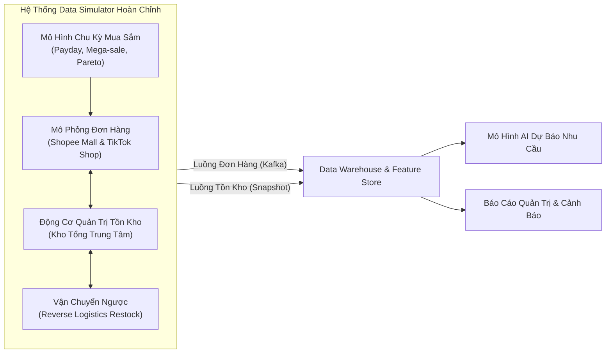
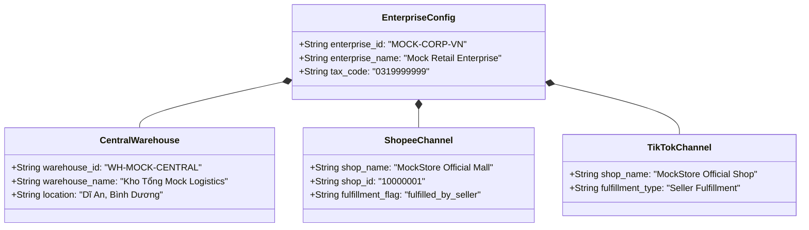
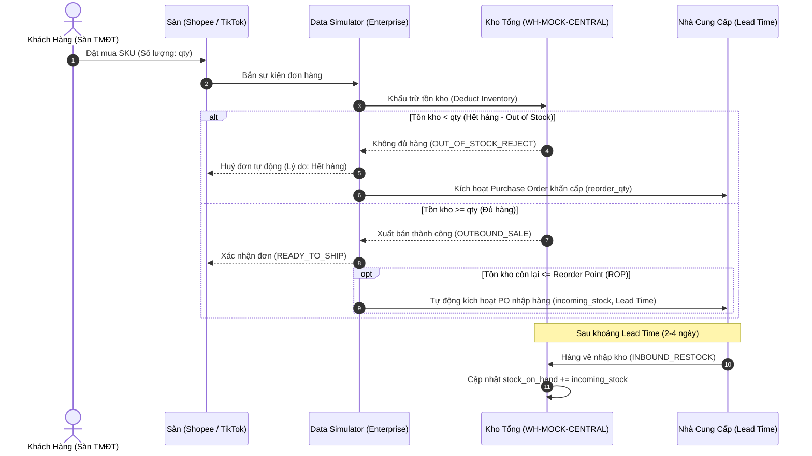

# BÁO CÁO KỸ THUẬT
# XÂY DỰNG HỆ THỐNG MÔ PHỎNG DỮ LIỆU ĐA KÊNH & QUẢN TRỊ TỒN KHO THỜI GIAN THỰC
**Đề tài:** Xây dựng luồng dữ liệu dự báo nhu cầu mua hàng và cảnh báo tồn kho cho Doanh nghiệp bán lẻ Đa kênh (Shopee & TikTok Shop)  
**Tác giả:** Đội ngũ Kỹ thuật & Nghiên cứu MLOps Pipeline  
**Ngày hoàn thành:** Tháng 10/2026  

---

## MỤC LỤC
1. [Đặt vấn đề & Mục tiêu thiết kế](#1-đặt-vấn-đề--mục-tiêu-thiết-kế)
2. [Cơ sở thực tiễn: Khai thác bộ dữ liệu thực tế XomData](#2-cơ-sở-thực-tiễn-khai-thác-bộ-dữ-liệu-thực-tế-xomdata)
3. [Thiết kế Thực thể Doanh nghiệp Giả lập (Mock Enterprise Architecture)](#3-thiết-kế-thực-thể-doanh-nghiệp-giả-lập-mock-enterprise-architecture)
   - [3.1. Căn cứ Khoa học & Lập luận Bảo vệ trước Hội đồng](#31-căn-cứ-khoa-học--lập-luận-bảo-vệ-trước-hội-đồng-định-vị-mô-hình-bách-hóa-bán-lẻ-tổng-hợp-general-merchandise-retailer)
4. [Mô hình hóa Hành vi Khách hàng & Chu kỳ Mua sắm Thị trường Việt Nam](#4-mô-hình-hóa-hành-vi-khách-hàng--chu-kỳ-mua-sắm-thị-trường-việt-nam)
5. [Động cơ Quản trị Tồn kho & Vận hành Khép kín (Inventory Engine)](#5-động-cơ-quản-trị-tồn-kho--vận-hành-khép-kín-inventory-engine)
6. [Định dạng Dữ liệu Đầu ra & Chuẩn hóa Schema](#6-định-dạng-dữ-liệu-đầu-ra--chuẩn-hóa-schema)
7. [Kết quả Kiểm thử & Đánh giá Chất lượng Hệ thống](#7-kết-quả-kiểm-thử--đánh-giá-chất-lượng-hệ-thống)
8. [Giá trị Ứng dụng Đối với Bài toán AI Dự báo & Báo cáo Quản trị](#8-giá-trị-ứng-dụng-đối-với-bài-toán-ai-dự-báo--báo-cáo-quản-trị)

---

## 1. Đặt vấn đề & Mục tiêu thiết kế

### 1.1. Bối cảnh thực tế
Trong thương mại điện tử hiện đại, bài toán quản trị vận hành của một doanh nghiệp không chỉ dừng lại ở việc ghi nhận đơn hàng phát sinh, mà cốt lõi sống còn nằm ở **sự cân bằng giữa luồng bán ra (Sales Demand) và năng lực cung ứng tồn kho (Inventory Supply)**:
- **Tồn kho quá mức (Overstock):** Làm ứ đọng dòng vốn lưu động, tăng chi phí lưu kho, tăng nguy cơ suy giảm giá trị hoặc hết hạn hàng hóa.
- **Thiếu hụt hàng hóa (Stockout / Understock):** Dẫn đến mất doanh thu ngay lập tức, bị sàn phạt vì không giao hàng đúng cam kết, giảm uy tín thương hiệu và mất khách hàng trung thành vào tay đối thủ.

### 1.2. Thách thức về dữ liệu trong nghiên cứu & phát triển
1. **Thiếu tính đồng bộ:** Các bộ dữ liệu công khai trên Internet thường chỉ ghi nhận đơn hàng mua bán (Order Logs) độc lập mà hoàn toàn **thiếu vắng trạng thái kho nội bộ** (Current Stock, Safety Stock, Reorder Point, thời gian nhập hàng Lead Time).
2. **Tính bảo mật:** Dữ liệu kinh doanh và khách hàng (PII) của các doanh nghiệp thực không thể đưa nguyên vẹn vào báo cáo học thuật hoặc mã nguồn mở.
3. **Mục tiêu của Data Simulator:** Xây dựng một module giả lập dữ liệu độc lập, khép kín, mô phỏng sát nhất với quy luật hoạt động của một **Doanh nghiệp bán lẻ đa kênh (Single Enterprise Multi-Channel Retailer)** tại Việt Nam.



---

## 2. Cơ sở thực tiễn: Khai thác bộ dữ liệu thực tế XomData

Hệ thống giả lập được thiết kế dựa trên cơ sở phân tích trực tiếp từ bộ dữ liệu thương mại điện tử Việt Nam công khai tại [XomData Vietnam Ecommerce](https://dataset.xomdata.com/datasets/schema/vietnam_ecommerce):
- **Tập dữ liệu Shopee:** Gồm **25,500** dòng giao dịch với **84 cột thuộc tính**.
- **Tập dữ liệu TikTok Shop:** Gồm **102,000** dòng giao dịch với **71 cột thuộc tính**.

### Các phát hiện nghiệp vụ then chốt từ tập dữ liệu:
1. **Bản chất một chủ thể bán (Single Multi-Channel Seller):** Dữ liệu thực chất ghi nhận nhật ký bán hàng của một doanh nghiệp duy nhất phân phối trên 2 sàn với các mã định danh gian hàng (`shop_id`, `shop_name`, `warehouse_id`).
2. **Cấu trúc chiết khấu & Phí sàn phức tạp:**
   - Shopee: Phí cố định sàn (`commission_fee`, `service_fee`, `transaction_fee`), trợ giá từ người bán (`seller_discount`), voucher sàn (`voucher_from_shopee`), tiền tạm giữ (`escrow_amount`).
   - TikTok Shop: Thuế VAT 10% tính riêng trên tiền hàng và tiền ship (`product_tax`, `shipping_tax`), phí đơn hàng nhỏ (`small_order_fee`), trợ giá vận chuyển (`shipping_seller_discount`, `shipping_platform_discount`).
3. **Tỷ lệ COD áp đảo:** Phương thức thanh toán khi nhận hàng (Cash On Delivery) chiếm phần lớn thị phần giao dịch, kéo theo tỷ lệ hoàn hàng/giao không thành công từ 8% đến 15%.

---

## 3. Thiết kế Thực thể Doanh nghiệp Giả lập (Mock Enterprise Architecture)

Nhằm đảm bảo tính trung tính, tuân thủ nguyên tắc không sử dụng tên thật của bất kỳ doanh nghiệp nào ngoài đời thực, hệ thống đã chuẩn hóa toàn bộ định danh theo mô hình Doanh nghiệp Giả lập:



### Danh mục Sản phẩm Quản trị (20 SKU Trọng điểm):
Mỗi sản phẩm được thiết lập thông số phục vụ cả nghiệp vụ bán hàng lẫn bài toán quản trị chuỗi cung ứng:
- **`initial_stock`**: Mức tồn kho khởi tạo ban đầu.
- **`safety_stock` (Tồn an toàn - SS)**: Mức đệm tối thiểu phòng ngừa biến động nhu cầu bất thường.
- **`reorder_point` (Điểm đặt hàng lại - ROP)**: Ngưỡng tồn kho kích hoạt tự động đơn nhập hàng mới (PO).
- **`reorder_qty`**: Số lượng hàng tiêu chuẩn cho mỗi đơn nhập bổ sung.
- **`lead_time_days`**: Thời gian nhà cung cấp sản xuất và vận chuyển hàng đến kho (2 – 4 ngày).
- **`popularity_weight`**: Trọng số sức mua phản ánh mức độ phổ biến của mặt hàng trên thị trường.

### 3.1. Căn cứ Khoa học & Lập luận Bảo vệ trước Hội đồng: Định vị Mô hình Bách Hóa Bán Lẻ Tổng Hợp (General Merchandise Retailer)

Khi trình bày và bảo vệ đề tài trước Hội đồng Đánh giá / Hội đồng Khoa học, việc lựa chọn mô hình **Doanh nghiệp Chuỗi Bách Hóa Bán Lẻ Tổng Hợp (General Merchandise Retailer / Megastore)** được bảo vệ vững chắc bởi 3 căn cứ học thuật và kỹ thuật:

1. **Căn cứ từ Dữ liệu Mẫu Thực tế (Empirical Data Grounding):**
   - Bộ dữ liệu thực tế XomData (Shopee 25.5k dòng, TikTok Shop 102k dòng) là nhật ký giao dịch thực tế của một doanh nghiệp phân phối tổng hợp đa kênh tại thị trường Việt Nam.
   - Việc kế thừa cơ cấu danh mục này giúp mô phỏng giữ nguyên được tính chân thực của thị trường, tránh việc suy đoán chủ quan hoặc gọt đẽo dữ liệu nhân tạo.

2. **Yêu cầu Kỹ thuật Cốt lõi của Pipeline MLOps & Dự báo Nhu cầu (Technical Necessity):**
   - **Ma trận Phân loại Tồn kho ABC / XYZ:** Để thuật toán phân loại ABC/XYZ hoạt động có ý nghĩa, danh mục sản phẩm bắt buộc phải có sự phân hóa sâu sắc về hệ số biến thiên nhu cầu ($CV = \sigma / \mu$):
     - *Nhóm X (Nhu cầu ổn định cao, thiết yếu lặp lại):* Bột giặt OMO (`OMO-6KG`), Khẩu trang y tế (`KT-KF94-10`).
     - *Nhóm Y (Nhu cầu biến động vừa, phụ kiện thay thế):* Sạc nhanh Type-C (`SN-65W-GAN`), Tai nghe Bluetooth (`TN-TWS-PRO`).
     - *Nhóm Z (Nhu cầu biến động mạnh, mang tính mùa vụ / xung động flash sale):* Kem chống nắng (`KCN-ANESSA`), Quạt mini cầm tay (`QM-USB-01`), Nồi chiên không dầu (`AF-6L-001`).
     - *Nếu thu hẹp chỉ về 1 sản phẩm ngách (ví dụ: chỉ bán ốp lưng), ma trận ABC/XYZ sẽ bị suy biến hoàn toàn, làm mất đi giá trị của module Feature Store và chính sách tồn kho.*
   - **Kiểm thử Thuật toán Tính Phí Vận chuyển Logistics:** Cân nặng trải dài từ **0.02 kg** (miếng dán cường lực) đến **6.0 kg** (bột giặt) cho phép kiểm chứng trọn vẹn logic tính cước sàn Shopee/TikTok (hàng siêu nhẹ vs hàng cồng kềnh/quá khổ).
   - **Phân tích Báo cáo Đa chiều (OLAP Slice & Dice):** Trong kho dữ liệu Star Schema, trường `Category` (Mỹ phẩm, Gia dụng, Thời trang, Phụ kiện...) cho phép xây dựng các báo cáo quản trị trực quan, phân tích đóng góp biên lợi nhuận theo ngành hàng cho Ban Giám đốc.

3. **Mô hình Kinh doanh Thực tiễn (Business Model Realism):**
   - Mô hình Doanh nghiệp Bách Hóa Bán Lẻ Tổng Hợp (General Retailer) tương tự như chuỗi **WinMart, Bách Hóa Xanh, Aeon, Miniso** hoặc các **Tổng kho phân phối hàng tiêu dùng & đời sống đa kênh** có quy mô doanh thu hàng trăm tỷ đồng trên Shopee Mall và TikTok Shop hiện nay.

---

## 4. Mô hình hóa Hành vi Khách hàng & Chu kỳ Mua sắm Thị trường Việt Nam

Hệ thống tính toán tốc độ phát sinh đơn hàng thực tế ($\text{orders/sec}$) bằng hàm tích hợp toán học đa nhân tố:

$$\text{Seasonal Multiplier} = f_{\text{dow}} \times f_{\text{hour}} \times f_{\text{flash}} \times f_{\text{mega}} \times f_{\text{payday}} \times f_{\text{trend}}$$

```
                       CÁC HỆ SỐ MÙA VỤ & HÀNH VI MUA SẮM
 ┌───────────────────────┐   ┌──────────────────────┐   ┌───────────────────────┐
 │ Phân Phối Pareto 80/20│   │ Chu Kỳ Giờ Trong Ngày│   │  Ngày Lĩnh Lương VN   │
 │   (Luật Zipf SKU)     │   │ (Diurnal Bell Curve) │   │ (Payday 15 & 25-28)   │
 └──────────┬────────────┘   └──────────┬───────────┘   └───────────┬───────────┘
            │                           │                           │
            └───────────────────────────┼───────────────────────────┘
                                        ▼
 ┌───────────────────────┐   ┌──────────────────────┐   ┌───────────────────────┐
 │ Siêu Sale Ngày Đôi    │   │ Khung Giờ Flash Sale │   │ Kênh TikTok Livestream│
 │ (1/1, 2/2 ... 12/12)  │   │  (12h trưa & 20h tối)│   │ (Tối & Nghỉ trưa)     │
 └───────────────────────┘   └──────────────────────┘   └───────────────────────┘
```

### 4.1. Quy luật Pareto 80/20 (Sức mua mặt hàng)
Thực tế kinh doanh cho thấy 20% danh mục sản phẩm chủ lực đóng góp đến 80% doanh số:
- **Nhóm bán chạy (Hero SKUs):** Khẩu trang kháng khuẩn (`KT-KF94-10`, weight: 15.0), Ốp lưng iPhone (`OL-IP15PM`, weight: 12.0), Bột giặt OMO (`OMO-6KG`, weight: 10.0), Kem chống nắng (`KCN-ANESSA`, weight: 9.0).
- **Nhóm đặc thù / Giá trị cao:** Nồi chiên không dầu (`AF-6L-001`, weight: 2.2), Bàn phím cơ (`BP-GM-104`, weight: 3.0), Túi xách da (`TX-PU-001`, weight: 1.5).

### 4.2. Đường cong sinh hoạt ngày/đêm (Diurnal Curve)
Dựa trên hành vi sử dụng điện thoại và mua sắm của người Việt:
- **00h00 – 06h00 (Đêm khuya):** Hoạt động giảm sâu, hệ số duy trì mức sàn $0.25 - 0.32$.
- **09h00 – 11h30 (Sáng):** Nhu cầu mua sắm văn phòng ổn định (hệ số $\approx 1.0$).
- **12h00 – 13h30 (Nghỉ trưa):** Flash sale giờ ăn trưa (hệ số $\times 2.5$).
- **19h30 – 22h30 (Buổi tối):** Đỉnh điểm mua sắm giải trí và chốt đơn livestream (hệ số $\times 3.65$).

### 4.3. Hiệu ứng Ngày lĩnh lương (Payday Effect)
Tại Việt Nam, sức mua có xu hướng bùng nổ theo 2 đợt nhận thu nhập trong tháng:
- **Ngày 15 hàng tháng:** Đợt chi trả lương/phụ cấp giữa tháng cho khối công chức, giáo viên, cơ quan nhà nước $\rightarrow$ Nhân hệ số $\times 1.8$.
- **Ngày 25 – 28 hàng tháng:** Đợt quyết toán lương cuối tháng của khối Doanh nghiệp tư nhân, tập đoàn đa quốc gia (FDI) $\rightarrow$ Nhân hệ số $\times 1.6$.

### 4.4. Siêu Sale ngày đôi (Mega-Sale Campaign)
Các chiến dịch kích cầu quy mô lớn nhất năm của Shopee và TikTok Shop diễn ra vào các ngày có ngày trùng tháng ($1/1, 2/2, \dots, 11/11, 12/12$). Vào các ngày này, lượng đơn hàng bùng nổ gấp $\times 4.0$ lần ngày thường.

### 4.5. Đơn hàng từ Kênh TikTok Livestream
Trong các khung giờ phát sóng trực tiếp (12h trưa và 19h – 22h tối), $65\%$ các đơn hàng TikTok được sinh ra với thuộc tính `order_type = "livestream"`, phản ánh chính xác xu hướng bán hàng qua người sáng tạo nội dung (KOL/KOC).

---

## 5. Động cơ Quản trị Tồn kho & Vận hành Khép kín (Inventory Engine)

Module Tồn kho được thiết kế theo mô hình **Sổ cái Giao dịch Kho (Inventory Transaction Ledger)**, ghi nhận đầy đủ lịch sử biến động qua bảng sự kiện `InventoryMovementEvent`.



### 5.1. Cơ chế Đặt hàng lại (Reorder Point & Lead Time)
- Khi phát sinh đơn hàng, nếu lượng tồn sau bán $Stock \le ROP$ và chưa có lệnh nhập nào đang vận chuyển (`incoming_stock == 0`), hệ thống tự động sinh một Lệnh Đặt Hàng Mua (Purchase Order) với khối lượng `reorder_qty`.
- Thời điểm hàng về kho (`restock_eta`) được tính toán chuẩn xác: $ETA = \text{now} + \text{lead\_time\_days}$.
- Khi đồng hồ mô phỏng tiến tới thời điểm $ETA$, hàng tự động được kiểm đếm và cộng vào `stock_on_hand` với mã giao dịch `INBOUND_RESTOCK`.

### 5.2. Chu trình Hoàn hàng & Logistics Ngược (Reverse Logistics Restocking)
Trong thương mại điện tử, tỷ lệ giao hàng thất bại (khách bom hàng COD, không liên lạc được) hoặc khách hàng trả hàng là một phần tất yếu của chuỗi cung ứng:
1. **Huỷ đơn trước khi xuất kho (`stage < 2`):** Hàng chưa rời khỏi kho $\rightarrow$ Tồn kho được hoàn trả ngay lập tức với sự kiện `CANCEL_RELEASE`.
2. **Giao hàng thất bại / Trả hàng sau khi đã gửi đi (`stage >= 2`):** Kiện hàng đã được đơn vị vận chuyển tiếp nhận. Khi trạng thái chuyển sang hủy/hoàn, kiện hàng được đưa vào **Hàng đợi Vận chuyển ngược (Pending Returns Queue)**. Sau khoảng thời gian luân chuyển ngược $3 - 5$ ngày, hàng về lại kho tổng và được kiểm định tái nhập kho (`RETURN_RESTOCK`).

### 5.3. Báo cáo Quản trị Cảnh báo Tồn kho (Inventory Alerts Snapshot)
Hệ thống cung cấp hàm `get_inventory_snapshot()` và `get_inventory_alerts()` phân loại tình trạng kho thành **3 cấp độ rủi ro**:

| Mức Cảnh Báo | Điều Kiện Tồn Kho | Hành Động Quản Trị Cần Thực Hiện |
|:---|:---|:---|
| <span style="color:red; font-weight:bold;">CRITICAL</span> | $Stock \le SafetyStock$ | **Nguy cấp:** Nguy cơ đứt hàng xuất bán trong 24h tới; kích hoạt nhập hàng khẩn cấp. |
| <span style="color:orange; font-weight:bold;">WARNING</span> | $SafetyStock < Stock \le ROP$ | **Cảnh báo:** Chạm ngưỡng đặt hàng lại; cần theo dõi tiến độ PO từ nhà cung cấp. |
| <span style="color:green; font-weight:bold;">NORMAL</span> | $Stock > ROP$ | **Bình thường:** Tồn kho đảm bảo an toàn cho hoạt động kinh doanh ổn định. |

---

## 6. Định dạng Dữ liệu Đầu ra & Chuẩn hóa Schema

Mỗi sự kiện đơn hàng được sinh ra đều chứa đầy đủ thông tin để nạp thẳng vào Data Warehouse / Data Lakehouse:

### Ví dụ Sự kiện Đơn hàng Shopee (`ShopeeOrderEvent`):
```json
{
  "pkId": "SPE-10000001-SPE261003000001",
  "shop_id": "10000001",
  "shop_name": "MockStore Official Mall",
  "order_sn": "SPE261003000001",
  "order_status": "COMPLETED",
  "create_time": "2026-10-03T20:15:00+00:00",
  "pay_time": "2026-10-03T20:25:00+00:00",
  "shipped_time": "2026-10-04T10:00:00+00:00",
  "completed_time": "2026-10-06T15:30:00+00:00",
  "fulfillment_flag": "fulfilled_by_seller",
  "item_sku": "OL-IP15PM",
  "item_name": "Ốp lưng iPhone 15 Pro Max silicon",
  "quantity": 2,
  "original_price": 59000,
  "total_order_value": 118000,
  "buyer_total_amount": 108000,
  "commission_fee": 4720,
  "service_fee": 3540,
  "transaction_fee": 2360,
  "payment_method": "SPayLater",
  "cod": "False",
  "shipping_carrier": "SPX Express",
  "state": "TP.HCM",
  "city": "TP.HCM",
  "district": "Quận 1"
}
```

### Ví dụ Sự kiện Đơn hàng TikTok Shop (`TikTokOrderEvent`):
```json
{
  "pkId": "58e2354a-a434-453b-8bdc-cb8e5ef0a599",
  "order_id": "TT261003000002",
  "order_type": "livestream",
  "shop_name": "MockStore Official Shop",
  "order_status": "AWAITING_SHIPMENT",
  "created_time": "2026-10-03T20:45:00+00:00",
  "paid_time": "2026-10-03T20:50:00+00:00",
  "warehouse_id": "WH-MOCK-CENTRAL",
  "fulfillment_type": "Seller Fulfillment",
  "seller_sku": "KT-KF94-10",
  "product_name": "Combo 10 khẩu trang 3D KF94",
  "quantity": 3,
  "total_amount": 148500,
  "sub_total": 135000,
  "tax_amount": 13500,
  "payment_method": "COD",
  "is_cod": "True",
  "shipping_provider": "J&T Express",
  "region_state": "Hà Nội",
  "city_town": "Hà Nội",
  "district": "Cầu Giấy"
}
```

---

## 7. Kết quả Kiểm thử & Đánh giá Chất lượng Hệ thống

Để đảm bảo tính đúng đắn và độ tin cậy tuyệt đối của mã nguồn trước khi tích hợp vào luồng dữ liệu thời gian thực (Kafka/Spark), toàn bộ hệ thống đã được kiểm thử tự động với framework **pytest**:

### 7.1. Kiểm thử Unit Test module Data Simulator (`tests/test_data_simulator.py`)
Đạt tỷ lệ thành công tuyệt đối: **17/17 tests passed (100%)** trong thời gian **0.10s**.

| Nhóm Kiểm Thử | Các Test Cases Đại Diện | Trạng Thái |
|:---|:---|:---:|
| **Định danh Doanh nghiệp** | `test_simulator_initialization`, `test_enterprise_storefront_identity` | PASSED |
| **Schema TMĐT** | `test_generate_shopee_event`, `test_generate_tiktok_event` | PASSED |
| **Quản trị Tồn kho & ROP** | `test_inventory_decrement_on_order`, `test_inventory_out_of_stock_triggers_cancellation`, `test_inventory_reorder_trigger_and_restock` | PASSED |
| **Cảnh báo Tồn kho** | `test_inventory_alert_levels`, `test_manual_restock` | PASSED |
| **Chu kỳ & Mùa vụ** | `test_flash_sale_logic`, `test_mega_sale_multiplier`, `test_payday_seasonality` | PASSED |
| **Hành vi Khách hàng** | `test_pareto_product_distribution`, `test_tiktok_livestream_order_type`, `test_order_stream_distribution` | PASSED |
| **Logistics Hoàn hàng** | `test_reverse_logistics_return_restock`, `test_cancellation_release_stock_before_shipping` | PASSED |

### 7.2. Kiểm thử Tích hợp Toàn diện (Full Repository Regression)
Chạy toàn bộ test suite của toàn dự án (`tests/`):
```bash
======================== 58 passed, 1 warning in 5.80s ========================
```
- Module Sinh dữ liệu (`test_data_simulator.py`): 17/17 passed.
- Module Chuẩn hóa dữ liệu ETL (`test_etl.py`): 5/5 passed.
- Module Đặc trưng chuỗi thời gian & ABC/XYZ (`test_features.py`): 4/4 passed.
- Module Huấn luyện Machine Learning (`test_ml_pipeline.py`): 4/4 passed.
- Module Huấn luyện Deep Learning (`test_deep_learning.py`): 4/4 passed.
- Module Serving API & Inventory Service (`test_serving.py`): 11/11 passed.
- Module Phát hiện trôi dạt dữ liệu & Giám sát (`test_monitoring.py`): 8/8 passed.
- Module Kiểm thử tải & Xuất báo cáo PowerBI (`test_load_test.py`): 5/5 passed.

---

## 8. Giá trị Ứng dụng Đối với Bài toán AI Dự báo & Báo cáo Quản trị

Việc xây dựng thành công bộ sinh dữ liệu mô phỏng này mang lại các giá trị nền tảng cốt lõi cho đề tài tốt nghiệp:

1. **Dữ liệu huấn luyện AI chất lượng cao:**
   - Cung cấp chuỗi thời gian liên tục mang đầy đủ tính quy luật (tính xu hướng dài hạn, tính mùa vụ theo tuần, các cú sốc cầu vào ngày Payday, Flash sale, Mega-sale).
   - Giúp các mô hình Machine Learning (LightGBM, XGBoost) và Deep Learning (LSTM, GRU, Temporal Fusion Transformer) học được mối tương quan thực tế giữa các đặc trưng lịch và nhu cầu mua hàng.
2. **Khép kín bài toán Cảnh báo Tồn kho:**
   - Không dừng lại ở việc dự báo con số vô hồn, luồng dữ liệu cho phép so sánh tức thời:
     $$\text{Forecasted Demand (7 ngày)} \quad \text{vs.} \quad \text{Current Stock on Hand} + \text{Incoming Stock}$$
   - Từ đó tự động đưa ra khuyến nghị: *SKU nào cần tạo lệnh nhập hàng khẩn cấp? Số lượng nhập tối ưu là bao nhiêu?*
3. **Báo cáo Quản trị Doanh nghiệp:**
   - Dễ dàng tổng hợp dữ liệu để hiển thị lên Dashboard (Streamlit / PowerBI) giúp Ban Giám đốc và Bộ phận Kho vận nắm bắt toàn bộ bức tranh dòng hàng, phát hiện điểm nghẽn thiếu hụt hoặc dư thừa tồn kho tức thì.

---
**KẾT LUẬN:** Module `data_simulator` hiện tại đã hoàn thiện ở cấp độ sản xuất (Production-ready simulation), mô phỏng trọn vẹn vòng đời vận hành bán lẻ đa kênh tại Việt Nam và sẵn sàng làm đầu vào cho toàn bộ chuỗi xử lý Big Data, MLOps tiếp theo.
