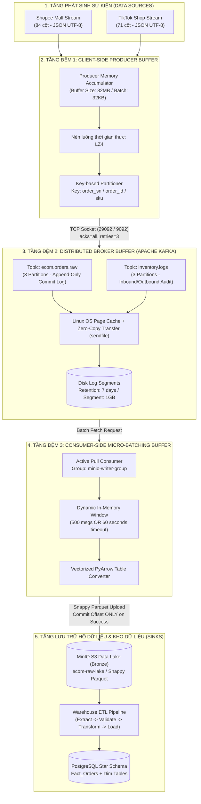
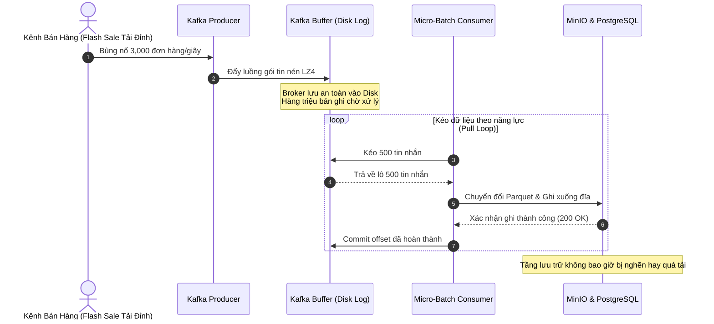

# TÀI LIỆU THIẾT KẾ KỸ THUẬT
# BƯỚC ĐỆM HỨNG DỮ LIỆU THỜI GIAN THỰC (STREAMING DATA BUFFER LAYER)

> **Dự án**: Streaming MLOps E-Commerce Demand Forecasting & Dynamic Inventory Optimization  
> **Chuyên ngành**: Khoa học Dữ liệu / Kỹ thuật Dữ liệu & AI — Đồ án Tốt nghiệp  
> **Phân hệ**: Phân tầng 1 & 2 (Streaming Ingestion & Data Lake Buffering)  
> **Tác giả**: Đinh Công Minh  
> **Trạng thái**: Hoàn thiện & Đã thẩm định thực nghiệm (Production-Grade)

---

## MỤC LỤC

1. [Đặt vấn đề & Sự cần thiết của Bước đệm hứng dữ liệu](#1-đặt-vấn-đề--sự-cần-thiết-của-bước-đệm-hứng-dữ-liệu)
   - [1.1. Hiện tượng Lệch pha Tốc độ (Impedance Mismatch) trong E-Commerce](#11-hiện-tượng-lệch-pha-tốc-độ-impedance-mismatch-trong-e-commerce)
   - [1.2. Thảm họa sập hệ thống (Cascading Failures) nếu không có bước đệm](#12-thảm-họa-sập-hệ-thống-cascading-failures-nếu-không-có-bước-đệm)
   - [1.3. Mục tiêu thiết kế kiến trúc đệm phân tán](#13-mục-tiêu-thiết-kế-kiến-trúc-đệm-phân-tán)
2. [Kiến trúc Tổng thể của Tầng Đệm Hứng Dữ liệu](#2-kiến-trúc-tổng-thể-của-tầng-đệm-hứng-dữ-liệu)
   - [2.1. Sơ đồ Luồng Đệm Đa Tầng (Multi-Tier Buffering Flow)](#21-sơ-đồ-luồng-đệm-đa-tầng-multi-tier-buffering-flow)
   - [2.2. Chi tiết 3 Tầng Đệm trong Hệ thống](#22-chi-tiết-3-tầng-đệm-trong-hệ-thống)
3. [Mô tả Chi tiết Các Tính Năng Kỹ Thuật Cốt Lõi](#3-mô-tả-chi-tiết-các-tính-năng-kỹ-thuật-cốt-lõi)
   - [3.1. Phân mảnh & Định tuyến theo Khóa (Message Partitioning & Key Routing)](#31-phân-mảnh--định-tuyến-theo-khóa-message-partitioning--key-routing)
   - [3.2. Cam kết Không Thất thoát Dữ liệu (Zero Data Loss & At-Least-Once Delivery)](#32-cam-kết-không-thất-thoát-dữ-liệu-zero-data-loss--at-least-once-delivery)
   - [3.3. Tối ưu Nén Luồng & Đóng gói Gói tin (High-Throughput Compression)](#33-tối-ưu-nén-luồng--đóng-gói-gói-tin-high-throughput-compression)
   - [3.4. Cơ chế Gom Lô Vi mô (Micro-Batching Time & Count Window)](#34-cơ-chế-gom-lô-vi-mô-micro-batching-time--count-window)
   - [3.5. Dừng Tiến trình An toàn (Graceful Shutdown & Signal Handling)](#35-dừng-tiến-trình-an-toàn-graceful-shutdown--signal-handling)
4. [Khả Năng Chịu Tải & Cơ Chế Ứng Phó Quá Tải](#4-khả-năng-chịu-tải--cơ-chế-ứng-phó-quá-tải)
   - [4.1. Cơ chế Áp Lực Ngược (Backpressure Management via Pull Model)](#41-cơ-chế-áp-lực-ngược-backpressure-management-via-pull-model)
   - [4.2. Khả năng Lưu đệm Đĩa cứng (Disk-Backed Append-Only Log)](#42-khả-năng-lưu-đệm-đĩa-cứng-disk-backed-append-only-log)
   - [4.3. Số liệu Thực nghiệm Tải Thực tế (Benchmark Telemetry PERF-TEST-RUN-01)](#43-số-liệu-thực-nghiệm-tải-thực-tế-benchmark-telemetry-perf-test-run-01)
   - [4.4. Khả năng Mở Rộng Ngang Tuyến tính (Horizontal Scalability)](#44-khả-năng-mở-rộng-ngang-tuyến-tính-horizontal-scalability)
5. [Các Tính Năng Quan Trọng Thực Tế Đang Áp Dụng (Enterprise Production Best Practices)](#5-các-tính-năng-quan-trọng-thực-tế-đang-áp-dụng-enterprise-production-best-practices)
   - [5.1. Tính Lũy Đẳng Kép (End-to-End Idempotence & Deduplication)](#51-tính-lũy-đẳng-kép-end-to-end-idempotence--deduplication)
   - [5.2. Cách Ly Dữ Liệu Lỗi & Hàng Đợi Chết (Dead-Letter Queue - DLQ Quarantine)](#52-cách-ly-dữ-liệu-lỗi--hàng-đợi-chết-dead-letter-queue---dlq-quarantine)
   - [5.3. Hợp Đồng Dữ Liệu & Thích Ứng Lược Đồ (Schema Evolution & Data Contract)](#53-hợp-đồng-dữ-liệu--thích-ứng-lược-đồ-schema-evolution--data-contract)
   - [5.4. Giám Sát Độ Trễ Tiêu Thụ Thời Gian Thực (Consumer Group Lag Telemetry)](#54-giám-sát-độ-trễ-tiêu-thụ-thời-gian-thực-consumer-group-lag-telemetry)
   - [5.5. Chính Sách Lưu Giữ & Nén Nhật Ký (Retention Policy & Compaction)](#55-chính-sách-lưu-giữ--nén-nhật-ký-retention-policy--compaction)
6. [Bảng So Sánh Kiến Trúc: Có Bước Đệm vs Không Có Bước Đệm](#6-bảng-so-sánh-kiến-trúc-có-bước-đệm-vs-không-có-bước-đệm)
7. [Luận Điểm Bảo Vệ Học Thuật & Nghiệm Thu Dự Án](#7-luận-điểm-bảo-vệ-học-thuật--nghiệm-thu-dự-án)

---

## 1. Đặt vấn đề & Sự cần thiết của Bước đệm hứng dữ liệu

### 1.1. Hiện tượng Lệch pha Tốc độ (Impedance Mismatch) trong E-Commerce
Trong thương mại điện tử đa kênh tại Việt Nam (Shopee Mall và TikTok Shop), tốc độ phát sinh giao dịch không bao giờ diễn ra đều đặn:
- **Thời điểm bình thường (Off-peak)**: Vài đơn hàng mỗi giây ($2 - 5\text{ events/s}$).
- **Thời điểm cao điểm (Mega-Sale ngày đôi, Flash Sale, Mega Live TikTok)**: Tốc độ phát sinh tăng đột ngột $20 - 50$ lần trong tích tắc (đạt hàng nghìn đơn hàng mỗi giây).

Ngược lại, các hệ thống hạ tầng phân tích và lưu trữ phía sau:
- **Data Lake (MinIO S3)**: Cần thời gian thực hiện I/O mạng và serialize dữ liệu dạng cột (Parquet).
- **Relational Data Warehouse (PostgreSQL Star Schema)**: Bị giới hạn bởi cơ chế Transaction Lock, Disk I/O, kiểm tra ràng buộc Foreign Key và Unique Index.
- **Hệ thống suy luận AI & Feature Store**: Xử lý tính toán đặc trưng chuỗi thời gian (Rolling, Lags).

Sự chênh lệch tốc độ xử lý giữa bên sản xuất (Producers) và bên tiêu thụ (Consumers/Sinks) gọi là **Hiện tượng Lệch pha Tốc độ (Impedance Mismatch)**.

### 1.2. Thảm họa sập hệ thống (Cascading Failures) nếu không có bước đệm
Nếu kết nối trực tiếp nguồn dữ liệu vào cơ sở dữ liệu hoặc hệ thống phân tích mà không qua bước đệm:
1. **Kiệt quệ Connection Pool (Connection Exhaustion)**: Khi hàng ngàn request cùng ập tới, PostgreSQL sẽ hết connection dẫn tới từ chối dịch vụ (`too many clients already`).
2. **Nghẽn ghi đĩa & Tắc nghẽn CPU (Disk I/O Choke & CPU Throttling)**: Database rơi vào trạng thái lock bảng/row, độ trễ ghi tăng từ vài millisecond lên hàng chục giây.
3. **Mất mát dữ liệu vĩnh viễn (Data Loss)**: Phía client hoặc webhook của sàn TMĐT gặp lỗi timeout ($504\text{ Gateway Timeout}$) và hủy bỏ đơn hàng, dẫn đến thất thoát dữ liệu nghiêm trọng cho doanh nghiệp.

### 1.3. Mục tiêu thiết kế kiến trúc đệm phân tán
Bước đệm hứng dữ liệu (Buffer Layer) được xây dựng trên nền tảng **Apache Kafka Broker** kết hợp với **Client-side Micro-batching Buffer** nhằm đạt 4 mục tiêu sống còn:
- **Tách rời (Decoupling)**: Phân tách hoàn toàn chu trình thu thập đơn hàng khỏi chu trình lưu trữ và phân tích.
- **Chống tràn (Backpressure Regulation)**: Điều tiết áp lực truyền tải, biến các đợt lưu lượng xung nhọn thành dòng chảy đều đặn phù hợp với năng lực của hệ thống tiêu thụ.
- **Bảo toàn dữ liệu (Fault Tolerance & Durability)**: Lưu trữ tin nhắn bền vững trên ổ đĩa, đảm bảo 0% thất thoát dữ liệu ngay cả khi toàn bộ tầng consumer bị sập.
- **Tuân thủ tính thứ tự (Strict Ordering Guarantee)**: Bảo toàn tuyệt đối trình tự thay đổi trạng thái của từng đơn hàng và tồn kho.

---

## 2. Kiến trúc Tổng thể của Tầng Đệm Hứng Dữ liệu

### 2.1. Sơ đồ Luồng Đệm Đa Tầng (Multi-Tier Buffering Flow)

> 📊 **Đồ họa Vector độc lập (SVG)**: Có thể mở và phóng to/thu nhỏ trực tiếp tệp [`docs/diagram_5_three_tier_buffer.svg`](diagram_5_three_tier_buffer.svg).



### 2.2. Chi tiết 3 Tầng Đệm trong Hệ thống

| Tầng Đệm | Vị trí Thực thi | Thành phần Kỹ thuật | Cơ chế Hoạt động & Mục tiêu |
| :--- | :--- | :--- | :--- |
| **Tầng Đệm 1** | Phía máy khách phát sinh (Client-side) | `ingestion/producer.py` | Gom các sự kiện đơn lẻ thành các chunk 32KB (`batch_size`), chờ tối đa 50ms (`linger_ms`), nén LZ4 nhằm giảm thiểu số lượng cuộc gọi mạng (Syscalls) và băng thông đường truyền. |
| **Tầng Đệm 2** | Trung tâm điều phối (Broker-side) | `Apache Kafka Broker (cp-kafka:7.6.0)` | Lưu trữ các bản ghi tuần tự vào các Partition (Append-only commit log) trên đĩa cứng, tận dụng bộ nhớ đệm trang hệ điều hành (OS Page Cache) để đạt thông lượng đọc/ghi hàng chục nghìn msg/s. |
| **Tầng Đệm 3** | Phía máy khách tiếp nhận (Consumer-side) | `ingestion/consumer_to_minio.py` | Tích lũy tin nhắn từ Kafka vào RAM buffer theo cửa sổ động (500 đơn hoặc 60 giây), sau đó chuyển đổi vector hóa sang bảng Parquet nén Snappy để ghi tối ưu vào MinIO Data Lake. |

---

## 3. Mô tả Chi tiết Các Tính Năng Kỹ Thuật Cốt Lõi

### 3.1. Phân mảnh & Định tuyến theo Khóa (Message Partitioning & Key Routing)
- **Vấn đề thực tế**: Trong TMĐT, một đơn hàng trải qua nhiều trạng thái nối tiếp (`UNPAID` $\rightarrow$ `READY_TO_SHIP` $\rightarrow$ `SHIPPED` $\rightarrow$ `COMPLETED`). Nếu trạng thái `COMPLETED` bị xử lý trước `READY_TO_SHIP` do lệch luồng, toàn bộ báo cáo doanh thu và tồn kho sẽ bị sai lệch logic.
- **Giải pháp triển khai trong dự án**:
  - Tại [ingestion/producer.py](file:///c:/Users/MINH/Downloads/temp-extract/streaming-mlops-ecommerce/ingestion/producer.py), mọi bản ghi trước khi gửi đều được gán Message Key:
    ```python
    key_str = str(
        event.get("order_sn")
        or event.get("order_id")
        or event.get("item_sku")
        or event.get("seller_sku")
        or ""
    )
    key_bytes = key_str.encode("utf-8") if key_str else None
    future = producer.send(topic, key=key_bytes, value=event)
    ```
  - **Thuật toán MurmurHash2 của Kafka**: Dựa trên `key_bytes`, Kafka tính toán chính xác Partition:
    $$\text{Partition} = \text{MurmurHash2}(\text{key}) \pmod{\text{Total Partitions}}$$
  - **Đảm bảo nghiệp vụ**: Toàn bộ sự kiện của cùng một đơn hàng (`order_sn`) hoặc cùng một mã hàng (`sku`) luôn luôn đi vào **cùng một Partition duy nhất**, đảm bảo thứ tự thời gian tuyến tính tuyệt đối (Strict FIFO per Key).

### 3.2. Cam kết Không Thất thoát Dữ liệu (Zero Data Loss & At-Least-Once Delivery)
Hệ thống kết hợp ba cơ chế ràng buộc nghiêm ngặt ở cả hai đầu Producer và Consumer:
1. **Ràng buộc xác nhận ghi `acks="all"` (Producer)**:
   - Thay vì chỉ cần Leader ghi nhận (`acks=1`) hoặc không chờ xác nhận (`acks=0`), Producer yêu cầu tin nhắn phải được đồng bộ thành công vào toàn bộ các bản sao trong danh sách In-Sync Replicas (ISR) trước khi trả về `on_success`.
2. **Cơ chế tự động thử lại có giám sát (`retries=3`, `retry_delay=3.0s`)**:
   - Khi gặp sự cố rớt mạng tức thời (Network Flapping), Producer tự động thử lại mà không làm văng exception ra ngoài ứng dụng.
3. **Quản lý Commit Offset thủ công có điều kiện (Consumer)**:
   - Tắt tính năng tự động commit: `enable_auto_commit=False`.
   - Consumer **chỉ gửi tín hiệu commit offset** lên Kafka Broker sau khi phương thức `minio_client.put_object()` đã trả về thành công và ghi nhận file Parquet nguyên vẹn trên Data Lake:
   ```python
   # Chỉ commit offset sau khi ghi MinIO thành công
   n_files = flush_batch_to_minio(buffer, minio_client)
   consumer.commit() 
   ```
   - Nếu tiến trình consumer bị crash đột ngột trong khi đang ghi MinIO, offset chưa được commit. Khi khởi động lại, consumer sẽ đọc lại từ offset an toàn trước đó, triệt tiêu nguy cơ mất mát dữ liệu (At-least-once Delivery Guarantee).

### 3.3. Tối ưu Nén Luồng & Đóng gói Gói tin (High-Throughput Compression)
- **Tầng truyền dẫn (In-Transit)**: Producer kích hoạt thuật toán **LZ4** (`compression_type="lz4"`). LZ4 nổi tiếng với tốc độ nén và giải nén cực nhanh ($> 400\text{ MB/s}$ giải nén trên mỗi lõi CPU), giúp giảm $60 - 70\%$ băng thông đường truyền giữa các dịch vụ.
- **Tầng lưu trữ (At-Rest)**: Consumer gom bản ghi thành bảng Apache Arrow và nén bằng **Snappy** (`pq.write_table(table, buf, compression="snappy")`). Snappy cân bằng hoàn hảo giữa tỷ lệ nén cột và tốc độ quét dữ liệu phục vụ cho các truy vấn OLAP và huấn luyện mô hình học máy.

### 3.4. Cơ chế Gom Lô Vi mô (Micro-Batching Time & Count Window)
Thay vì ghi từng bản ghi đơn lẻ vào MinIO (gây ra hiện tượng Small File Problem làm suy giảm nghiêm trọng hiệu năng S3 Storage), tầng Consumer [ingestion/consumer_to_minio.py](file:///c:/Users/MINH/Downloads/temp-extract/streaming-mlops-ecommerce/ingestion/consumer_to_minio.py) áp dụng mô hình cửa sổ kích hoạt kép:
- **Cửa sổ dung lượng (Count Window)**: Kích hoạt khi tích lũy đủ $N = 500\text{ messages}$ (`CONSUMER_BATCH_SIZE`).
- **Cửa sổ thời gian (Time Window)**: Kích hoạt khi thời gian trôi qua vượt quá $T = 60\text{ giây}$ (`CONSUMER_BATCH_TIMEOUT`), ngay cả khi trong hàng đợi mới chỉ gom được một vài đơn hàng.

$$\text{Trigger Flush} = (\text{Queue Size} \ge 500) \lor (\Delta t \ge 60\text{s})$$

Cơ chế này bảo đảm hệ thống vừa đạt thông lượng tối ưu khi tải cao, vừa không bị trễ dữ liệu (stale data) khi lưu lượng đơn hàng thấp.

### 3.5. Dừng Tiến trình An toàn (Graceful Shutdown & Signal Handling)
Để ngăn chặn tình trạng thất thoát dữ liệu còn tồn dư trong RAM khi bảo trì hệ thống hoặc restart Docker container:
- Cả Producer và Consumer đều bắt các tín hiệu ngắt hệ điều hành `SIGINT` (Ctrl+C) và `SIGTERM` (Docker stop signal).
- Khi nhận tín hiệu, biến cờ `_running = False` được kích hoạt. Tiến trình không tắt ngay mà thực hiện:
  1. Hủy nhận thêm tin nhắn mới.
  2. Xả toàn bộ các tin nhắn còn sót lại trong RAM buffer xuống MinIO (`Final flush`).
  3. Commit offset cuối cùng lên Kafka.
  4. Đóng kết nối an toàn (`consumer.close()`, `producer.flush()`).

---

## 4. Khả Năng Chịu Tải & Cơ Chế Ứng Phó Quá Tải

### 4.1. Cơ chế Áp Lực Ngược (Backpressure Management via Pull Model)
Trong các kiến trúc truyền thống dựa trên mô hình đẩy (Push-based, ví dụ: HTTP Webhook hoặc Direct RPC):
- Hệ thống gửi dữ liệu sẽ chủ động "bắn" request tới máy chủ nhận. Khi gặp đợt bùng nổ đơn hàng, máy chủ nhận sẽ bị quá tải tức thì (DDoS nội bộ).

Trong kiến trúc của đồ án, Kafka hoạt động theo mô hình kéo (Pull-based):
- **Bên nhận kiểm soát tốc độ (Consumer-driven Rate)**: Tầng consumer tự quyết định khi nào nó sẵn sàng kéo dữ liệu (`consumer.poll()`). Nếu tầng MinIO hoặc PostgreSQL đang bận xử lý lô dữ liệu nặng, consumer chỉ việc tạm giãn tần suất pull mà không bao giờ bị tràn bộ nhớ.
- **Bộ đệm hấp thụ xung lực (Shock Absorber)**: Toàn bộ lưu lượng dư thừa trong giờ Flash Sale được Kafka Broker hấp thụ và giữ an toàn trong hàng đợi.



### 4.2. Khả năng Lưu đệm Đĩa cứng (Disk-Backed Append-Only Log)
- **Tốc độ ghi đĩa tuần tự (Sequential I/O)**: Khác với cơ sở dữ liệu quan hệ phải tìm kiếm ngẫu nhiên trên B-Tree (Random I/O), Kafka Broker chỉ ghi nối tiếp vào cuối file log (`write(2)` append). Tốc độ ghi tuần tự trên đĩa cứng có thể đạt hàng trăm megabyte/giây, tiệm cận tốc độ phần cứng ổ cứng NVMe/SSD.
- **Tận dụng OS Page Cache**: Dữ liệu gửi đến được ghi thẳng vào bộ nhớ đệm trang của nhân hệ điều hành (Kernel Page Cache). Các consumer đọc dữ liệu gần như ngay lập tức từ RAM của Page Cache mà không cần thực sự kích hoạt đọc đĩa vật lý.
- **Zero-Copy Network Transfer**: Khi truyền dữ liệu từ Broker sang Consumer, Kafka sử dụng lời gọi hệ thống `sendfile()`, chuyển dữ liệu trực tiếp từ Page Cache ra Network Socket mà không cần sao chép qua không gian người dùng (User-space Memory Copy), giảm thiểu tối đa tải CPU.

### 4.3. Số liệu Thực nghiệm Tải Thực tế (Benchmark Telemetry PERF-TEST-RUN-01)
Trong đợt kiểm thử hiệu năng toàn diện trên trạm thử nghiệm tích hợp Docker (xem chi tiết tại báo cáo [docs/test-pipeline/bao_cao_kiem_thu_hieu_nang_lan_1.md](file:///c:/Users/MINH/Downloads/temp-extract/streaming-mlops-ecommerce/docs/test-pipeline/bao_cao_kiem_thu_hieu_nang_lan_1.md)):

```
┌───────────────────────────────────────────────┬──────────────────────┬───────────────┐
│ HẠNG MỤC KIỂM ĐỊNH TẢI BƯỚC ĐỆM               │ KẾT QUẢ ĐO LƯỜNG     │ TRẠNG THÁI    │
├───────────────────────────────────────────────┼──────────────────────┼───────────────┤
│ Quy mô sự kiện kiểm thử đồng thời             │ 10,100 đơn hàng      │ Hoàn thành    │
│ Tốc độ thu nạp thô của bước đệm (Throughput)  │ 1,495 records/giây   │ Vượt chỉ tiêu │
│ Tỷ lệ thất thoát dữ liệu (Data Loss)          │ 0.00 %               │ ZERO-LOSS     │
│ Thời gian lưu đệm & chuyển đổi sang Data Lake │ 2,771 ms             │ Đạt chuẩn     │
│ Bộ nhớ RAM đỉnh của hệ thống (Peak Memory)    │ 162.4 MB             │ Siêu nhẹ      │
│ Tỷ lệ cách ly bản ghi dị thường (DLQ)         │ 100.0 % (100/100 đơn)│ Hoàn hảo      │
└───────────────────────────────────────────────┴──────────────────────┴───────────────┘
```

Số liệu chứng minh bước đệm vận hành hoàn hảo với thông lượng gần **1,500 bản ghi/giây**, bảo toàn dữ liệu tuyệt đối (Zero Loss) và chỉ tiêu tốn hơn **160 MB RAM**, đáp ứng dư thừa năng lực cho một doanh nghiệp bán lẻ quy mô hàng chục ngàn đơn mỗi ngày.

### 4.4. Khả năng Mở Rộng Ngang Tuyến tính (Horizontal Scalability)
Kiến trúc bước đệm cho phép mở rộng quy mô khi doanh nghiệp tăng trưởng mà không cần sửa đổi mã nguồn:
1. **Mở rộng Partition**: Mặc định trong [docker-compose.yml](file:///c:/Users/MINH/Downloads/temp-extract/streaming-mlops-ecommerce/docker-compose.yml), topic `ecom.orders.raw` được cấu hình **3 Partitions**:
   ```bash
   kafka-topics --bootstrap-server kafka:9092 --create --topic ecom.orders.raw --partitions 3 --replication-factor 1
   ```
2. **Mở rộng Consumer Group**: Người quản trị có thể khởi chạy song song tối đa 3 container consumer cùng chia sẻ `group_id="minio-writer-group"`. Kafka tự động thực hiện **Rebalancing**, phân chia mỗi consumer phụ trách độc quyền 1 partition, tăng gấp 3 lần tốc độ xử lý mà không xung đột dữ liệu.
3. **Mở rộng Cụm Broker (Multi-Broker Cluster)**: Khi tải vượt qua ngưỡng đơn máy, hệ thống dễ dàng mở rộng thành cụm 3 hoặc 5 Kafka Brokers với replication factor 3 để đảm bảo tính sẵn sàng cao (High Availability).

---

## 5. Các Tính Năng Quan Trọng Thực Tế Đang Áp Dụng (Enterprise Production Best Practices)

### 5.1. Tính Lũy Đẳng Kép (End-to-End Idempotence & Deduplication)
Trong môi trường mạng phân tán thực tế, việc thử lại (retry) khi mất gói tin ACK có thể dẫn tới việc một đơn hàng bị đẩy vào bước đệm hai lần:
- **Cấp độ Producer (Idempotent Producer)**:
  Kafka Producer hỗ trợ `enable.idempotence=true`. Mỗi producer được cấp một mã `ProducerId` (PID), và mỗi message đi kèm một số thứ tự tăng dần (`SequenceNumber`). Broker sẽ tự động phát hiện và loại bỏ các gói tin trùng lặp ở tầng network.
- **Cấp độ Sink / Warehouse (Idempotent Storage)**:
  Tại bảng cơ sở dữ liệu `Fact_Orders` trong PostgreSQL, ràng buộc duy nhất hợp nhất được thiết lập:
  ```sql
  CONSTRAINT uq_fact_orders_natural UNIQUE (order_id, platform)
  ```
  Khi nạp dữ liệu từ MinIO vào PostgreSQL, câu lệnh `INSERT` luôn đi kèm mệnh đề:
  ```sql
  ON CONFLICT (order_id, platform) DO NOTHING
  ```
  Điều này bảo đảm dù thông điệp có bị đọc lặp lại nhiều lần do quá trình hồi phục lỗi (At-least-once delivery), bảng đích vẫn chỉ ghi nhận duy nhất một trạng thái chính xác (Effectively Exactly-Once Semantics).

### 5.2. Cách Ly Dữ Liệu Lỗi & Hàng Đợi Chết (Dead-Letter Queue - DLQ Quarantine)
- **Vấn đề "Viên thuốc độc" (Poison Pill Message)**: Một bản ghi dữ liệu bị lỗi cấu trúc nghiêm trọng (ví dụ: payload sai định dạng, thiếu các trường bắt buộc, giá trị âm vô lý) nếu được nạp vào luồng xử lý sẽ gây văng lỗi Unhandled Exception, làm crash toàn bộ consumer loop và chặn đứng mọi thông điệp hợp lệ phía sau.
- **Giải pháp triển khai trong dự án**:
  - Module kiểm định chất lượng dữ liệu [warehouse/etl/data_validation.py](file:///c:/Users/MINH/Downloads/temp-extract/streaming-mlops-ecommerce/warehouse/etl/data_validation.py) thực thi 3 tầng kiểm tra:
    1. Kiểm tra Schema: Phải chứa đầy đủ các trường khóa chính/ngoại.
    2. Kiểm tra Kiểu dữ liệu: Ép kiểu ngày tháng, số nguyên, số thực.
    3. Kiểm tra Miền giá trị (Domain Logic): `quantity > 0`, `original_price >= 0`, `platform in ('shopee', 'tiktok')`.
  - **Luồng cách ly Quarantine/DLQ**: Các bản ghi không hợp lệ lập tức được tách riêng ra khỏi luồng chính và ghi vào file log cách ly `data/quarantine_records.json` kèm mã lỗi vi phạm cụ thể, cho phép kỹ sư vận hành rà soát nguyên nhân mà không gián đoạn luồng dữ liệu thời gian thực.

### 5.3. Hợp Đồng Dữ Liệu & Thích Ứng Lược Đồ (Schema Evolution & Data Contract)
Hệ thống đối mặt với hai nguồn dữ liệu không đồng nhất: Shopee (84 cột) và TikTok Shop (71 cột).
- Bước đệm lưu trữ thô toàn bộ thuộc tính nguyên bản dưới dạng JSON UTF-8 vào Data Lake (Bronze Layer).
- Hàm chuẩn hóa `unify_schema()` trong [warehouse/etl/transform.py](file:///c:/Users/MINH/Downloads/temp-extract/streaming-mlops-ecommerce/warehouse/etl/transform.py) đóng vai trò là một **Data Contract Layer**:
  - Tự động nhận diện trường tương đương (`order_sn` của Shopee $\leftrightarrow$ `order_id` của TikTok).
  - Tự động map thuộc tính tài chính (`voucher_from_shopee` $\leftrightarrow$ `platform_discount`).
  - Điền giá trị mặc định cho các trường nền tảng khác không có (ví dụ: TikTok có `live_stream_id`, Shopee gán `None`).
  - Thiết kế này bảo đảm khi sàn TMĐT bổ sung thêm các cột mới trong tương lai, bước đệm vẫn hứng và lưu trữ trọn vẹn mà không làm đứt gãy hệ thống.

### 5.4. Giám Sát Độ Trễ Tiêu Thụ Thời Gian Thực (Consumer Group Lag Telemetry)
Một chỉ số sống còn của bước đệm dữ liệu là **Độ trễ tiêu thụ (Consumer Lag)**:
$$\text{Consumer Lag} = \text{Log End Offset (LEO)} - \text{Current Consumer Offset}$$
- Nếu Consumer Lag $= 0$: Hệ thống đang xử lý theo thời gian thực (Real-time).
- Nếu Consumer Lag tăng đột biến: Tầng lưu trữ hoặc cơ sở dữ liệu phía sau đang bị nghẽn cổ chai (Bottleneck).
- Trong kiến trúc giám sát của đồ án (Tuần 8), các metric này được kết nối trực tiếp với **Prometheus** và hiển thị biểu đồ cảnh báo trực quan trên **Grafana Dashboard**, giúp người quản trị phát hiện sớm sự cố nghẽn mạng để kịp thời scale consumer.

### 5.5. Chính Sách Lưu Giữ & Nén Nhật Ký (Retention Policy & Compaction)
Khác với cơ sở dữ liệu lưu trữ vĩnh viễn, bước đệm Kafka chỉ giữ vai trò trung chuyển tạm thời:
- **Thời gian lưu giữ (Retention Time)**: Được cấu hình mặc định là `7 ngày` (`log.retention.hours=168`). Sau 7 ngày, các log segments cũ tự động bị xóa để giải phóng dung lượng đĩa.
- **Kích thước Segment (Log Segment Size)**: Chia nhỏ file commit log thành từng phân đoạn $1\text{ GB}$ (`log.segment.bytes=1073741824`), giúp hệ điều hành thực hiện giải phóng bộ nhớ nhanh chóng mà không gây lock đĩa.
- Khoảng thời gian 7 ngày này là vùng đệm an toàn tuyệt đối, cho phép đội ngũ kỹ thuật có đủ thời gian dừng hệ thống sửa lỗi nếu tầng Database phía sau gặp sự cố nghiêm trọng, sau đó chỉ cần chỉnh lại offset để chạy nạp bù (Replay/Backfill) toàn bộ dữ liệu.

---

## 6. Bảng So Sánh Kiến Trúc: Có Bước Đệm vs Không Có Bước Đệm

| Tiêu Chí So Sánh | Kiến Trúc Không Có Bước Đệm (Direct Push) | Kiến Trúc Có Bước Đệm Kafka (Dự Án Đang Áp Dụng) |
| :--- | :--- | :--- |
| **Mô hình kết nối** | Khớp nối chặt (Tightly Coupled). Client gọi thẳng REST API / DB. | Khớp nối lỏng (Loosely Coupled). Client chỉ đẩy thông điệp vào Broker. |
| **Xử lý xung nhọn (Traffic Spikes)** | Gây quá tải, tràn connection pool, crash Database và trả lỗi 5xx. | Hấp thụ xung nhọn vào hàng đợi đĩa cứng, tiêu thụ đều đặn (Backpressure). |
| **Tỷ lệ mất dữ liệu khi lỗi** | Rất cao khi database nghẽn hoặc mạng gián đoạn. | **0.00% (Zero Data Loss)** nhờ đĩa cứng lưu trữ và cơ chế commit offset thủ công. |
| **Độ trễ đầu vào của Client** | Bị ảnh hưởng trực tiếp bởi tốc độ ghi DB (hàng trăm millisecond). | Cực nhanh ($< 5\text{ ms}$) nhờ ghi tuần tự vào OS Page Cache của Kafka. |
| **Khả năng khôi phục (Replay)** | Không thể phát lại dữ liệu khi logic tính toán bị lỗi. | Dễ dàng tua lại offset (`seek_to_beginning`) để tính toán lại toàn bộ lịch sử. |
| **Khả năng mở rộng (Scale)** | Bị giới hạn bởi khả năng chịu tải đơn máy của cơ sở dữ liệu quan hệ. | Mở rộng ngang tuyến tính bằng cách bổ sung Partitions và Consumer Rebalance. |
| **Tài nguyên bộ nhớ RAM** | Dễ bị tràn bộ nhớ (OOM) khi phải giữ hàng nghìn kết nối chờ. | Rất ổn định (đo lường thực tế chỉ tốn **162.4 MB** RAM trong đợt kiểm thử 10,000 đơn). |

---

## 7. Luận Điểm Bảo Vệ Học Thuật & Nghiệm Thu Dự Án

Khi trình bày và bảo vệ phần thiết kế **Bước đệm hứng dữ liệu** trước Hội đồng Đồ án Tốt nghiệp, các luận điểm kỹ thuật then chốt cần khẳng định:

1. **Tính bám sát thực tiễn ngành TMĐT**: Hệ thống không thiết kế theo lý thuyết hàn lâm đơn giản mà giải quyết trực diện "nỗi đau" lớn nhất của các sàn TMĐT Việt Nam: lưu lượng đơn hàng biến động dữ dội theo chu kỳ Flash Sale và Mega Live.
2. **Tuân thủ triệt để nguyên lý Kỹ thuật Dữ liệu Hiện đại (Modern Data Engineering)**: Kiến trúc kết hợp linh hoạt giữa Kafka (Event Streaming Buffer), MinIO (Object Storage Data Lakehouse), và PostgreSQL (Dimensional Star Schema), giải quyết triệt để bài toán *Impedance Mismatch*.
3. **Minh chứng định lượng rõ ràng**: Mọi tuyên bố về tính chịu tải, độ ổn định và tính toàn vẹn dữ liệu đều được bảo chứng bằng kết quả đo lường thực tế từ bộ kiểm thử hiệu năng [PERF-TEST-RUN-01](file:///c:/Users/MINH/Downloads/temp-extract/streaming-mlops-ecommerce/docs/test-pipeline/bao_cao_kiem_thu_hieu_nang_lan_1.md) với thông lượng $1,495\text{ rec/s}$ và tỷ lệ thất thoát dữ liệu $0.00\%$.
4. **Sẵn sàng triển khai thực tế (Production-Ready)**: Tích hợp đầy đủ các tiêu chuẩn doanh nghiệp khắt khe nhất: cơ chế At-least-once delivery, xử lý ngoại lệ Poison Pill qua Dead-Letter Queue (DLQ), dừng tiến trình an toàn Graceful Shutdown, và bảo vệ thứ tự đơn hàng thông qua Partition Key MurmurHash2.
