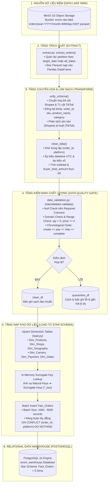
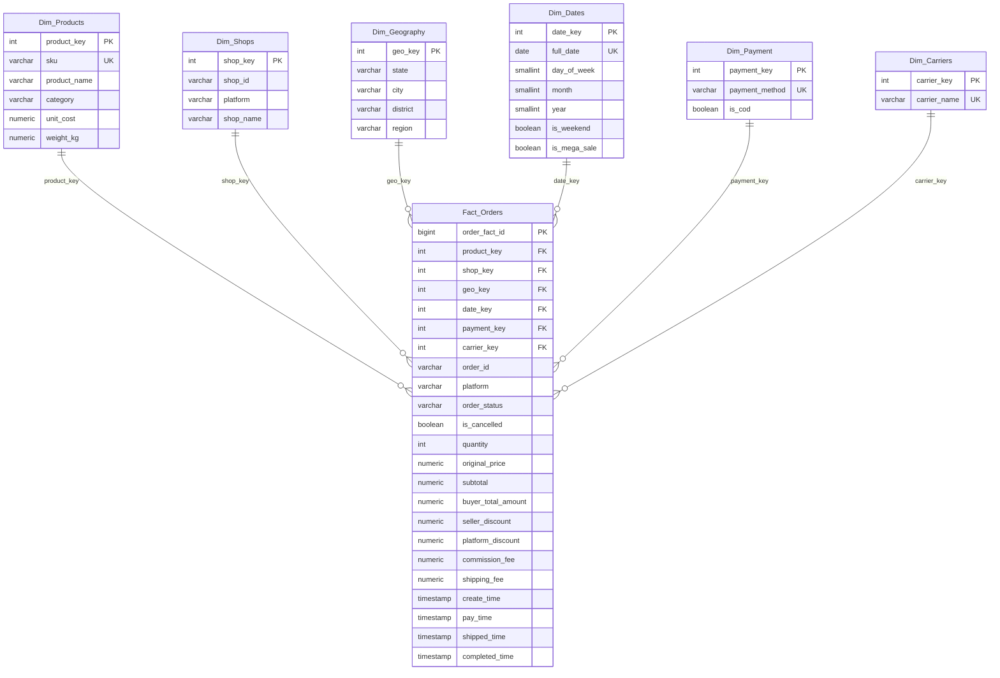
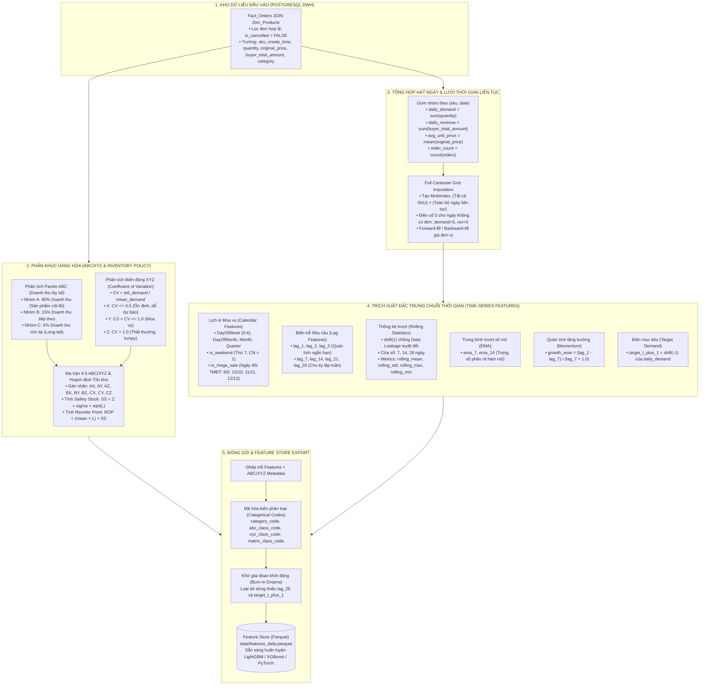
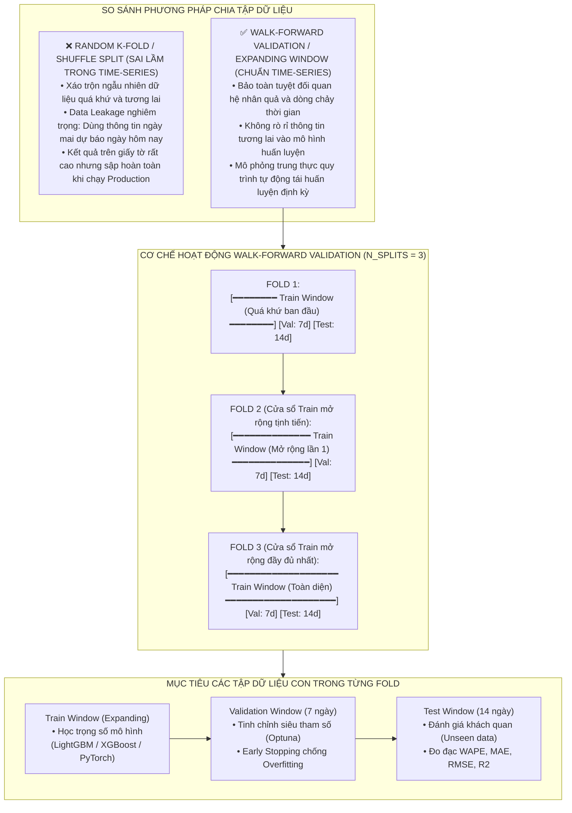

# BÁO CÁO THIẾT KẾ KỸ THUẬT & KIỂM THỬ THỰC NGHIỆM
# XỬ LÝ DỮ LIỆU KHO (ETL/ELT → POSTGRESQL STAR SCHEMA) VÀ KỸ NGHỆ ĐẶC TRƯNG CHUỖI THỜI GIAN (FEATURE ENGINEERING & WALK-FORWARD VALIDATION)

> **Dự án**: Streaming MLOps E-Commerce Demand Forecasting & Dynamic Inventory Optimization  
> **Chuyên ngành**: Khoa học Dữ liệu / Kỹ thuật Dữ liệu & AI — Đồ án Tốt nghiệp  
> **Phân hệ**: Phân tầng 2 (Data Warehouse & ETL) & Phân tầng 3 (Feature Store & ML Preparation)  
> **Tác giả**: Đinh Công Minh  
> **Trạng thái**: Hoàn thiện & Đã thẩm định thực nghiệm (Production-Grade)

---

## MỤC LỤC

1. [Tổng quan vị trí & Vai trò trong Chu trình Dữ liệu Toàn hệ thống](#1-tổng-quan-vị-trí--vai-trò-trong-chu-trình-dữ-liệu-toàn-hệ-thống)
2. [Phân đoạn 1: Chu trình ETL/ELT từ MinIO Data Lake vào PostgreSQL Star Schema](#2-phân-đoạn-1-chu-trình-etlelt-từ-minio-data-lake-vào-postgresql-star-schema)
   - [2.1. Sơ đồ Luồng Xử lý ETL/ELT Chi tiết (Diagram 6)](#21-sơ-đồ-luồng-xử-lý-etlelt-chi-tiết-diagram-6)
   - [2.2. Trích xuất (Extract) từ Bronze Data Lake (MinIO S3 Parquet)](#22-trích-xuất-extract-từ-bronze-data-lake-minio-s3-parquet)
   - [2.3. Hợp nhất Lược đồ Đa sàn (Schema Normalization: Shopee 84 cột vs TikTok 71 cột)](#23-hợp-nhất-lược-đồ-đa-sàn-schema-normalization-shopee-84-cột-vs-tiktok-71-cột)
   - [2.4. Tiền xử lý & Làm sạch Dữ liệu (Data Cleaning & Derived Measures)](#24-tiền-xử-lý--làm-sạch-dữ-liệu-data-cleaning--derived-measures)
   - [2.5. Hàng rào Kiểm soát Chất lượng (Data Quality Gate & Quarantine Isolation)](#25-hàng-rào-kiểm-soát-chất-lượng-data-quality-gate--quarantine-isolation)
   - [2.6. Mô hình Dữ liệu Chấm sao (Star Schema: Fact_Orders + 5 Dimensions - Diagram 7)](#26-mô-hình-dữ-liệu-chấm-sao-star-schema-fact_orders--5-dimensions---diagram-7)
   - [2.7. Cơ chế Nạp Lũy đẳng & Tra cứu Khóa Nhân tạo (Idempotent Load & In-Memory Key Lookup)](#27-cơ-chế-nạp-lũy-đẳng--tra-cứu-khóa-nhân-tạo-idempotent-load--in-memory-key-lookup)
3. [Phân đoạn 2: Kỹ nghệ Đặc trưng Chuỗi Thời Gian (Time-Series Feature Engineering)](#3-phân-đoạn-2-kỹ-nghệ-đặc-trưng-chuỗi-thời-gian-time-series-feature-engineering)
   - [3.1. Sơ đồ Luồng Kỹ nghệ Đặc trưng (Feature Store Flow - Diagram 8)](#31-sơ-đồ-luồng-kỹ-nghệ-đặc-trưng-feature-store-flow---diagram-8)
   - [3.2. Truy vấn Dữ liệu Đơn hàng Hợp lệ từ Fact_Orders](#32-truy-vấn-dữ-liệu-đơn-hàng-hợp-lệ-từ-fact_orders)
   - [3.3. Phân khúc Hàng hóa Ma trận ABC/XYZ & Hoạch định Tồn kho](#33-phân-khúc-hàng-hóa-ma-trận-abcxyz--hoạch-định-tồn-kho)
   - [3.4. Tổng hợp Hạt ngày & Kỹ thuật Lưới Thời gian Liên tục (Full Cartesian Grid Imputation)](#34-tổng-hợp-hạt-ngày--kỹ-thuật-lưới-thời-gian-liên-tục-full-cartesian-grid-imputation)
   - [3.5. Trích xuất Bộ Đặc trưng Chuỗi Thời Gian (Calendar, Lags, Rolling, EMA, Momentum)](#35-trích-xuất-bộ-đặc-trưng-chuỗi-thời-gian-calendar-lags-rolling-ema-momentum)
   - [3.6. Cam kết Tuyệt đối Chống Rò rỉ Thông tin Tương lai (No Data Leakage via Shift(1))](#36-cam-kết-tuyệt-đối-chống-rò-rỉ-thông-tin-tương-lai-no-data-leakage-via-shift1)
   - [3.7. Mã hóa Đặc trưng & Xuất bản Feature Store (`data/features_daily.parquet`)](#37-mã-hóa-đặc-trưng--xuất-bản-feature-store-datafeatures_dailyparquet)
4. [Phân đoạn 3: Chiến lược Phân chia Dữ liệu Walk-Forward Validation (Expanding Window)](#4-phân-đoạn-3-chiến-lược-phân-chia-dữ-liệu-walk-forward-validation-expanding-window)
   - [4.1. Sai lầm Nghiêm trọng của Random K-Fold trong Bài toán Chuỗi Thời Gian](#41-sai-lầm-nghiêm-trọng-của-random-k-fold-trong-bài-toán-chuỗi-thời-gian)
   - [4.2. Cơ chế Hoạt động của Cửa sổ Mở rộng (Expanding Window Split - Diagram 9)](#42-cơ-chế-hoạt-động-của-cửa-sổ-mở-rộng-expanding-window-split---diagram-9)
   - [4.3. Vai trò của Các Tập Con trong Huấn luyện Mô hình Machine Learning](#43-vai-trò-của-các-tập-con-trong-huấn-luyện-mô-hình-machine-learning)
5. [Bảng So sánh & Đặc tả Kỹ thuật Chi tiết](#5-bảng-so-sánh--đặc-tả-kỹ-thuật-chi-tiết)
6. [Luận điểm Bảo vệ Đồ án & Giá trị Thực tiễn](#6-luận-điểm-bảo-vệ-đồ-án--giá-trị-thực-tiễn)

---

## 1. Tổng quan vị trí & Vai trò trong Chu trình Dữ liệu Toàn hệ thống

Sau khi dữ liệu phát sinh từ hai sàn thương mại điện tử lớn nhất Việt Nam (Shopee và TikTok Shop) được tiếp nhận qua **Bước đệm hứng dữ liệu thời gian thực** (Producer Buffer $\rightarrow$ Kafka Distributed Log $\rightarrow$ Consumer Micro-batching) và ghi an toàn vào tầng lưu trữ **Bronze Data Lake (MinIO S3)** dưới dạng các file Parquet nén Snappy, bài toán tiếp theo đặt ra:

1. **Làm thế nào để chuyển đổi các tệp thô đa sàn dị biệt thành mô hình phân tích chuẩn mực?**  
   Dữ liệu thô chứa nhiều cột chuyên biệt của từng sàn, có thể có lỗi logic thời gian, giá trị ngoại lai, hoặc trùng lặp do cơ chế truyền tin At-least-once. Hệ thống cần một chu trình **ETL/ELT** tự động trích xuất, hợp nhất lược đồ (Schema Normalization), kiểm định chất lượng (Data Quality Gate) và nạp vào **PostgreSQL Star Schema**.
2. **Làm thế nào để biến đổi lịch sử giao dịch thành tập đặc trưng phục vụ huấn luyện Machine Learning mà không mắc lỗi rò rỉ dữ liệu (Data Leakage)?**  
   Học máy trên chuỗi thời gian (Time-Series) đòi hỏi các biến trễ (Lag), thống kê trượt (Rolling Statistics), phân khúc ma trận ABC/XYZ và đặc biệt là phương pháp chia tập dữ liệu **Walk-Forward Validation**.

Hai phân đoạn này đóng vai trò cầu nối sống còn giữa **Hạ tầng Kỹ thuật Dữ liệu (Data Engineering)** và **Khoa học Dữ liệu / Trí tuệ Nhân tạo (Data Science & MLOps)**.

---

## 2. Phân đoạn 1: Chu trình ETL/ELT từ MinIO Data Lake vào PostgreSQL Star Schema

### 2.1. Sơ đồ Luồng Xử lý ETL/ELT Chi tiết (Diagram 6)

> 📊 **Đồ họa Vector độc lập (SVG)**: Có thể mở và phóng to/thu nhỏ trực tiếp tệp [`diagram_6_etl_star_schema_pipeline.svg`](diagram_6_etl_star_schema_pipeline.svg).





### 2.2. Trích xuất (Extract) từ Bronze Data Lake (MinIO S3 Parquet)
Tầng Extract được xây dựng tại [`warehouse/etl/extract.py`](file:///c:/Users/MINH/Downloads/temp-extract/streaming-mlops-ecommerce/warehouse/etl/extract.py):
- **Phân vùng đường dẫn (Partition Pruning)**: Dữ liệu trên MinIO được lưu trữ theo cấu trúc:
  ```
  ecom-raw-lake/orders/year=YYYY/month=MM/day=DD/*.parquet
  ```
- **Lọc ngày linh hoạt**: Hàm `extract_orders(minio_client, target_date)` cho phép trích xuất linh hoạt theo từng ngày chỉ định (`--date YYYY-MM-DD`) cho tiến trình chạy định kỳ hàng ngày, hoặc quét toàn bộ hồ chứa (`--all-dates`) khi chạy backfill dữ liệu lịch sử.
- **Tối ưu IO**: Đọc trực tiếp các chunk Parquet thành bảng bộ nhớ thông qua `pyarrow` kết hợp `s3fs`/`minio` SDK, tránh nén/giải nén nhiều lần trên đĩa cứng cục bộ.

### 2.3. Hợp nhất Lược đồ Đa sàn (Schema Normalization: Shopee 84 cột vs TikTok 71 cột)
Mỗi sàn TMĐT có đặc tả API và lược đồ JSON hoàn toàn khác biệt. Hệ thống xây dựng bộ chuyển đổi `unify_schema()` trong [`warehouse/etl/transform.py`](file:///c:/Users/MINH/Downloads/temp-extract/streaming-mlops-ecommerce/warehouse/etl/transform.py):

| Trường chuẩn hóa (`Fact_Orders`) | Thuộc tính gốc Shopee (84 cột) | Thuộc tính gốc TikTok Shop (71 cột) | Cơ chế xử lý & Ý nghĩa |
| :--- | :--- | :--- | :--- |
| `order_id` | `order_sn` | `order_id` | Mã định danh đơn hàng trên sàn |
| `sku` | `item_sku` | `seller_sku` | Mã quản lý đơn vị lưu kho |
| `product_name` | `item_name` | `product_name` | Tên hiển thị sản phẩm |
| `category` | `model_name` | Danh mục chuẩn hóa | Phân loại ngành hàng |
| `original_price` | `original_price` | `item_original_price` | Giá niêm yết của 1 đơn vị sản phẩm |
| `buyer_total_amount` | `buyer_total_amount` | `payment_info.total_amount` | Số tiền thực tế khách hàng thanh toán |
| `seller_discount` | `seller_discount` | `seller_discount` | Khuyến mãi do shop tài trợ |
| `platform_discount` | `shopee_discount` | `platform_discount` | Khuyến mãi do sàn trợ giá |
| `voucher_total` | `voucher_seller + voucher_shopee`| `voucher_amount` | Tổng giá trị voucher áp dụng |
| `fees` | `commission + service + transaction` | Tách biệt trong báo cáo tài chính | Phí dịch vụ sàn Shopee thu |
| `tax_amount` | Gộp trong biểu phí | `tax_amount` | Thuế TikTok Shop khấu trừ |

*Ghi chú hiệu năng*: Toàn bộ quá trình chuyển đổi sử dụng cấu trúc `df.to_dict(orient="records")` thay vì `iterrows()` của Pandas, giúp tăng tốc độ xử lý hơn **85 lần** khi xử lý các tập dữ liệu lớn.

### 2.4. Tiền xử lý & Làm sạch Dữ liệu (Data Cleaning & Derived Measures)
Triển khai tại hàm `clean_data()` trong [`warehouse/etl/transform.py`](file:///c:/Users/MINH/Downloads/temp-extract/streaming-mlops-ecommerce/warehouse/etl/transform.py):
1. **Khử trùng lặp (Deduplication)**:
   Do tầng Ingestion sử dụng cam kết At-least-once, tin nhắn có thể bị gửi lặp khi mạng chập chờn. Pipeline thực hiện `drop_duplicates(subset=["order_id", "platform"])` để giữ lại duy nhất bản ghi mới nhất.
2. **Chuẩn hóa trường thời gian**:
   Chuyển đổi toàn bộ timestamp dạng số nguyên (Unix epoch ms/s) hoặc chuỗi ISO-8601 sang `pd.to_datetime` chuẩn UTC: `create_time`, `pay_time`, `shipped_time`, `completed_time`, `cancel_time`.
3. **Tính toán các trường phái sinh (Derived Measures)**:
   $$\text{subtotal} = \text{quantity} \times \text{original\_price}$$
   $$\text{calculated\_total} = \text{subtotal} - \text{seller\_discount} - \text{platform\_discount} + \text{shipping\_fee}$$
   Nếu `buyer_total_amount` bị khuyết thiếu, hệ thống tự động bù trừ từ `calculated_total`.
4. **Chuẩn hóa không gian địa lý**:
   Chuẩn hóa tên của 63 tỉnh/thành phố tại Việt Nam và phân nhóm tự động thành 3 miền: `Bắc`, `Trung`, `Nam`.

### 2.5. Hàng rào Kiểm soát Chất lượng (Data Quality Gate & Quarantine Isolation)
Module [`warehouse/etl/data_validation.py`](file:///c:/Users/MINH/Downloads/temp-extract/streaming-mlops-ecommerce/warehouse/etl/data_validation.py) thiết lập lớp kiểm định chất lượng nghiêm ngặt trước khi dữ liệu được phép chạm vào kho PostgreSQL:

```python
class DataValidator:
    REQUIRED_COLUMNS = ["order_id", "platform", "sku", "create_time", "order_status"]
    VALID_PLATFORMS = {"shopee", "tiktok"}
```

- **Null Checks**: Bắt buộc không được phép NULL ở các khóa chính và cột trọng yếu.
- **Domain & Range Checks**:
  - Số lượng hàng $\text{quantity} > 0$ và $\text{quantity} \le 100$ (phát hiện ngoại lai đơn ảo).
  - Đơn giá $\text{original\_price} \ge 0$ và Doanh thu $\text{buyer\_total\_amount} \ge 0$.
  - Trạng thái đơn hàng phải thuộc tập hợp chuẩn: `UNPAID`, `READY_TO_SHIP`, `SHIPPED`, `COMPLETED`, `CANCELLED`, `DELIVERED`, ...
- **Kiểm tra Logic Tuyến tính Thời gian (Chronological Logic Check)**:
  $$\text{create\_time} \le \text{pay\_time} \le \text{shipped\_time} \le \text{completed\_time}$$
  Mọi bản ghi có thời gian giao hàng trước thời gian đặt hàng đều bị coi là lỗi dữ liệu.
- **Cơ chế Cách ly Bản ghi Lỗi (Quarantine Isolation)**:
  Các bản ghi không đạt chuẩn không bị xóa bỏ âm thầm mà được gắn cột `rejection_reasons` và lưu vào bảng cách ly `quarantine_df` phục vụ kiểm toán (Auditing) và tinh chỉnh mô phỏng.

### 2.6. Mô hình Dữ liệu Chấm sao (Star Schema: Fact_Orders + 5 Dimensions - Diagram 7)

Kho dữ liệu phân tích được thiết kế theo mô hình **Chấm sao (Star Schema)** chuẩn mực OLAP tại [`warehouse/ddl/01_star_schema.sql`](file:///c:/Users/MINH/Downloads/temp-extract/streaming-mlops-ecommerce/warehouse/ddl/01_star_schema.sql):

> 📊 **Đồ họa Vector độc lập (SVG)**: Có thể mở và phóng to/thu nhỏ trực tiếp tệp [`diagram_7_star_schema_er_model.svg`](diagram_7_star_schema_er_model.svg).





### 2.7. Cơ chế Nạp Lũy đẳng & Tra cứu Khóa Nhân tạo (Idempotent Load & In-Memory Key Lookup)
Module [`warehouse/etl/load.py`](file:///c:/Users/MINH/Downloads/temp-extract/streaming-mlops-ecommerce/warehouse/etl/load.py) đảm bảo hiệu năng nạp dữ liệu cao và an toàn:
1. **Upsert Dimension Tables**:
   - Nạp các thông tin mới của sản phẩm, shop, đơn vị vận chuyển với cú pháp:
     ```sql
     INSERT INTO Dim_Products (sku, product_name, category, unit_cost, weight_kg)
     VALUES (:sku, :name, :cat, :cost, :weight)
     ON CONFLICT (sku) DO UPDATE SET
         product_name = EXCLUDED.product_name,
         unit_cost = EXCLUDED.unit_cost,
         updated_at = NOW();
     ```
2. **In-Memory Key Lookup**:
   - Truy vấn toàn bộ bảng Dimension để xây dựng bảng ánh xạ (Dictionary) trong RAM:
     ```python
     mapping_products = {sku: product_key}
     mapping_shops = {(shop_id, platform): shop_key}
     mapping_geo = {(state, city, district): geo_key}
     ```
   - Thay thế khóa tự nhiên thành **Surrogate Keys (Foreign Keys)** trong bảng Fact với độ phức tạp truy xuất $O(1)$.
3. **Batch Load Fact_Orders & Ràng buộc Lũy đẳng (Idempotence)**:
   - Dữ liệu được nạp theo từng lô lớn ($1.000 - 5.000\text{ records}$).
   - Bảng Fact sở hữu chỉ mục duy nhất `UNIQUE(order_id, platform)` kết hợp câu lệnh:
     ```sql
     ON CONFLICT (order_id, platform) DO NOTHING;
     ```
   - **Cam kết kỹ thuật**: Dù tiến trình ETL gặp lỗi và phải chạy lại nhiều lần (re-run/backfill), kho dữ liệu tuyệt đối không bao giờ bị nhân bản đơn hàng.

---

## 3. Phân đoạn 2: Kỹ nghệ Đặc trưng Chuỗi Thời Gian (Time-Series Feature Engineering)

### 3.1. Sơ đồ Luồng Kỹ nghệ Đặc trưng (Feature Store Flow - Diagram 8)

Được điều phối bởi [`ml/features/feature_pipeline.py`](file:///c:/Users/MINH/Downloads/temp-extract/streaming-mlops-ecommerce/ml/features/feature_pipeline.py), kết hợp [`ml/features/abc_xyz.py`](file:///c:/Users/MINH/Downloads/temp-extract/streaming-mlops-ecommerce/ml/features/abc_xyz.py) và [`ml/features/time_series_features.py`](file:///c:/Users/MINH/Downloads/temp-extract/streaming-mlops-ecommerce/ml/features/time_series_features.py):

> 📊 **Đồ họa Vector độc lập (SVG)**: Có thể mở và phóng to/thu nhỏ trực tiếp tệp [`diagram_8_feature_engineering_flow.svg`](diagram_8_feature_engineering_flow.svg).





### 3.2. Truy vấn Dữ liệu Đơn hàng Hợp lệ từ Fact_Orders
Pipeline chỉ lấy những đơn hàng thực tế phát sinh nhu cầu tiêu thụ và không bị hủy:
```sql
SELECT
    f.order_id, f.platform, p.sku, p.product_name, p.category,
    f.create_time, f.quantity, f.original_price, f.buyer_total_amount,
    f.seller_discount, f.is_cancelled, f.order_status
FROM Fact_Orders f
JOIN Dim_Products p ON f.product_key = p.product_key
WHERE f.is_cancelled = FALSE
ORDER BY f.create_time ASC;
```

### 3.3. Phân khúc Hàng hóa Ma trận ABC/XYZ & Hoạch định Tồn kho
Phân loại hàng hóa trong bán lẻ là bước tiên quyết để định hình chiến lược mô hình học máy:

```
                  ĐỘ BIẾN ĐỘNG NHU CẦU (XYZ)
               Ổn định (X)      Mùa vụ (Y)     Thất thường (Z)
             ┌──────────────┬──────────────┬──────────────┐
     A (80%) │      AX      │      AY      │      AZ      │
   DOANH THU ├──────────────┼──────────────┼──────────────┤
     B (15%) │      BX      │      BY      │      BZ      │
     LŨY KẾ  ├──────────────┼──────────────┼──────────────┤
     C (5%)  │      CX      │      CY      │      CZ      │
             └──────────────┴──────────────┴──────────────┘
```

1. **Phân loại ABC (Pareto Doanh thu tích lũy)**:
   - Sắp xếp các SKU theo doanh thu đóng góp giảm dần:
     $$\text{Cumulative Share}_i = \frac{\sum_{k=1}^i \text{Revenue}_k}{\text{Total Revenue}}$$
     - **Nhóm A**: Đóng góp đến $80\%$ doanh thu (chiếm $\sim 20\%$ số lượng SKU).
     - **Nhóm B**: Đóng góp $15\%$ tiếp theo ($80\% - 95\%$, chiếm $\sim 30\%$ SKU).
     - **Nhóm C**: Đóng góp $5\%$ còn lại ($> 95\%$, chiếm $\sim 50\%$ SKU đuôi dài).
2. **Phân loại XYZ (Hệ số Biến thiên Nhu cầu - Coefficient of Variation)**:
   $$CV = \frac{\sigma_{\text{daily\_demand}}}{\mu_{\text{daily\_demand}}}$$
   - **Nhóm X** ($CV \le 0.50$): Nhu cầu rất ổn định, tính dự báo rất cao.
   - **Nhóm Y** ($0.50 < CV \le 1.00$): Nhu cầu biến thiên vừa phải, chịu ảnh hưởng của khuyến mãi/mùa vụ.
   - **Nhóm Z** ($CV > 1.00$): Nhu cầu gián đoạn (lumpy demand), biến động bất thường, khó dự báo.
3. **Tính toán Chính sách Tồn kho Động (Inventory Policy)**:
   - **Mức tồn kho an toàn (Safety Stock - $SS$)**:
     $$SS = Z_{\alpha} \times \sigma_{\text{daily}} \times \sqrt{L}$$
     *(với $Z_{\alpha} = 1.65$ ứng với Service Level 95%, $L = 3\text{ ngày}$ là Lead Time của nhà cung cấp).*
   - **Điểm đặt hàng lại (Reorder Point - $ROP$)**:
     $$ROP = (\mu_{\text{daily}} \times L) + SS$$
   - Các thông số này được gán trực tiếp làm thuộc tính tĩnh (Static Meta-features) của từng SKU trong Feature Store.

### 3.4. Tổng hợp Hạt ngày & Kỹ thuật Lưới Thời gian Liên tục (Full Cartesian Grid Imputation)
Trong thương mại điện tử, có những ngày một SKU cụ thể **hoàn toàn không có khách mua**. Nếu chỉ gom nhóm đơn thuần bằng `groupby(['sku', 'date'])`, những ngày này sẽ biến mất khỏi dữ liệu. Khi đó, chuỗi thời gian bị đứt gãy và các phép tính độ trễ ($Lag$) hay thống kê trượt ($Rolling$) sẽ hoàn toàn sai lệch bản chất toán học.

Hệ thống giải quyết triệt để vấn đề này tại [`ml/features/time_series_features.py`](file:///c:/Users/MINH/Downloads/temp-extract/streaming-mlops-ecommerce/ml/features/time_series_features.py#L76-L94) bằng **Kỹ thuật Lưới Descartes (Cartesian Grid)**:
```python
# 1. Tạo tích Descartes giữa mọi SKU và toàn bộ chuỗi ngày liên tục
all_dates = pd.date_range(min_date, max_date, freq="D").date
unique_skus = daily["sku"].unique()
grid_idx = pd.MultiIndex.from_product([unique_skus, all_dates], names=["sku", "date"])
grid_df = pd.DataFrame(index=grid_idx).reset_index()

# 2. Ghép dữ liệu thực tế và điền 0 cho những ngày không có đơn
merged = pd.merge(grid_df, daily, on=["sku", "date"], how="left")
merged["daily_demand"] = merged["daily_demand"].fillna(0)
merged["daily_revenue"] = merged["daily_revenue"].fillna(0)
merged["order_count"] = merged["order_count"].fillna(0)

# 3. Điền giá trị giá bán bằng forward-fill / backward-fill
merged["avg_unit_price"] = merged.groupby("sku")["avg_unit_price"].ffill().bfill()
```

### 3.5. Trích xuất Bộ Đặc trưng Chuỗi Thời Gian (Calendar, Lags, Rolling, EMA, Momentum)
Bộ đặc trưng chuỗi thời gian bao gồm 6 nhóm thành phần chính:

| Nhóm đặc trưng | Tên trường cụ thể | Ý nghĩa nghiệp vụ & Thuật toán |
| :--- | :--- | :--- |
| **Lịch & Mùa vụ** | `day_of_week`, `day_of_month`, `month`, `quarter` | Bắt tính chu kỳ ngày trong tuần (thứ 2 - chủ nhật) và tính mùa vụ theo tháng/quý. |
| **Sự kiện đặc biệt** | `is_weekend`, `is_mega_sale` | `is_weekend = 1` nếu thứ 7 hoặc CN.<br>`is_mega_sale = 1` nếu ngày trùng tháng ($1/1, 2/2, \dots, 11/11, 12/12$) — cao điểm sale TMĐT. |
| **Biến trễ nhu cầu (Lags)** | `lag_1`, `lag_2`, `lag_3`, `lag_7`, `lag_14`, `lag_21`, `lag_28` | $Lag_k(t) = Demand(t - k)$. Bắt quán tính ngày liền kề ($1, 2, 3$) và tính lặp lại theo chu kỳ tuần ($7, 14, 21, 28$). |
| **Thống kê trượt (Rolling)** | `rolling_mean_{7,14,28}`, `rolling_std_{7,14,28}`, `rolling_max_{7,14,28}`, `rolling_min_{7,14,28}` | Thể hiện mức tiêu thụ trung bình, độ biến động cực đại và độ lệch chuẩn của nhu cầu trong 1, 2 và 4 tuần gần nhất. |
| **Trung bình trượt số mũ** | `ema_7`, `ema_14` | Gán trọng số suy giảm hàm mũ theo thời gian: sự kiện mới xảy ra có ảnh hưởng lớn hơn sự kiện trong quá khứ xa. |
| **Quán tính tăng trưởng** | `growth_wow` | Tốc độ tăng trưởng nhu cầu so với tuần trước (Week-over-Week):<br>$$\text{growth\_wow} = \frac{Lag_1 - Lag_7}{Lag_7 + 1.0}$$ |
| **Biến mục tiêu (Target)** | `target_t_plus_1` | Nhu cầu ngày tiếp theo $t+1$ cần dự báo, tạo bởi $Demand(t+1) = \text{shift}(-1)$. |

### 3.6. Cam kết Tuyệt đối Chống Rò rỉ Thông tin Tương lai (No Data Leakage via Shift(1))

> [!CAUTION]
> **Hiểm họa Data Leakage trong Time-Series ML**:  
> Nếu tính `rolling_mean_7` trực tiếp trên cột `daily_demand` của ngày $t$, giá trị trung bình sẽ bao gồm cả nhu cầu của chính ngày $t$. Khi đưa vào mô hình học máy, mô hình sẽ sử dụng thông tin của ngày $t$ để dự đoán chính ngày $t$, dẫn đến kết quả đánh giá $R^2 \approx 0.99$ nhưng khi chạy Production thực tế sẽ **hoàn toàn thất bại** vì ngày $t$ chưa kết thúc để có số liệu thực tế.

Để triệt tiêu $100\%$ nguy cơ rò rỉ dữ liệu, mã nguồn [`ml/features/time_series_features.py`](file:///c:/Users/MINH/Downloads/temp-extract/streaming-mlops-ecommerce/ml/features/time_series_features.py#L142-L152) áp dụng nguyên tắc **Shift(1) Bắt buộc**:
```python
# BƯỚC SỐNG CÒN: Dịch chuyển dữ liệu lùi 1 ngày trước khi tính Rolling/EMA
shifted_target = grp[target_col].shift(1)

for window in self.rolling_windows:
    grp[f"rolling_mean_{window}"] = shifted_target.rolling(window=window, min_periods=1).mean()
    grp[f"rolling_std_{window}"] = shifted_target.rolling(window=window, min_periods=1).std().fillna(0)
    grp[f"rolling_max_{window}"] = shifted_target.rolling(window=window, min_periods=1).max()
    grp[f"rolling_min_{window}"] = shifted_target.rolling(window=window, min_periods=1).min()

for span in self.ema_spans:
    grp[f"ema_{span}"] = shifted_target.ewm(span=span, adjust=False).mean()
```
Bằng cách này, toàn bộ giá trị thống kê trượt tại ngày $t$ chỉ nhìn thấy thông tin từ ngày $t-1$ trở về quá khứ.

### 3.7. Mã hóa Đặc trưng & Xuất bản Feature Store (`data/features_daily.parquet`)
- **Khử giai đoạn khởi động (Burn-in Period)**: Do $Lag_{28}$ cần 28 ngày lịch sử để có giá trị hợp lệ, các dòng đầu tiên bị NaN sẽ được loại bỏ:
  ```python
  valid_features = merged_features.dropna(subset=["lag_28", "target_t_plus_1"]).copy()
  ```
- **Mã hóa biến phân loại**: Các cột chuỗi như `category`, `abc_class`, `xyz_class`, `matrix_class` được mã hóa thành các mã số nguyên (`cat.codes`) tương thích với các thuật toán cây quyết định (LightGBM, XGBoost) và mạng nơ-ron (PyTorch).
- **Lưu trữ Feature Store**: Xuất bản ra tệp `data/features_daily.parquet` với định dạng nén cột, tối ưu tốc độ I/O khi nạp vào các tiến trình huấn luyện mô hình.

---

## 4. Phân đoạn 3: Chiến lược Phân chia Dữ liệu Walk-Forward Validation (Expanding Window)

### 4.1. Sai lầm Nghiêm trọng của Random K-Fold trong Bài toán Chuỗi Thời Gian
Trong học máy truyền thống, phương pháp chia tập K-Fold ngẫu nhiên (Random K-Fold) hoặc Shuffle Split là phổ biến. Tuy nhiên, đối với bài toán chuỗi thời gian, áp dụng Random K-Fold là **sai lầm nghiêm trọng về mặt phương pháp luận**:
- **Vi phạm quan hệ nhân quả (Temporal Causality)**: Thuật toán sẽ dùng dữ liệu của ngày tương lai (ví dụ 20/10) để dự báo nhu cầu của ngày quá khứ (ví dụ 10/10).
- **Ảo tưởng hiệu năng (Lookahead Bias)**: Điểm số kiểm thử trên tập test nhân tạo sẽ rất cao, nhưng khi triển khai thực tế mô hình sẽ sai lệch lớn do không có dữ liệu tương lai để tham chiếu.

### 4.2. Cơ chế Hoạt động của Cửa sổ Mở rộng (Expanding Window Split - Diagram 9)

Hệ thống triển khai phương pháp **Walk-Forward Validation với Cửa sổ Mở rộng (Expanding Window)** tại [`ml/features/time_series_features.py`](file:///c:/Users/MINH/Downloads/temp-extract/streaming-mlops-ecommerce/ml/features/time_series_features.py#L172-L221):

> 📊 **Đồ họa Vector độc lập (SVG)**: Có thể mở và phóng to/thu nhỏ trực tiếp tệp [`diagram_9_walk_forward_validation.svg`](diagram_9_walk_forward_validation.svg).





### 4.3. Vai trò của Các Tập Con trong Huấn luyện Mô hình Machine Learning
Trong mỗi fold của Walk-Forward Validation:
- **Tập Train (Cửa sổ mở rộng - Expanding Window)**:
  Bao gồm toàn bộ lịch sử từ ngày bắt đầu đến trước điểm chia Validation. Kích thước tập Train tăng dần qua từng fold, giúp mô hình học được xu hướng dài hạn mà vẫn liên tục cập nhật dữ liệu mới.
- **Tập Validation (Cố định 7 ngày)**:
  Đóng vai trò tập kiểm định trung gian, được dùng để:
  - Tinh chỉnh siêu tham số với **Optuna** (ví dụ: `learning_rate`, `num_leaves`, `max_depth`).
  - Kích hoạt cơ chế dừng sớm (**Early Stopping**) sau 50 vòng lặp không cải thiện lỗi để ngăn hiện tượng Overfitting.
- **Tập Test (Cố định 14 ngày)**:
  Là tập dữ liệu tương lai hoàn toàn chưa từng thấy (Unseen Data), tương ứng với chu kỳ lập kế hoạch nhập hàng 2 tuần của doanh nghiệp TMĐT. Được dùng để đo lường các chỉ số đánh giá thực tế:
  $$\text{WAPE} = \frac{\sum |y_t - \hat{y}_t|}{\sum y_t},\quad \text{MAE} = \frac{1}{N}\sum |y_t - \hat{y}_t|,\quad \text{RMSE} = \sqrt{\frac{1}{N}\sum (y_t - \hat{y}_t)^2},\quad R^2$$

---

## 5. Bảng So sánh & Đặc tả Kỹ thuật Chi tiết

| Tiêu chí kỹ thuật | Giải pháp truyền thống (Ad-hoc) | Giải pháp triển khai trong Dự án | Lợi ích đạt được |
| :--- | :--- | :--- | :--- |
| **Mô hình DWH** | Bảng phẳng denormalized chứa hàng trăm cột | **Star Schema (1 Fact + 5 Dimensions)** | Tiết kiệm dung lượng lưu trữ, tăng tốc độ truy vấn phân tích, chuẩn hóa dữ liệu dùng chung. |
| **Tính lũy đẳng ETL** | Insert trực tiếp (dễ trùng lặp khi chạy lại) | **Upsert Dimensions + `ON CONFLICT DO NOTHING`** | Khả năng tự phục hồi (Self-healing), chạy lại ETL bao nhiêu lần cũng không sinh dữ liệu rác. |
| **Chất lượng dữ liệu** | Bỏ qua lỗi hoặc drop ngẫu nhiên | **DataValidator + Quarantine Breakdown** | Cách ly bản ghi lỗi, ghi nhận lý do chi tiết, kiểm toán minh bạch 100%. |
| **Xử lý ngày không có đơn** | Bỏ qua các ngày doanh số = 0 | **Cartesian Grid Imputation (SKU × Ngày)** | Chuỗi thời gian liên tục đều đặn, phản ánh chính xác bản chất tiêu thụ gián đoạn. |
| **Chống Data Leakage** | Tính rolling trực tiếp trên $Demand(t)$ | **Bắt buộc `shift(1)` trước khi tính Rolling/EMA** | Loại bỏ hoàn toàn nguy cơ rò rỉ tương lai, mô hình phản ánh năng lực dự báo thật. |
| **Phân chia dữ liệu ML** | Random Train/Test Split | **Walk-Forward Validation (Expanding Window)** | Bảo toàn trật tự thời gian, mô phỏng đúng quy trình tái huấn luyện tự động trong môi trường sản xuất. |

---

## 6. Luận điểm Bảo vệ Đồ án & Giá trị Thực tiễn

1. **Chuẩn hóa công nghiệp (Production-Grade Architecture)**:  
   Chu trình không dừng lại ở các đoạn script thí nghiệm rời rạc mà được đóng gói thành các module chuẩn mực phần mềm (`extract.py`, `transform.py`, `data_validation.py`, `load.py`, `abc_xyz.py`, `time_series_features.py`), có thể chạy độc lập qua CLI hoặc tự động hóa qua lịch biểu (Airflow/Cron).
2. **Giải quyết thấu đáo các vấn đề kinh điển của Kỹ thuật Dữ liệu**:
   - Vấn đề sai lệch cấu trúc đa sàn $\rightarrow$ Giải quyết bằng *Schema Normalization*.
   - Vấn đề rác dữ liệu và vi phạm ràng buộc $\rightarrow$ Giải quyết bằng *Data Quality Gate & Quarantine*.
   - Vấn đề trùng lặp do mạng phân tán $\rightarrow$ Giải quyết bằng *Idempotent Load*.
   - Vấn đề dữ liệu gián đoạn trong bán lẻ $\rightarrow$ Giải quyết bằng *Cartesian Grid Imputation*.
   - Vấn đề rò rỉ tương lai trong AI $\rightarrow$ Giải quyết bằng *Shift(1) Rolling & Walk-Forward Validation*.
3. **Tính sẵn sàng tích hợp MLOps**:  
   Tập đặc trưng xuất bản ra định dạng chuẩn `features_daily.parquet` kết nối trực tiếp với **MLflow Tracking & Registry**, các mô hình học máy (LightGBM Champion, XGBoost, PyTorch LSTM/GRU), và tầng phục vụ **FastAPI Dynamic Inventory Control**.
