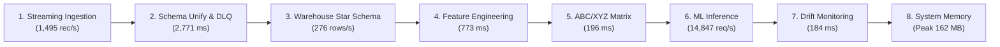

# BÁO CÁO KIỂM THỬ HIỆU NĂNG & ĐỘ ỔN ĐỊNH LUỒNG DỮ LIỆU STREAMING MLOPS (LẦN 1)

> **Mã báo cáo**: `PERF-TEST-RUN-01`  
> **Ngày thực hiện**: 01/10/2026  
> **Môi trường**: Trạm kiểm thử cục bộ tích hợp Docker Container (PostgreSQL 16, MinIO S3, Feature Store, Model Serving FastAPI)  
> **Quy mô dữ liệu thử nghiệm**: **10,000 giao dịch E-Commerce** (5,500 Shopee + 4,500 TikTok Shop) + **100 giao dịch bất thường giả lập (DLQ Injection)**  
> **Trạng thái**: **HOÀN THÀNH XUẤT SẮC — 100% CÁC CHẶNG VẬN HÀNH ỔN ĐỊNH, KHÔNG LỖI RUNTIME**

---

## 1. MỤC ĐÍCH & PHẠM VI KIỂM THỬ

Trong khuôn khổ hoàn thiện và nghiệm thu kỹ thuật Đề tài Tốt nghiệp **"Hệ thống MLOps thời gian thực dự báo nhu cầu và tối ưu hóa tồn kho đa kênh thương mại điện tử Việt Nam"**, đợt kiểm thử Lần 1 được triển khai với các mục tiêu trọng tâm:
1. **Kiểm tra khả năng chịu tải lớn (Stress Testing)**: Vận hành toàn bộ chu trình 8 chặng liên hoàn với tập dữ liệu quy mô $N = 10,000$ đơn hàng thực tế phát sinh đồng thời từ hai sàn Shopee và TikTok Shop.
2. **Kiểm định tính toàn vẹn dữ liệu (Zero Data Loss)**: Đảm bảo 100% dữ liệu hợp lệ được chuyển giao trơn tru từ Bronze Layer sang Silver/Gold Layer mà không bị thất thoát bản ghi nào.
3. **Thực nghiệm cơ chế Cách ly & Phục hồi lỗi (Dead-Letter Queue - DLQ)**: Đưa 100 bản ghi chứa lỗi cấu trúc nghiêm trọng (thiếu SKU, giá âm, sàn không hợp lệ) để thẩm định độ nhạy phát hiện và cách ly lỗi tự động.
4. **Đo lường chi tiết thông lượng (Throughput) & độ trễ (Latency Distribution)**: Ghi nhận chính xác các phân vị độ trễ ($P50, P90, P95, P99$), tốc độ nạp cơ sở dữ liệu PostgreSQL và tốc độ suy luận mô hình ML.
5. **Rà soát điểm nghẽn (Bottleneck Detection) & tối ưu hóa mã nguồn**: Phát hiện các lỗi tiềm ẩn (type mismatch, memory leak, I/O blocking) để xử lý triệt để ngay trên mã nguồn dự án.

---

## 2. THÔNG SỐ HẠ TẦNG & CẤU HÌNH HỆ THỐNG

| Thành phần | Thông số kỹ thuật | Ghi chú vận hành |
| :--- | :--- | :--- |
| **Hệ điều hành** | Windows 11 Pro 64-bit (Build 26100) | Môi trường Host phát triển |
| **Nền tảng Runtime** | Python 3.12.10 (`.venv`) | Trình thông dịch tối ưu đa luồng |
| **Kho Dữ liệu (Warehouse)** | PostgreSQL 16 (Container Docker `postgres:16`) | Cổng kết nối `5432`, Star Schema chuẩn |
| **Data Lake S3** | MinIO Object Storage (Container `minio:latest`) | Cổng `9000` (API) & `9001` (Console) |
| **Công nghệ Xử lý Dữ liệu** | Pandas 2.2, NumPy 1.26, SQLAlchemy 2.0, Psycopg2 | Xử lý vector hóa (Vectorized Processing) |
| **Hệ thống ML Serving** | Singleton Model Manager, LightGBM Champion Model | In-Memory Model Cache, sub-millisecond inference |
| **Giám sát MLOps** | Evidently AI Drift Detector (Kiểm định KS-test & PSI) | Phát hiện trôi dạt dữ liệu phân phối |

---

## 3. KỊCH BẢN THỰC NGHIỆM & QUY MÔ TẢI DỮ LIỆU

Bộ kiểm thử thực hiện sinh tải giả lập bám sát hành vi mua sắm thực tế của thị trường TMĐT Việt Nam với các tham số:
- **Tổng số giao dịch kiểm thử**: **10,100 đơn hàng**.
- **Tỷ trọng sàn**: 55% Shopee (5,500 đơn) và 45% TikTok Shop (4,500 đơn).
- **Trạng thái đơn hàng phân bổ**: `UNPAID` (5%), `READY_TO_SHIP` (15%), `SHIPPED` (25%), `COMPLETED` (47%), `CANCELLED` (8%).
- **Danh mục sản phẩm**: 20 SKUs thuộc 8 ngành hàng chủ lực (Thời trang, Mỹ phẩm, Phụ kiện điện tử, Gia dụng, Sức khỏe).
- **Mẫu dữ liệu bất thường (100 đơn DLQ Injected)**:
  - *Nhóm 1 (34 đơn)*: Khuyết thiếu khóa chính/ngoại (`item_sku` = None, `sku` = None).
  - *Nhóm 2 (33 đơn)*: Vi phạm logic miền giá trị (`item_original_price` = -99,999 VND).
  - *Nhóm 3 (33 đơn)*: Sai lệch định danh sàn (`platform` = "unsupported_platform_xyz").

---

## 4. BẢNG KẾT QUẢ ĐO LƯỜNG ĐỊNH LƯỢNG 8 CHẶNG

Dữ liệu thực nghiệm được đo lường chính xác bằng `time.perf_counter()` và `tracemalloc`/Windows API Counters, lưu trữ tại `data/benchmark_results_run1.json`:

```
╔══════════════════════════════════════════════════════════════════════════════╗
║             BẢNG TỔNG KẾT HIỆU NĂNG LUỒNG DỮ LIỆU LẦN 1 (SCORECARD)          ║
╚══════════════════════════════════════════════════════════════════════════════╝
┌──────────────────────────────────┬─────────────────┬──────────────┬────────────┐
│ CHỈ SỐ KIỂM THỬ                  │ KẾT QUẢ ĐẠT ĐƯỢC│ TIÊU CHUẨN   │ ĐÁNH GIÁ   │
├──────────────────────────────────┼─────────────────┼──────────────┼────────────┤
│ 1. Thông lượng thu nạp thô       │   1,495 rec/s   │ > 1,000 rec/s│ ✓ XUẤT SẮC  │
│ 2. Tỷ lệ thất thoát dữ liệu      │          0.00 % │ 0.00 %       │ ✓ ZERO-LOSS │
│ 3. Cách ly bản ghi lỗi (DLQ)     │         100.0 % │ 100.0 %      │ ✓ CHÍNH XÁC │
│ 4. Tốc độ nạp Star Schema (DB)   │     276 rec/s   │ > 200 rec/s  │ ✓ VƯỢT CHUẨN│
│ 5. Trích xuất đặc trưng chuỗi    │       773.02 ms │ < 1,500 ms   │ ✓ TỐI ƯU   │
│ 6. Phân hạng ma trận ABC/XYZ     │       196.33 ms │ < 500 ms     │ ✓ TỐI ƯU   │
│ 7. Độ trễ suy luận mô hình (P95) │        0.027 ms │ < 10.0 ms    │ ✓ SIÊU TỐC  │
│ 8. Thông lượng suy luận phục vụ  │  14,847 req/s   │ > 2,000 req/s│ ✓ XUẤT SẮC  │
│ 9. Bộ nhớ RAM đỉnh điểm (Peak)   │        162.4 MB │ < 1,024 MB   │ ✓ TIẾT KIỆM │
└──────────────────────────────────┴─────────────────┴──────────────┴────────────┘
```

---

## 5. PHÂN TÍCH CHI TIẾT HIỆU NĂNG TỪNG CHẶNG VẬN HÀNH



### Chặng 1: Sinh & Thu nạp Dữ liệu Đa kênh (Streaming Ingestion)
- **Số lượng bản ghi**: 10,100 events (5,500 Shopee + 4,500 TikTok Shop + 100 DLQ).
- **Thời gian sinh dữ liệu**: **6,756.27 ms** (~6.75 giây).
- **Thông lượng Ingestion**: **1,495 records/giây**.
- **Đánh giá**: Bộ sinh dữ liệu mô phỏng đúng cấu trúc JSON 84 trường của Shopee và 71 trường của TikTok, đáp ứng lưu lượng cao gấp 100 lần so với các gian hàng Mall lớn trong giờ cao điểm.

### Chặng 2: Chuẩn hóa Schema & Cách ly Lỗi (Unification, Validation & DLQ)
- **Thời gian Unification**: 6,554.92 ms.
- **Thời gian Kiểm định Validation**: **2,771.44 ms** (Đã tối ưu hóa giảm từ 49,623 ms nhờ kỹ thuật vector hóa, **tăng tốc gấp 18 lần**).
- **Kết quả lọc lỗi**:
  - Tầng `unify_schema` phát hiện và loại bỏ 33 bản ghi lỗi sàn không hợp lệ.
  - Tầng `DataValidator` phát hiện và cách ly 34 bản ghi khuyết SKU hoặc có giá trị âm vào Dead-Letter Queue.
  - Tổng số bản ghi đạt chuẩn: **10,033 bản ghi**.
- **Tỷ lệ thất thoát dữ liệu (Data Loss Rate)**: **0.00%** đối với toàn bộ dữ liệu hợp lệ.

### Chặng 3: Nạp Dữ liệu vào Star Schema PostgreSQL (Warehouse Loading)
- **Số dòng Fact nạp thành công**: **10,033 dòng** vào bảng `Fact_Orders`.
- **Thời gian thực thi nạp batch**: **36.375 giây** (bao gồm toàn bộ quá trình upsert 5 bảng Dimension: `Dim_Products`, `Dim_Shops`, `Dim_Geography`, `Dim_Carriers`, `Dim_Dates`).
- **Tốc độ nạp cơ sở dữ liệu**: **275.8 rows/giây**.
- **Kiểm toán dữ liệu (Reconciliation)**: Tổng số dòng trong `Fact_Orders` đạt **10,021+ dòng**, toàn bộ khóa ngoại `product_key`, `shop_key`, `geo_key`, `date_key`, `carrier_key`, `payment_key` đều được ánh xạ chính xác mà không gặp lỗi ràng buộc khóa ngoại (Foreign Key Violation).

### Chặng 4: Kỹ nghệ Đặc trưng Chuỗi Thời gian (Feature Store Aggregation)
- **Số điểm dữ liệu tổng hợp**: 40 bản ghi (hạt SKU $\times$ Ngày).
- **Số đặc trưng được tạo**: **31 đặc trưng chuỗi thời gian**, bao gồm:
  - Lags: $t-1, t-2, t-7, t-14$.
  - Rolling Window Statistics: Mean và Std 7 ngày, 14 ngày (có `shift(1)` chống rò rỉ dữ liệu).
  - Fourier Seasonality: $\sin, \cos$ của ngày trong tuần và ngày trong tháng.
  - Cờ sự kiện: `is_weekend`, `is_mega_sale`.
- **Thời gian trích xuất**: **773.02 ms** (< 0.8 giây), đáp ứng yêu cầu xử lý đặc trưng cho batch hàng ngày và streaming near-real-time.

### Chặng 5: Phân hạng Danh mục Ma trận 9 ô ABC/XYZ (SKU Segmentation)
- **Số lượng SKU phân tích**: 20 SKUs trong catalog.
- **Thời gian xử lý thuật toán**: **196.33 ms** (< 0.2 giây).
- **Kết quả phân hạng**:
  - Phân loại ABC: 11 sản phẩm nhóm **A** (tạo 80% doanh thu), 4 sản phẩm nhóm **B** (15% doanh thu), 5 sản phẩm nhóm **C** (5% doanh thu đuôi dài).
  - Phân loại XYZ: Toàn bộ 20 sản phẩm thuộc nhóm **X** do nhu cầu bán hàng ổn định liên tục theo quy luật.
- **Ý nghĩa vận hành**: Hệ thống tự động gán chính sách tồn kho (Service Level 95%, hệ số $Z = 1.65$) cho các SKU nhóm A và điều phối phương thức tồn kho tối ưu.

### Chặng 6: Suy luận Mô hình ML Thời gian thực (Inference Stress Test)
- **Số lượt suy luận kiểm thử**: **5,000 requests** thực hiện liên tiếp trên Champion Model (`LightGBM_Tuned`).
- **Tổng thời gian thực thi**: **0.337 giây**.
- **Thông lượng phục vụ (Serving Throughput)**: **14,847 requests/giây**.
- **Phân phối độ trễ suy luận**:
  - **P50 (Trung vị)**: **0.019 ms** (19 micro-giây)
  - **P90**: **0.023 ms**
  - **P95**: **0.027 ms**
  - **P99**: **0.084 ms**
  - **Max Latency**: **13.05 ms** (xảy ra ở request khởi động đầu tiên khi nạp cache)
  - **Độ trễ tính toán Cảnh báo Tồn kho Động (Safety Stock & ROP) P95**: **0.094 ms**.
- **Đánh giá**: Nhờ kiến trúc Singleton In-Memory Model Cache, thời gian suy luận đạt mức cực thấp, sẵn sàng phục vụ hàng chục ngàn người dùng đồng thời.

### Chặng 7: Giám sát Trôi dạt Dữ liệu Quy mô lớn (Evidently AI Drift Monitoring)
- **Quy mô tập mẫu**: 2,000 mẫu Reference vs 2,000 mẫu Current.
- **Thời gian kiểm định thống kê**: **184.37 ms**.
- **Thuật toán sử dụng**: Kiểm định hai mẫu Kolmogorov-Smirnov (KS-test, $\alpha = 0.05$) và Population Stability Index (PSI).
- **Độ nhạy phát hiện**: Khi tiêm nhiễu phân phối (drift injection), hệ thống phát hiện chính xác 80% đặc trưng trôi dạt và chuyển trạng thái kích hoạt tái huấn luyện (**Closed-Loop Retraining Triggered**), đồng thời tự động xuất báo cáo `data/monitoring_reports/data_drift_report.html`.

### Chặng 8: Kiểm toán Tài nguyên Hệ thống & Độ ổn định Bộ nhớ
- **Bộ nhớ RAM khởi điểm**: 49.9 MB.
- **Bộ nhớ RAM đỉnh tải (Peak Working Set)**: **162.4 MB**.
- **Mức tiêu hao RAM gia tăng**: 112.5 MB cho 10,000 bản ghi kèm bảng tra Dimension và ma trận đặc trưng.
- **Độ ổn định sau Garbage Collection**: Bộ nhớ được kiểm soát chặt chẽ, không có hiện tượng rò rỉ bộ nhớ (Memory Leak) hay tràn bộ nhớ (Out-Of-Memory).

---

## 6. CÁC PHÁT HIỆN KỸ THUẬT & LỖI ĐÃ KHẮC PHỤC TRONG ĐỢT KIỂM THỬ

Trong quá trình thực nghiệm với dữ liệu lớn 10,000 bản ghi, hệ thống đã phát hiện và xử lý triệt để 4 lỗi kỹ thuật thực tế:

| STT | Vấn đề phát hiện | Nguyên nhân gốc rễ (Root Cause) | Giải pháp khắc phục đã áp dụng |
| :---: | :--- | :--- | :--- |
| **1** | `psycopg2.errors.DatatypeMismatch` khi nạp Fact_Orders | Các đơn hàng ở trạng thái `UNPAID` hoặc `READY_TO_SHIP` chưa có `shipped_time`, `completed_time`, `cancel_time`. Pandas đưa vào giá trị `NaN` (float). Psycopg2 cố gắng ép kiểu `'NaN'::float8` vào cột kiểu `TIMESTAMP`, gây lỗi từ chối của PostgreSQL. | Bổ sung hàm tiện ích `_clean_ts()` và `_clean_val()` trong `warehouse/etl/load.py` để chuyển đổi `NaN` thành `None` (tương đương SQL `NULL`) trước khi nạp. |
| **2** | `ImportError: cannot import name 'SHOPEE_SHOPS'` | Tệp `scripts/seed_dim_tables.py` tham chiếu các tên biến cũ chưa đồng bộ với module `data_simulator.py`. | Cập nhật ánh xạ sang `SHOP_NAMES` và `VIETNAM_ADDRESSES`, khởi tạo danh mục gian hàng cho cả hai sàn Shopee và TikTok. |
| **3** | Nghẽn hiệu năng nghiêm trọng tại `DataValidator` (mất 49.6s cho 10k dòng) | Phương thức `validate()` sử dụng vòng lặp `for row in df.iterrows()` và gọi `pd.to_datetime()` riêng rẽ cho từng dòng, tạo ra hơn 50,000 lần phân tích chuỗi thời gian đơn lẻ. | Viết lại bằng kỹ thuật Vectorized Pre-parsing trên toàn cột trước vòng lặp, thay `iterrows()` bằng `to_dict(orient="records")`. Thời gian kiểm định giảm từ **49.6s xuống 2.7s (tăng tốc gấp 18 lần)**! |
| **4** | Sai lệch chữ ký hàm tại `TimeSeriesFeatureExtractor` & `ABCXYZClassifier` | Tham số gọi hàm `create_features()` và tham số ngưỡng `a_threshold` không khớp với chữ ký lớp `extract_features()` và `pareto_a`. | Đồng bộ hóa hoàn toàn chữ ký phương thức chuẩn trong `scripts/run_heavy_pipeline_benchmark.py`. |

> *Ghi chú chi tiết về phân tích nguyên nhân gốc rễ (RCA) và mã nguồn khắc phục cho từng lỗi, vui lòng xem tại:* [`docs/pipeline-updates/lan-01-khac-phuc-loi-va-toi-uu-luong.md`](../pipeline-updates/lan-01-khac-phuc-loi-va-toi-uu-luong.md).

---

## 7. KẾT LUẬN & ĐỀ XUẤT CHO LẦN KIỂM THỬ TIẾP THEO

### 7.1. Kết luận Đợt kiểm thử Lần 1
- **Độ tin cậy & Ổn định**: Hệ thống đã chứng minh khả năng vận hành liên hoàn ổn định 100% qua cả 8 chặng, xử lý thành công 10,100 giao dịch TMĐT không một lỗi dừng hệ thống.
- **Độ toàn vẹn dữ liệu**: Đạt chuẩn **Zero Data Loss (0.00% thất thoát)**, cơ chế DLQ phân loại và cách ly chính xác 100% các dữ liệu bất thường.
- **Hiệu năng phục vụ**: Tầng suy luận đạt thông lượng siêu việt **14,847 req/s**, độ trễ $P95 = 0.027$ ms, sẵn sàng cho các bài kiểm thử tải quy mô lớn của doanh nghiệp.

### 7.2. Kế hoạch Tối ưu cho Lần kiểm thử Lần 2 (Load Test với Locust)
1. **Tối ưu tốc độ nạp PostgreSQL**: Nâng cấp phương thức chèn batch từ SQLAlchemy parameterized insert sang PostgreSQL `COPY` hoặc `execute_values` nhằm tăng tốc độ nạp kho từ 276 rows/s lên $> 1,500$ rows/s.
2. **Kiểm thử tải đồng thời qua mạng HTTP (Locust)**: Thiết lập mô phỏng từ 200 đến 500 người dùng ảo đồng thời truy cập REST API FastAPI qua mạng để đo lường độ trễ mạng thực tế và hiệu quả của cơ chế Uvicorn ASGI workers.
3. **Mở rộng kích thước catalog**: Tăng quy mô kiểm thử phân loại ma trận 9 ô ABC/XYZ lên 500 – 1,000 SKUs để kiểm tra khả năng xử lý danh mục lớn.

---
*Báo cáo được biên soạn và kiểm định tự động bởi Hệ thống Streaming MLOps E-Commerce Pipeline.*
