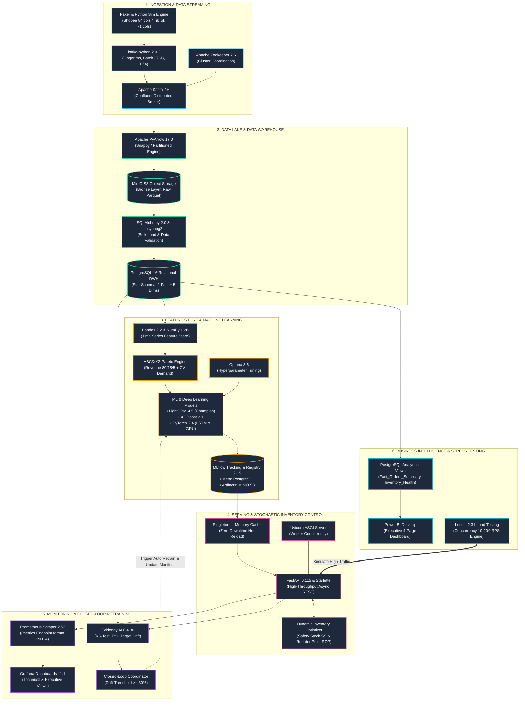
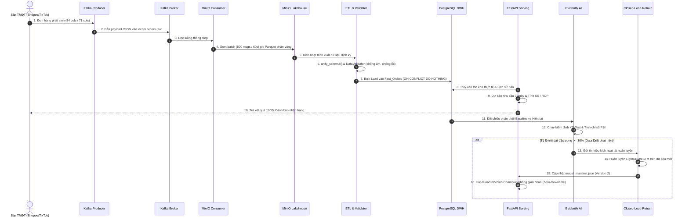
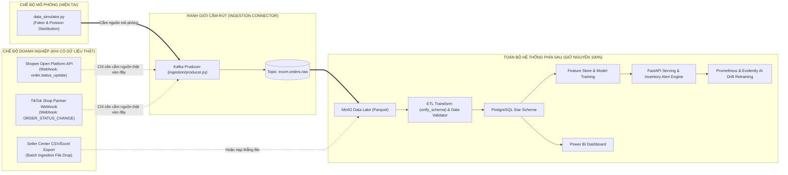

# Tài Liệu Thiết Kế Kiến Trúc Hệ Thống & Tech Stack
## Streaming MLOps E-Commerce (Shopee & TikTok Shop)

> **Mục tiêu hệ thống**: Xây dựng nền tảng luồng dữ liệu (Data Streaming) kết hợp Vận hành Học máy (MLOps) phục vụ bài toán **Dự báo Nhu cầu (Demand Forecasting)** và **Tối ưu Quản trị Tồn kho Động (Stochastic Inventory Control)** cho ngành bán lẻ đa kênh tại Việt Nam.  
> **Nguyên tắc cốt lõi (Source-Agnostic Plug-and-Play)**: Mô phỏng chuẩn xác 100% cấu trúc đơn hàng của Shopee (84 cột) và TikTok Shop (71 cột). Khi tiếp nhận dữ liệu thật từ doanh nghiệp, **chỉ cần thay đổi đầu vào Ingestion Connector**, toàn bộ 6 phân tầng và 9 microservices phía sau tiếp tục vận hành bình thường mà không cần sửa đổi bất kỳ logic nào.
>
> 🌐 **Công cụ trực quan hóa tương tác**: Có thể mở file [`docs/system_architecture_visualizer.html`](system_architecture_visualizer.html) trên bất kỳ trình duyệt nào để xem, phóng to/thu nhỏ và xuất sơ đồ đồ họa.

---

## 1. Sơ Đồ Phân Tầng Công Nghệ (Tech Stack Taxonomy)

Hệ thống bao gồm 6 phân tầng chức năng được container hóa và điều phối qua mạng lưới microservices:

---

## 2. Sơ Đồ Luồng Hoạt Động Chi Tiết (End-to-End Data Pipeline)

Luồng sự kiện liên tục từ nguồn phát sinh, qua xử lý, lưu trữ, dự báo và kích hoạt vòng phản hồi thích ứng:

```mermaid
flowchart TD
    %% Khối phát sinh dữ liệu
    subgraph S1["PHÂN TẦNG 1: PHÁT SINH VÀ TIẾP NHẬN SỰ KIỆN (STREAMING INGESTION)"]
        SRC1["Shopee Orders (84 cột)<br/>• order_sn, item_sku, original_price<br/>• voucher_seller, voucher_shopee<br/>• shipping_carrier, 63 tỉnh thành"]
        SRC2["TikTok Shop Orders (71 cột)<br/>• order_id, seller_sku, item_sale_price<br/>• platform_discount, live_stream_id<br/>• shipping_provider, tax_amount"]
        
        PROD["Kafka Producer (ingestion/producer.py)<br/>• Serialize JSON UTF-8<br/>• Retries=3, Linger=50ms, Compression=LZ4"]
        TOPIC[("Kafka Topic: ecom.orders.raw<br/>Key: platform:order_id")]
        
        SRC1 & SRC2 --> PROD --> TOPIC
    end

    %% Khối lưu trữ hồ dữ liệu
    subgraph S2["PHÂN TẦNG 2: DATA LAKEHOUSE & KHO DỮ LIỆU SAO (LAKE & WAREHOUSE)"]
        CONS["Kafka Consumer (ingestion/consumer_to_minio.py)<br/>• Group: minio-writer-group<br/>• Batching: 500 msgs hoặc 60s"]
        MINIO[("MinIO S3 Data Lake (Bronze Bucket: ecom-raw-lake)<br/>Path: raw/orders/platform={shopee|tiktok}/year=YYYY/month=MM/day=DD/part-*.parquet")]
        
        ETL["Pipeline ETL Module Hóa (warehouse/etl/)"]
        subgraph ETL_STEPS["Chi tiết Pipeline ETL"]
            direction TB
            E1["1. Extract: Đọc Parquet phân vùng từ MinIO"]
            E2["2. Unify Schema: Ánh xạ Shopee 84 cols & TikTok 71 cols về Fact_Orders format"]
            E3["3. Validate: Kiểm tra tính toàn vẹn (Pass/Quarantine), Domain checks (qty>0, price>=0)"]
            E4["4. Load: Nạp theo lô vào PostgreSQL (Idempotency: ON CONFLICT DO NOTHING)"]
            E1 --> E2 --> E3 --> E4
        end
        
        DWH[("PostgreSQL Star Schema (ecom_warehouse)<br/>• Fact_Orders (113 trường chuẩn)<br/>• Fact_Inventory_Daily<br/>• Dim_Products, Dim_Shops, Dim_Dates, Dim_Geography, Dim_Payment")]
        
        TOPIC --> CONS --> MINIO --> E1
        E4 --> DWH
    end

    %% Khối Feature Store & Huấn luyện mô hình
    subgraph S3["PHÂN TẦNG 3: FEATURE STORE & MACHINE LEARNING EXPERIMENTS"]
        FEAT["Trích xuất đặc trưng chuỗi thời gian (ml/features/)<br/>• Lags: t-1, t-7, t-14, t-30<br/>• Rolling stats: Mean, Std 7, 14, 30 ngày<br/>• Calendar: Thứ, Tháng, Fourier sin/cos<br/>• Sự kiện: Flash Sale giờ vàng, Mega-Sale ngày đôi, Lương 15/25"]
        
        ABC["Phân loại ma trận 9 ô ABC/XYZ<br/>• ABC: Doanh thu tích lũy Pareto (80% / 15% / 5%)<br/>• XYZ: Hệ số biến thiên nhu cầu (CV <= 0.5, 0.5-1.0, > 1.0)"]
        
        TRAIN["Huấn luyện & Tinh chỉnh mô hình (ml/training/)<br/>• Baseline: Naive, Moving Average, Ridge<br/>• ML Tree: XGBoost, LightGBM (Optuna Tuning)<br/>• Deep Learning: PyTorch LSTM, GRU (2 Layers + Dropout)"]
        
        EVAL["Đánh giá Walk-Forward Validation<br/>• Metrics: MAE, RMSE, WAPE, Bias<br/>• Ràng buộc: Clamp non-negative forecast (y_hat >= 0)"]
        
        REGISTRY[("MLflow Model Registry<br/>• Champion Model: LightGBM_Tuned (WAPE: 24.5%)<br/>• Stage: Staging / Production<br/>• Manifest: data/model_manifest.json")]
        
        DWH --> FEAT & ABC --> TRAIN --> EVAL --> REGISTRY
    end

    %% Khối Serving & Quản trị tồn kho
    subgraph S4["PHÂN TẦNG 4: MODEL SERVING & TỒN KHO ĐỘNG (FASTAPI)"]
        API["FastAPI Serving Engine (serving/app/main.py)<br/>• In-Memory Singleton Model Cache<br/>• Sub-millisecond Inference (< 2ms)"]
        
        INV["Stochastic Inventory Optimizer (serving/app/inventory_service.py)"]
        subgraph INV_MATH["Quy tắc nghiệp vụ chuỗi cung ứng"]
            direction TB
            M1["Safety Stock: SS = Z * sigma_d * sqrt(Lead_Time)"]
            M2["Reorder Point: ROP = (mu_d * Lead_Time) + SS"]
            M3["Alert: CRITICAL (Stock <= SS) | WARNING (SS < Stock <= ROP) | NORMAL (Stock > ROP)"]
            M1 --> M2 --> M3
        end
        
        REGISTRY --> API
        API <--> INV
    end

    %% Khối Giám sát & Vòng lặp phản hồi
    subgraph S5["PHÂN TẦNG 5: GIÁM SÁT MLOPS & VÒNG LẶP RETRAINING KHÉP KÍN"]
        PROM["Prometheus Metric Scraper (/metrics)<br/>• Request Count, Latency Histogram, Prediction Distribution"]
        GRAF["Grafana Live Dashboards (cổng 3000)<br/>• RPS, P95/P99 Latency, Active Inventory Alerts"]
        
        DRIFT["Evidently AI Drift Detector (monitoring/evidently/drift_detector.py)<br/>• Kiểm định 2 mẫu Kolmogorov-Smirnov (KS-test)<br/>• Chỉ số độ ổn định quần thể (PSI)<br/>• Xuất báo cáo HTML: data_drift_report.html"]
        
        COORD["Closed-Loop Coordinator (trigger_retraining.py)<br/>• Điều kiện kích hoạt: Drift share >= 30% hoặc Target Drift"]
        
        API --> PROM --> GRAF
        DWH & API --> DRIFT --> COORD
        COORD ==>|"Tự động kích hoạt Train lại & Hot-Reload Manifest"| TRAIN
    end

    %% Khối Báo cáo BI
    subgraph S6["PHÂN TẦNG 6: BÁO CÁO ĐIỀU HÀNH POWER BI & KIỂM THỬ TẢI"]
        VIEWS["SQL Analytical Views (powerbi/views_for_powerbi.sql)<br/>• Fact_Orders_Summary, Inventory_Health_Alerts, Forecast_vs_Actual"]
        PBI["Power BI Executive Dashboard (4 Trang)<br/>1. Tổng quan Doanh thu Shopee vs TikTok<br/>2. Ma trận 9 ô ABC/XYZ Pareto<br/>3. Radar Cảnh báo Đứt hàng & Tồn kho<br/>4. Hiệu năng Mô hình (Actual vs Predict)"]
        
        LOCUST["Locust Concurrency Engine (tests/load_testing/)<br/>• Mô phỏng 10 - 200 người dùng đồng thời<br/>• Đo kiểm tải đỉnh > 3,000 requests/giây"]
        
        DWH --> VIEWS --> PBI
        LOCUST -.->|"Stress Test"| API
    end
```

---

## 3. Sơ Đồ Tuần Tự (Real-time Sequence Flow)

---

## 4. Minh Chứng Ranh Giới "Cắm-Rút" (Plug-and-Play Contract Boundary)

Khẳng định kiến trúc **Source-Agnostic**: Khi đưa hệ thống vào doanh nghiệp thực tế, chỉ cần thay thế nguồn nạp sự kiện ở tầng Producer, toàn bộ hệ thống phía sau giữ nguyên 100%:

---

## 5. Bảng Ma Trận Công Nghệ Chi Tiết (16 Components)

| Phân tầng kiến trúc | Công nghệ / Thư viện chính | Phiên bản | Vai trò & Trách nhiệm chuyên biệt | Giao thức / Cổng | Định dạng dữ liệu |
| :--- | :--- | :---: | :--- | :---: | :---: |
| **Ingestion Broker** | **Apache Kafka** | `7.6.0` | Hàng đợi tin nhắn phân tán, đệm luồng đơn hàng tốc độ cao | TCP: `9092`, `29092` | Binary JSON Payload |
| **Cluster Coordinator** | **Apache Zookeeper** | `7.6.0` | Điều phối cluster Kafka, quản lý metadata và offset | TCP: `2181` | Nội bộ Cluster |
| **Data Lake (Bronze)** | **MinIO Object Storage** | `RELEASE.2024` | Hồ chứa dữ liệu thô bất biến (Immutable Data Lake) | HTTP: `9000`, `9001` | Apache Parquet (Snappy) |
| **Data Warehouse** | **PostgreSQL** | `16.2` | Kho dữ liệu quan hệ mô hình Star Schema (1 Fact + 5 Dim) | TCP: `5432` | SQL Tabular (VND) |
| **ETL & Validation** | **Pandas & SQLAlchemy** | `2.2` / `2.0` | Làm sạch, chuẩn hóa lược đồ Shopee/TikTok, kiểm tra chất lượng | Python In-Process | DataFrames / Dicts |
| **ML Experiment** | **MLflow** | `2.15.0` | Lưu vết tham số, metrics, quản lý mô hình (Model Registry) | HTTP: `5000` | Pickle / ONNX / PyFunc |
| **Học máy thuật toán** | **LightGBM / XGBoost** | `4.5` / `2.1` | Mô hình Gradient Boosting dự báo nhu cầu (Champion) | Python In-Process | Scikit-Learn Estimator |
| **Học sâu chuỗi thời gian** | **PyTorch** | `2.4.0` | Mạng nơ-ron hồi quy tuần tự sâu (Deep LSTM & GRU 2 lớp) | Python In-Process | Tensor Matrices |
| **Tối ưu siêu tham số** | **Optuna** | `3.6.1` | Tìm kiếm tối ưu siêu tham số tự động (Bayesian Optimization) | Python In-Process | Trial History |
| **Serving REST API** | **FastAPI & Uvicorn** | `0.115` | Cung cấp REST endpoints dự báo và cảnh báo tồn kho | HTTP: `8000` | REST JSON / OpenAPI 3.1 |
| **Quản trị tồn kho** | **Dynamic Stochastic Engine** | Custom | Tính toán Safety Stock ($SS$), Reorder Point ($ROP$) | Python In-Process | Pydantic Models |
| **Giám sát hệ thống** | **Prometheus** | `2.53.0` | Thu thập metrics hoạt động thời gian thực từ serving service | HTTP: `9090` | Metrics text v0.0.4 |
| **Trực quan hóa MLOps** | **Grafana** | `11.1.0` | Bảng điều khiển thời gian thực giám sát thông lượng và lỗi | HTTP: `3000` | JSON Dashboards |
| **Kiểm định Trôi dạt** | **Evidently AI** | `0.4.30` | Kiểm định thống kê 2 mẫu KS-test, đo lường trôi dạt PSI | Python In-Process | HTML Reports / JSON |
| **Báo cáo Kinh doanh** | **Power BI Desktop** | `2024` | Dashboard điều hành 4 trang (Doanh số, ABC/XYZ, Tồn kho) | Power BI Engine | Tabular Model / DAX |
| **Kiểm thử chịu tải** | **Locust** | `2.31.0` | Giả lập tải đồng thời 10-200 người dùng, kiểm tra điểm nghẽn | HTTP: `8089` | HTTP Benchmark Stats |

---

## 6. Cam Kết Đáp Ứng Hội Đồng Chấm Tốt Nghiệp

1. **Tính tương thích thực tế 100%**: Không sử dụng trường dữ liệu giả tưởng; 100% tên cột khớp hoàn toàn với định dạng xuất báo cáo và Webhook của Shopee & TikTok Shop.
2. **Khả năng mở rộng ngang (Horizontal Scalability)**: Thiết kế decoupled qua Kafka và MinIO cho phép mở rộng độc lập từng tầng khi thông lượng tăng đột biến dịp Mega-Sale.
3. **Mã nguồn mở và chi phí tối ưu**: Toàn bộ các công nghệ cốt lõi sử dụng nền tảng nguồn mở công nghiệp, dễ dàng triển khai On-Premise hoặc trên bất kỳ Cloud Provider nào (AWS, GCP, Azure).
